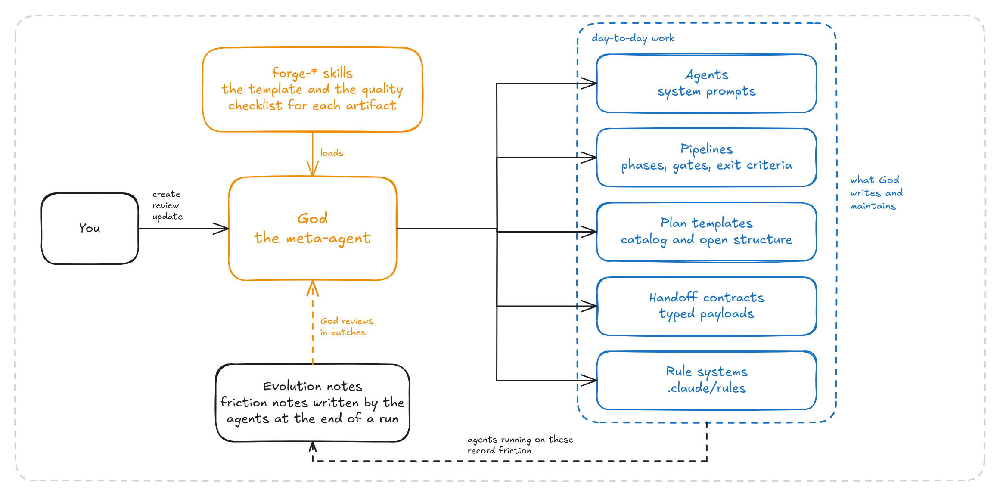

<h1 align="center">🏺 demiurge</h1>

<br>

<h3 align="center">15 agents and 58 skills for Claude Code.<br>Plain markdown, installed with symlinks</h3>

<p align="center">
   <a href="https://github.com/Petri-Hub/demiurge/commits/main"></a>
</p>

<br>

## About

> **TL;DR:** a harness for Claude Code, made of plain markdown, built around one agent that doesn't write code. I call it God, and its job is to write the instructions of every other agent: their system prompts, the pipelines they follow, the plan templates and the handoff contracts. Around it sits the roster I run: an Orchestrator that dispatches an Architect, an Executor and the reviewers that attack their work, with every agent handing work to the next as files.

## The idea



<br>

**A model computes what comes next from everything that came before:** the system prompt, the skill it loaded, the plan it was handed, the handoff it read. So the quality of what comes out depends on how well that *before* is written, and the real question is what the best possible instructions look like for the work you want out.

**God is the agent I built to answer that question in files.** It is a regular Claude Code agent, but it never touches your code. You tell it what you need, say a new agent, a pipeline or a plan template, and it works out with you the best artifact it can write for another agent to read and follow. It does the same to check or improve one that already exists.

**It also closes a loop. At the end of every run, each agent writes down the friction it hit in its own instructions,** and God reviews those notes in batches and fixes the instructions. That is what makes this a meta-harness: one agent shapes the environment of all the others, and what the others learn flows back to it.

**Current frontier models are good at following a path.** A pipeline is a path, with phases, entry and exit conditions and gates, and inside each phase the model is free to adapt. You keep the flexibility of the model and it gets a direction to follow.

## Don't use this

> **Don't use these agents. Use the one that makes them.** This harness was built around my work: my agents, my HITL gates, my way of reviewing. The piece worth taking is **God**, the agent that creates the others, together with the forge skills.

I built it for a financial system, where I needed to read and understand what was going to be built before it was built. That is why there is an Architect whose plan I review, and an Executor whose code can go through four reviewers before it reaches me. There is a Scribe for writing anything from a post-mortem to a simple integration report, and a Crawler that gathers context from other websites and maps their features before I recreate the product. Those are my needs. Yours are different, and you would spend your time fighting agents shaped around mine.

## How to use this

Take **God**, the `pipeline-god-*` skills, the `forge-*` skills and the three `workspace-*` skills God uses to record its own notes. Leave the rest, or read it as examples of what God produces.

Start Claude Code with `claude --agent God` and tell it what you need: an agent, a pipeline, a plan template, a handoff contract or a rule system. It interviews you first, writes the draft, then attacks its own draft against the forge checklist before handing it over. God needs the Context7 MCP server configured in Claude Code.

`install.sh` links the whole kit into `~/.claude`. To take only the God subset, link those folders by hand.

```sh
git clone https://github.com/Petri-Hub/demiurge.git && cd demiurge && ./install.sh
```

Agents read their skills from `~/.claude/skills`, so allow `Read(~/.claude/skills/**)` in your `settings.json`. `./uninstall.sh` removes only the links it created. It does not restore anything `install.sh` moved to `~/.claude/.demiurge-backup/`.

## How it works

The Orchestrator is the entry point: it proposes the next step, dispatches the specialists and stops at the gates. The Architect's plan is attacked by two reviewers before you read it. The Executor's code can be attacked by four, each switched on per run: quality, security, tests, and whether the code honors the plan's behavioral contracts. God and the Teacher you call directly.


## Glossary

| Entity | What it is |
|---|---|
| **Agent** | A markdown file with a system prompt, a model, a tool list and the agents it is allowed to call. Lives in `agents/` |
| **Skill** | A markdown file an agent loads on demand instead of carrying it in its prompt. Lives in `skills/<name>/SKILL.md` |
| **Pipeline** | A skill describing one execution flow: phases, each with a goal, actions, things to avoid and exit conditions |
| **Forge skill** | The template and the quality checklist for one kind of artifact. God's reference material |
| **Plan template** | What the Architect fills in to write a plan. Either catalog-driven, for domain features, or open-structure, for tooling and infrastructure |
| **Handoff** | A typed markdown file one agent writes for another, with a purpose, a context, a payload table and a validation block. The receiver reads it from disk |
| **Workspace** | `.workspace/`, a git repository beside your project where plans, handoffs, research, docs, audits, crawls and evolution notes live. Each agent knows which folders it may write to |
| **HITL gate** | A point where an agent stops and asks you. The Orchestrator runs at one of three levels: Supervised, Guided (the default) or Autonomous |
| **Behavioral contract** | A numbered, testable statement in a plan, such as BC-01. The Refinement reviewer checks the code and the tests against them |
| **Evolution note** | A short note an agent writes at the end of a run about friction in its own instructions. God reviews them in batches |
| **Rule system** | `.claude/rules/` plus the root `CLAUDE.md` that orients the agents, in three tiers: foundation, concerns and components |

Skills are grouped by prefix: `pipeline-` for flows, `forge-` for templates, `workspace-` for layout, naming and git lifecycle, `handoff-` for what each reviewer receives, `specialization-` for tools (tmux, Maestro, Slidev, Lighthouse and axe, agent-browser, frontend design) and `teacher-` for course state and source ranking.

## The forge skills

They define the structure of every agent, pipeline, plan template, handoff and rule system in the kit, and each one carries the quality checklist an artifact has to pass before God is allowed to save it.

| Skill | Used when |
|---|---|
| `forge-principles` | Before writing the content of any artifact, and on every review pass. It covers the wording, not the structure: how to phrase an instruction so a model follows it. Reference only, it has no phases |
| `forge-agent` | Creating, validating or updating an agent file: section order, frontmatter, delegation rules |
| `forge-pipeline` | Creating, validating or updating a pipeline skill: phases, actions, exit conditions, gate design |
| `forge-plan` | Creating a catalog-driven plan template, for plans with entities, use cases and API contracts |
| `forge-plan-open` | Creating an open-structure plan template, for infrastructure, tooling, CI/CD and migrations, where the structure is specific to the domain |
| `forge-handoff` | Creating a handoff skill, the contract between two agents: payload design and the rule of passing a path instead of copying content |
| `forge-mdcs` | Creating a project's rule system, the `.claude/rules/` tiers and the root `CLAUDE.md` |

## When it is worth it

It is worth it when a mistake is expensive: fintech, distributed systems, anything mission critical. You trade tokens and time for review before and after the work. A plan is not one model's first draft, it gets attacked by other agents. Code is not only implemented, it can come back with the findings of four reviewers. The point is to stay away from the keyboard and still deliver something you can trust.

If your work is not critical, it is probably not worth the cost. Plain Claude Code with a few skills is faster and cheaper, and for most work that is the better trade.

## What it produced

Counted on the workspace the agents kept while I used this, from 13 May to 2 September 2026, the last commit in my copy.

| What | Count |
|---|---|
| Plan files, in feature workspaces | 149, across 120 workspaces |
| Handoff files between agents | 601 |
| Audits, with their findings | 27 audits, 261 findings |
| Incident workspaces, with their investigation files | 10 workspaces, 16 files |
| Research files, and documentation files from the Librarian | 122 and 71 |
| Evolution notes written by the agents | 876 |
| Markdown files in the workspace | 3,254, about 241,500 lines |
| Commits to the workspace repository | 1,327 |

The kit itself is 15 agent files and 58 skills, 73 markdown files and about 17,000 lines.

## License

MIT, in [`LICENSE.md`](LICENSE.md).
