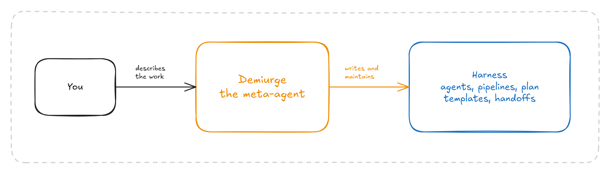
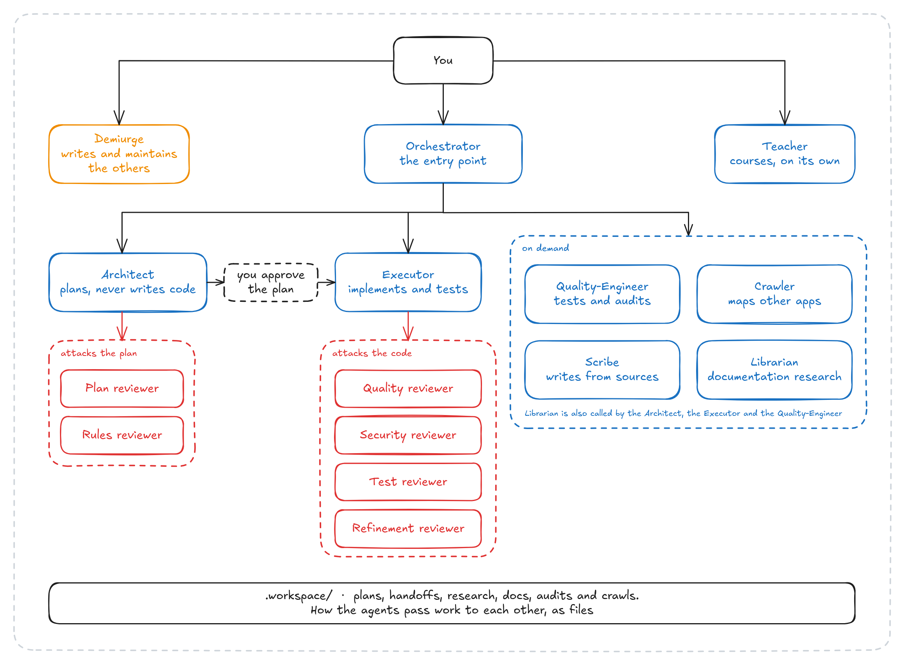

<h1 align="center">🏺 demiurge</h1>

<br>

<h3 align="center">A meta-harness that creates other agents.<br>An agent whose only job is writing the instructions of the others</h3>

<p align="center">
   <a href="https://github.com/Petri-Hub/demiurge/commits/main"></a>
</p>

<br>

## About

> **TL;DR:** a harness for Claude Code, made of plain markdown, built around one agent that doesn't write code. I call it Demiurge, and its job is to write the instructions of every other agent: their system prompts, the pipelines they follow, the plan templates and the handoff contracts. This is not a framework: it has no versioned interface, and the roster around it was built for my own work, so expect to edit the markdown to fit yours.

## The idea, in two paragraphs



**A model computes what comes next from everything that came before:** the system prompt, the skill it loaded, the plan it was handed, the handoff it read. So the quality of what comes out depends on how well that *before* is written, and the real question is what the best possible instructions look like for the work you want out.

**If that is true, what if you had an agent whose only job was to write that *before*?** It would know how to write a system prompt, a pipeline, a plan template or a handoff so that another agent reads it and follows it. Current frontier models are good at following a path, and a pipeline is one: phases, gates and exit conditions, with the model free to adapt inside each phase. That agent is Demiurge, and the harness around it is what it produces.

## Don't use this

> **Don't use these agents. Use the one that makes them.**

Everything else in this repository is the roster I built with Demiurge for my own work: my agents, my HITL gates, my way of reviewing. It is here to show what Demiurge produces. Your work is different, and you would spend your time fighting agents shaped around mine, so install Demiurge alone and let it build yours.

## Install

You need Claude Code, git and bash.

```sh
git clone https://github.com/Petri-Hub/demiurge.git && cd demiurge
./install.sh --demiurge   # Demiurge and the 26 skills it uses
./install.sh              # or the whole harness
./uninstall.sh            # removes only the links install.sh created
```

The installer links the files into `~/.claude` instead of copying them, so a `git pull` updates them. Anything already in the way is moved to `~/.claude/.demiurge-backup/`, and `uninstall.sh` tells you it is there without restoring it.

Agents read their skills from `~/.claude/skills`, so allow `Read(~/.claude/skills/**)` in `~/.claude/settings.json`. Demiurge also checks library and framework behavior through Context7, and it expects the server under the name `context-7`, with the hyphen:

```sh
claude mcp add --scope user context-7 -- npx -y @upstash/context7-mcp
```

The key is optional. Add `--api-key <key>` at the end for higher rate limits.

The whole harness needs a few more servers. Playwright, next-devtools and NotebookLM start on their own through `npx` or `uvx` when their agent runs, and the Architect also expects the `sentrux` binary on your path.

## Using Demiurge

Start Claude Code with Demiurge as the main agent, from the folder where you keep your agents, either `~/.claude` or your own harness repository. It writes into `agents/` and `skills/` under that folder.

```sh
claude --agent Demiurge
```

Then describe what you need in plain words, for example:

> Create an agent that reviews database migrations before they merge. It should block any migration that drops a column the code still reads.

It asks its questions before writing anything, drafts the file against the template for that kind of artifact, and reviews its own draft before handing it over. The same goes for pipelines, plan templates, handoff contracts and a project's rule system, and it can validate or update any of them that already exist.

## How it works

This is the roster I used day to day, built for a financial system where I needed to read and understand what was going to be built before it was built.



The Orchestrator is the entry point: it proposes the next step, dispatches the specialists and stops at the gates. The Architect's plan is attacked by two reviewers before you read it, and the Executor's code can be attacked by four, each switched on per run: quality, security, tests, and whether the code honors the plan's behavioral contracts. Around them, a Scribe writes anything from a post-mortem to an integration report, and a Crawler maps the features of another product before it is rebuilt. Demiurge and the Teacher you call directly.

## When it is worth it

When a mistake is expensive: fintech, distributed systems, anything mission critical. You trade tokens and time for review before and after the work, so you can stay away from the keyboard and still trust what comes back. For everything else, plain Claude Code with a few skills is faster and cheaper.

## What it produced

I used this day to day for almost four months in 2026, in a fintech environment, and the agents produced 149 plan files in 120 feature workspaces, 601 handoffs, 27 audits with 261 findings and 3,254 markdown files, counting my copy of the workspace. The version published here has 15 agents and 58 skills.

## Glossary

| Entity | What it is |
|---|---|
| **Agent** | A markdown file with a system prompt, a model, a tool list and the agents it may call. Lives in `agents/` |
| **Skill** | A markdown file an agent loads on demand instead of carrying it in its prompt. Lives in `skills/<name>/SKILL.md` |
| **Pipeline** | A skill describing one flow: phases, each with a goal, actions, things to avoid and exit conditions |
| **Forge skill** | The template and the quality checklist Demiurge follows for one kind of artifact |
| **Plan template** | What the Architect fills in to write a plan, catalog-driven for domain features or open-structure for tooling |
| **Handoff** | A typed markdown file one agent writes for another, read from disk by the receiver |
| **Workspace** | `.workspace/`, a git repository beside your project where plans, handoffs, audits and crawls live |
| **HITL gate** | A point where an agent stops and asks you. The Orchestrator runs Supervised, Guided (the default) or Autonomous |
| **Behavioral contract** | A numbered, testable statement in a plan, such as BC-01, checked against the code by the Refinement reviewer |
| **Evolution note** | A note an agent writes at the end of a run about friction in its own instructions, reviewed by Demiurge in batches |
| **Rule system** | A project's `.claude/rules/` plus the root `CLAUDE.md` that orients the agents |

Skills are grouped by prefix: `pipeline-` for flows, `forge-` for templates, `workspace-` for the workspace, `handoff-` for what each reviewer receives, `specialization-` for tools and `teacher-` for courses.

## License

MIT, in [`LICENSE.md`](LICENSE.md).
