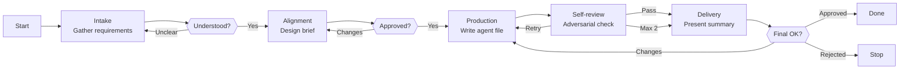

# Skill: Forge Pipeline

## Purpose

Pipeline skills exist because agents accumulate multiple execution flows, most of which are irrelevant to any given invocation. A 1,000-line agent file carrying 9 pipelines forces the model to route past 8 irrelevant specifications to find the 1 it needs — degrading focus and wasting context window on every turn. Extracting each flow into its own skill eliminates this pollution: the agent carries a routing table (which pipeline to run) and loads the full specification only when needed.

This skill is the canonical reference for those pipeline skills — self-contained behavioral specifications, each defining a single execution flow with phases, intent-level actions, behavioral guardrails, and quality gates. Every pipeline skill Demiurge creates follows the format, writing standards, and quality checklist defined here. If a pipeline needs a structure not covered by this skill, Demiurge surfaces the gap and the user decides whether to extend this skill before proceeding.

## Pipeline Skill Format

Every pipeline skill follows this canonical structure. Sections appear in this order. The four core sections are mandatory and none is omitted. Constraints and Knowledge are optional — each included only when the pipeline needs it — and appear after Phases, in that order.

```
Frontmatter
→ # Skill: Pipeline — {Name}
→ ## Purpose
→ ## Presentation
→ ## Constraints   (optional — only when the pipeline has rules specific to it)
→ ## Flow
→ ## Phases
→ ## Knowledge   (optional — only when phases consult standing reference)
```

Constraints sits **before** Flow because it is behavior, and behavior that governs every phase must be read before the phases it governs — models favor the earlier directive when two collide. Knowledge sits last because it is reference reached by pointer from a phase Action, never by reading order; promoting it would push Phases, the behavioral core, into the positionally weakest region of the file.

---

### Frontmatter

#### Rationale

The frontmatter identifies the skill and tells the agent when to load it. The `name` embeds the owning agent (`pipeline-{agent}-{name}`), which is what the agent's routing table references; the `description` is what lets the agent pick the right pipeline without loading the full skill. The pipeline's mode (interactive vs. single-shot) is declared in the Purpose section and in the agent's routing table — not in the frontmatter.

| Field | Required | Description |
|---|---|---|
| `name` | Yes | Skill identifier. Must follow the pattern `pipeline-{agent}-{name}`. Examples: `pipeline-demiurge-agent-creation`, `pipeline-architect-deep-planning`, `pipeline-executor-execution`. |
| `description` | Yes | One-line description of when the agent loads this pipeline. Must be specific enough to distinguish this pipeline from the agent's other pipelines. |
| `user-invocable` | Yes | Always `false` — pipeline skills are loaded by agents from their routing tables, never invoked directly by the user. |

#### Template

```yaml
---
name: pipeline-{agent}-{name}
description: {one-line description of when the agent loads this pipeline}
user-invocable: false
---
```

#### Example

```yaml
---
name: pipeline-demiurge-agent-creation
description: Load when the user requests creation of a new agent file — drives the full interactive pipeline from intake through adversarial self-review to delivery.
user-invocable: false
---
```

#### Directives

**Do:**
- Use kebab-case for the name portion: `agent-creation`, not `agentCreation` or `Agent Creation`
- Make `description` specific enough that the agent can distinguish this pipeline from its siblings without loading the full skill

**Don't:**
- Don't use generic names like `pipeline-demiurge-default` or `pipeline-demiurge-main` — every pipeline has a specific purpose
- Don't include the agent name in the description — it's already in the `name` field
- Don't add fields beyond these three — the frontmatter schema is fixed and shared across all pipeline skills

---

### Purpose

#### Rationale

The Purpose section answers two questions the agent has the moment it loads the skill: "What am I about to do?" and "When should I have loaded this instead of something else?" Without it, the agent reads the first phase's actions without understanding the pipeline's intent — like being handed a recipe without knowing what dish you're cooking. Purpose anchors every subsequent decision the agent makes within the pipeline.

#### Template

```markdown
# Skill: Pipeline — {Name}

## Purpose

{What this pipeline produces. What triggers it. Its mode — interactive (pauses at human gates) or single-shot (runs start to end). What distinguishes it from other pipelines the same agent might run. 2-4 sentences.}
```

#### Example

```markdown
# Skill: Pipeline — Agent Creation

## Purpose

This pipeline produces a new agent file — a complete, validated `.md` file with YAML frontmatter and behavioral specification. It runs interactively when the user requests creation of a new agent with a natural language description, pausing at human gates for alignment and final approval. It differs from Agent Validation (which evaluates existing files) and Agent Update (which modifies existing files) by starting from zero — there is no existing artifact to read, only requirements to gather, decisions to align on, and a specification to produce.
```

#### Directives

**Do:**
- State what the pipeline produces (artifact type, file format, output location)
- State what triggers it (user request type, input format, invoking agent)
- State the mode — interactive when any phase waits for user approval or input; single-shot when the pipeline runs start to end without human gates
- State what distinguishes it from sibling pipelines the same agent runs
- Keep to 2-4 sentences — purpose is an anchor, not documentation

**Don't:**
- Don't describe the pipeline's phases or flow — that belongs in later sections
- Don't include implementation details, tool references, or skill references
- Don't write more than 4 sentences — if you need more, the pipeline's scope may be too broad or the distinction from sibling pipelines is unclear

---

### Presentation

#### Rationale

The agent's Presentation section in its main prompt defines the header format (`# AgentName | Phase Name`). The pipeline skill's Presentation section provides the specific phase names this pipeline uses — so the agent emits correct headers without guessing. Without it, the agent either invents phase names or falls back to generic labels, both of which break the user's ability to track progress through the conversation.

#### Template

```markdown
## Presentation

Phase headers for this pipeline:

| Phase | Header |
|---|---|
| {Phase 1 name} | `{Agent Name} \| {Phase 1 Name}` |
| {Phase 2 name} | `{Agent Name} \| {Phase 2 Name}` |
| {Phase N name} | `{Agent Name} \| {Phase N Name}` |
```

#### Example

```markdown
## Presentation

Phase headers for this pipeline:

| Phase | Header |
|---|---|
| Intake | `Demiurge \| Intake` |
| Alignment | `Demiurge \| Alignment` |
| Production | `Demiurge \| Production` |
| Self-review | `Demiurge \| Self-review` |
| Delivery | `Demiurge \| Delivery` |
```

#### Directives

**Do:**
- List every phase in the pipeline — no phase without a header, no header without a phase
- Use the exact phase names that appear in the Phases section — no synonyms or abbreviations
- Match the agent's Presentation format exactly (pipe separator, spacing, casing)
- Use proper pipe escaping in markdown table cells: `\|` for the header separator

**Don't:**
- Don't invent headers that don't follow the agent's Presentation convention
- Don't include sub-phase headers unless they are distinct phases in the Phases section with their own Goal/Actions/Avoid/`Exit when:`
- Don't omit phases — every phase the agent enters must have a corresponding header

---

### Flow

#### Rationale

The mermaid flowchart is the map the agent loads before walking the pipeline. It provides the complete routing — every phase, every decision, every gate, every loop — in a single visual structure. The agent reads this diagram once and knows the full journey ahead. Without it, the agent discovers the pipeline's shape phase by phase, losing the ability to anticipate what comes next and making incorrect routing decisions at decision points. The flow diagram is also the primary debugging tool — when an agent behaves unexpectedly, the first place to look is the mismatch between the diagram and the phase specifications.

#### Template

`````markdown
## Flow

```mermaid
flowchart {TD | LR}
    Start["Start"] --> Phase1["{Phase 1 Name}\n{Optional brief label}"]
    Phase1 --> Decision1{{"{Decision label}"}}
    Decision1 -->|"Yes"| Phase2["{Phase 2 Name}"]
    Decision1 -->|"No"| Phase1
    Phase2 --> Gate1{{"{HITL gate label}"}}
    Gate1 -->|"Approved"| Phase3["{Phase 3 Name}"]
    Gate1 -->|"Changes"| Phase2
    Phase3 --> Done["Done"]
```
`````

#### Example

`````markdown
## Flow


`````

#### Directives

**Do:**
- Include every phase from the Phases section as a node — no undocumented phases in the diagram
- Include every decision point as a diamond node (`{{}}`) with labeled edges for all possible paths
- Include HITL gates explicitly when the pipeline is interactive — label them with the human decision ("User approves?", "Understood?", "Final OK?"). Skip for single-shot pipelines.
- Include failure and retry paths — loops from review or gate nodes back to earlier phases
- Include terminal states — both success (`Done`) and deliberate termination (`Stop`)
- Include iteration limits on retry paths when applicable — label edges with "Max N" to show when retry is exhausted
- Use `flowchart TD` (top-down) for pipelines with more than 4 phases or significant branching depth
- Use `flowchart LR` (left-right) for simple linear or shallow pipelines with 3-4 phases
- Add brief labels to phase nodes — a few words describing what the phase does, not just its name
- Verify every node in the diagram maps to a documented phase, and every documented phase maps to a node

**Don't:**
- Don't include nodes that don't map to documented phases — every rectangular node must correspond to a section in Phases
- Don't use vague edge labels like "fail" or "error" — specify what happens ("Retry", "Stop", "Escalate to user", "Max 2")
- Don't omit retry loops — if a phase can loop back to an earlier phase, the diagram shows the loop with a labeled edge
- Don't draw the diagram from memory after writing phases — draw it first or verify it matches phases exactly after writing both
- Don't include conditional nodes for trivial checks that don't produce branching — reserve diamonds for meaningful decisions

---

### Phases

#### Rationale

Phases are the behavioral specification — the core of the pipeline skill. Each phase defines what the agent must achieve (Goal), what intent-level work it does (Actions), what failure modes to avoid (Avoid), and when it is done (Exit).

This structure is honest about how inference works: the model reads the entire phase, forms intent, and acts — it does not execute micro-steps sequentially. Goal + Actions + Avoid + Exit captures this reality. Goal is the output anchor; Actions are intent signals that orient the model toward the right kind of work; Avoid surfaces the predictable failure modes at the exact moment they are most likely to occur; Exit is the verification gate before the agent moves on.

Goal and Exit work as a pair: Goal is forward-looking ("what must I produce?"), Exit is backward-looking ("is it done?"). The Avoid section is the highest value-per-token field in the pipeline — a targeted prohibition with a reason corrects agent behavior far more efficiently than granular procedural steps ever could.

#### Template

```markdown
## Phases

### Phase {N} — {Phase Name}

**Goal**
{One sentence. What this phase must produce. Output-oriented, not process-oriented.}

**Actions**
- {Intent-level action — 3 to 5 max}
- {Not "open the file and go to section 2" — "extract all constraint rules from the constraint pack"}

**Avoid**
- {Anti-pattern} — because {short reason naming the failure mode}
- {Anti-pattern} — because {short reason naming the failure mode}

**Exit when:**
- [ ] {Observable evidence proving the Goal is met — not a restated action}
- [ ] {Observable evidence proving the Goal is met — not a restated action}
- [ ] {Observable evidence proving the Goal is met — not a restated action}
```

A phase that emits a fixed-shape block to the user carries a fifth, optional element — **Render** — between Avoid and `Exit when:`:

````markdown
**Render**

```
{the literal block the phase emits, with {placeholders}}
```
````

It sits at that boundary for two reasons: Goal, Actions, and Avoid are one continuous instruction block in a single voice, and dropping a fenced artifact into the middle of it interrupts a coherent unit; and the render is the last thing the phase produces before Exit verifies it, so the position matches execution order.

**Reuse count decides where the shape lives.** A shape emitted by two or more phases goes in Knowledge, with each phase's Action naming it — defined once, no duplication. A shape emitted by exactly one phase goes inline in that phase's Render, because there is no duplication to avoid and centralizing it would split one obligation across two locations. Never both for the same artifact.

#### Example

```markdown
### Phase 1 — Intake

**Goal**
Collect all decisions needed to design the agent from the user before any drafting begins.

**Actions**
- Load the `forge-agent` skill
- Use the AskUserQuestion tool to ask structured questions covering: name, role, agent type, model and effort with justification, product scope, tools, pipeline behavior, and constraints — in batches of at most 4 questions per call
- Flag ambiguities immediately — do not collect answers and silently resolve contradictions later

**Avoid**
- Don't proceed with vague or incomplete answers — because guessing produces artifacts that match assumptions, not requirements; ask follow-up questions until every template decision can be answered without guessing
- Don't resolve contradictions silently — because a contradictory design brief produces a contradictory agent file; surface conflicts to the user before moving to Alignment

**Exit when:**
- [ ] Every template decision has a recorded answer (no implicit defaults)
- [ ] Every contradiction between answers is surfaced to the user, not silently resolved
- [ ] User confirms the full picture is understood before drafting begins
```

A phase that emits a fixed shape of its own carries the optional Render. Here it gives a human gate something concrete to arbitrate:

`````markdown
### Phase 2 — Proposal

**Goal**
A remediation proposal the user has approved, fixing what will be changed before anything is touched.

**Actions**
- Rank the findings by blast radius, then present the proposal and iterate until the user approves it
- Record every finding you are deliberately not remediating, with its reason
- Stop and escalate when a remediation needs a decision this pipeline has no authority to make

**Avoid**
- Don't bundle unrelated remediations into one proposal — because a user approving a package cannot decline a single item, which turns the gate into a formality
- Don't read silence as approval — because a change applied at speed against an unapproved proposal is the exact failure this gate exists to prevent

**Render**

```
> # Remediation | Proposal
> *{n} findings · {n} proposed*
>
> 🎯 **Remediating**
> - `{finding-id}` — {one line}
>
> 📥 **Deferred**
> - `{finding-id}` — {why not now}
>
> 📉 **Blast radius**
> Services: `{n}`
> Reversible: `{yes | no}`
>
> 💬 **Open**
> — {question blocking approval, or the section omitted}
```

**Exit when:**
- [ ] User has approved the proposal in an explicit reply
- [ ] Every deferred finding carries its reason
`````

Note what the render does and does not carry. `Blast radius` is a count and a yes/no, not a list of every affected service — the field stays fixed-cost however large the remediation grows. Every marker sits in the `U+1F300`+ range, so all four render in colour rather than three of them silently degrading to monochrome glyphs. And `Open` collapses entirely when nothing is blocking, rather than rendering "none".

#### Directives

**Do:**
- Write the Goal as one output-oriented sentence — "Produce X that satisfies Y", not "Do the analysis" or "Work through the problem"
- Write Actions as intent-level statements starting with a verb — "Extract all constraint rules", "Present a synthesis", "Write the plan file"
- Keep Actions to 3–5 items — if a phase needs more, split it into two phases with distinct Goals and Exits
- Write Avoid items as anti-patterns with brief reasons — "Don't X — because Y" — where Y names the specific failure mode the prohibition prevents
- Write Exit as `Exit when:` followed by a `- [ ]` checklist of 2–4 evidence-phrased items — each item names observable proof the Goal is met, not a restatement of an Action
- Ensure every Exit item is phrased as a state the agent can verify by checking a fact — "file written and readable at the target path", not "write the file"; "user confirms understanding", not "present the synthesis"
- Ensure every Exit item references the Goal's artifact or outcome — the checklist collectively proves the Goal was achieved
- Put failure handling in Avoid, not inline in Actions — Actions describe what to do; Avoid describes what not to do and why
- Order phases so each Exit feeds naturally into the next phase's context — the chain of Exits tells the pipeline's progress story

**Don't:**
- Don't write Goals as process descriptions — "Perform grounding" is a process; "Build a verified factual foundation to plan from" is an output
- Don't write Actions as micro-steps — "Open the file, go to section 2, copy each rule" is micro; "Extract constraint rules from the constraint pack" is intent-level
- Don't write Avoid items without reasons — a prohibition without a reason looks arbitrary and will be discarded when the agent judges the reason doesn't apply
- Don't write Exit as prose — no statement above the checklist, no trailing sentence below it; the `Exit when:` header plus the `- [ ]` items is the complete Exit section
- Don't write Exit items as action restatements — if an item duplicates an Action without adding verification value, rewrite it as evidence or remove it
- Don't write more than 5 Actions per phase — if needed, split into two phases
- Don't reference other pipeline skills in any phase — this pipeline is self-contained; if validation logic is needed, write it inline
- Don't add an "Evolution Close-out" (or friction-capture / self-reflection) phase to any pipeline — the close-out is an **agent-level gate, not a pipeline phase**. It is encoded once as the last constraint in the agent file (see `forge-agent`), runs after the pipeline's final phase regardless of which pipeline ran, and applies uniformly to every pipeline the agent owns. Putting it in a pipeline would duplicate it across pipelines and wrongly couple a cross-cutting gate to one flow.
- Don't skip the Avoid section — every phase has predictable failure modes; if none come to mind, the phase's purpose hasn't been thought through carefully enough

---

### Constraints (optional)

#### Rationale

A pipeline sometimes carries an invariant that holds across all its phases yet belongs to this pipeline alone — "write each finding the moment it is observed, never batch", "never mutate a target the configuration marked read-only". Such a rule has no clean home in the other two places behavior lives: a phase `Avoid` is scoped to one phase, so a cross-phase rule would have to be copied into each; the agent's `Constraints` apply to *every* pipeline the agent runs, so parking a one-pipeline rule there pollutes the always-loaded surface and misapplies the rule to sibling pipelines. The Constraints section is that home — the few pipeline-wide behavioral rules that govern every phase of this flow, and only this flow.

It is optional. A pipeline with no rule specific to it omits the section. The boundary test decides where any behavioral rule lives:

| Home | Holds |
|---|---|
| Phase `Avoid` | A failure mode specific to one phase — placed where it bites |
| Pipeline `Constraints` | An invariant across all or most phases of *this* pipeline, and only this pipeline |
| Agent `Constraints` | A rule that holds across the agent's pipelines, or before routing into one |

If a rule would otherwise be repeated in more than one phase's `Avoid`, it is a pipeline Constraint. If it applies to more than one of the agent's pipelines, it is an agent Constraint — not this section. Keeping pipeline-specific rules here is what keeps the agent file lean.

#### Template

```markdown
## Constraints

- **{Pipeline-wide rule, stated positively.}** {The failure mode it prevents — because {what breaks} if violated.}
- **{Pipeline-wide rule, stated positively.}** {The failure mode it prevents.}
```

Each constraint is a bolded rule plus its reason, phrased as a positive directive — the same craft as agent Constraints.

#### Example

An audit pipeline whose read-as-you-go discipline and permission ceiling span every phase:

```markdown
## Constraints

- **Write each finding to disk the moment it is observed, with its evidence beside it.** An audit walks more states than a context window survives — a batched write loses the entire run when the context compacts, the single most expensive failure this pipeline can have.
- **Act only within the resolved permissions.** Submitting a form or mutating data on a target the configuration marked read-only creates real side effects the audit was never authorized to cause.
```

#### Directives

**Do:**
- Include Constraints only when the pipeline has a genuine rule specific to it — omit the section otherwise
- Place it after Presentation and before Flow — it is behavior, and it governs every phase that follows it
- State each constraint positively and pair it with the failure mode it prevents
- Apply the boundary test — every constraint is cross-phase and single-pipeline

**Don't:**
- Don't duplicate a phase `Avoid` or an agent `Constraint` — a rule that already lives in one of those does not belong here
- Don't add the Evolution Close-out as a constraint — it is an agent-level gate, never a pipeline rule, just as it is never a phase
- Don't manufacture a constraint to fill the section — no pipeline-specific rule means no section

---

### Knowledge (optional)

#### Rationale

Some pipelines carry standing reference their phases consult repeatedly — a configuration-parameter catalog, a failure-classification guide, a scoring rubric, a set of evaluation heuristics. This material is not behavior and does not belong in a phase's Actions; inlining it bloats the phase, and pushing it up into the agent's Knowledge section re-pollutes the always-loaded surface that pipeline extraction exists to keep lean. The Knowledge section gives that reference a home that travels *with* the pipeline and loads only when the pipeline runs.

It is optional. A pipeline whose phases need no standing reference omits the section entirely — most do. Include it only when a phase would otherwise have to inline a table, catalog, or criteria set too large to sit inside an Action.

The boundary that decides where reference lives: **Agent Knowledge** — needed *across* the agent's pipelines, or *before* routing into one (e.g. a capability registry, product routing). **Pipeline Knowledge** — consumed by *only this pipeline's* phases.

If more than one of the agent's pipelines consults the material, or the agent needs it before any pipeline loads, it belongs in the agent file — not here.

#### Template

```markdown
## Knowledge

### {Topic}

{Reference the phases consult — tables, catalogs, criteria, definitions. Never actions, directives, or phases.}
```

#### Examples

Pipeline Knowledge takes two shapes. The first is **configuration reference** — the parameters, toggles, and options a phase collects or applies. The second, easy to forget, is **domain reference** — the specialized judgment a phase reasons *with*, where no setting is involved at all. Both are reference the phases consult; neither is behavior.

**Configuration reference** — an audit pipeline whose Intake collects which concerns to run:

```markdown
## Knowledge

### Audit Catalog

Each concern is independently toggleable; default is on. Intake presents this catalog; Inspect runs each concern left on.

| Concern | Default | Judged against | Engine |
|---|---|---|---|
| Performance | on | Core Web Vitals | Lighthouse |
| Accessibility | on | WCAG 2.2 AA | axe-core + Lighthouse |
| Content & Copy | on | Clarity · consistency · plain language | Heuristic walkthrough |
| Forms & Error States | on | Nielsen #5, #9 | Heuristic walkthrough |
```

**Domain reference** — an incident-investigation pipeline whose Analysis phase classifies what it observes. Nothing here is configurable; it is encoded expertise the phase judges against:

```markdown
## Knowledge

### Failure Signatures

Analysis matches every observed symptom against this taxonomy before proposing a cause. Recognizing the class is domain judgment, not a setting.

| Class | Signature | First move |
|---|---|---|
| Saturation | latency climbs with load, errors follow | shed load or scale |
| Poison message | one consumer stalls, queue depth grows unbounded | quarantine and replay |
| Dependency timeout | errors spike downstream-first, then cascade upstream | isolate the dependency |
```

A third shape is the **standing render** — a fixed block a pipeline emits to the user at several defined moments. Its template and a field-to-source table live here; the obligation to emit it lives in the Actions of each phase that owes it:

````markdown
## Knowledge

### Run Card

Rendered at {phase}, {phase}, and {phase}. Every field is O(1) — counts and stats, never enumerations.

| Field | Source |
|---|---|
| {Field} | {where the value is read from — a command, a file, the task list} |

```
{the literal block}
```
````

Two rules keep a standing render honest, and both are earned:

- **Source every field.** A field the agent recomputes from memory drifts and is eventually invented, which turns a status block into fabricated evidence. If a value cannot be read from disk, a command, or the task list, it does not belong in the render.
- **Bound every field.** Counts and stats, never lists — see `forge-principles` → *Pointer over payload*. A render re-emitted five times multiplies any unbounded field by five.

Craft that makes a render readable rather than merely correct:

| Convention | Why |
|---|---|
| Wrap the whole block in a blockquote | The `\|` gutter marks where the render begins and ends against surrounding conversation |
| One fact per line, `Label: value` | Removes the header-to-cell mapping a wide table forces on the reader |
| Code-span the values, not the labels | Code spans pick up the renderer's theme color — the only colour control available, so spend it on what varies |
| Collapse empty sections entirely | A section rendering "none" trains the reader to skim; its *absence* is the signal |
| Emoji markers only from `U+1F300`+ | Symbols in `U+2600–U+27BF` have a text presentation and fall back to monochrome in most terminals |
| Heading repeats the phase-header format | The render reads as a continuation of the header rather than a competing format |

In every shape, the phase names what it consults — an Action reads *"classify each symptom against Knowledge → Failure Signatures"*, *"run each concern left on in Knowledge → Audit Catalog"*, or *"render the run card (Knowledge → Run Card)"* — never a copy of the table.

#### Directives

**Do:**
- Include Knowledge only when a phase consults standing reference too large to inline
- Place it last — Knowledge is looked up from within phases rather than read linearly, so it needs findability, not position
- Wire it explicitly — a phase Action names the subsection it consumes ("collect the parameters in Knowledge → Configuration Reference")
- Keep every subsection to reference — tables, catalogs, criteria, definitions
- Shape each subsection to whatever renders its material most usable — a table, a list, a decision matrix, or plain prose. Unlike the four core sections, Knowledge has no fixed internal structure; the examples above illustrate the *kind* of content, not a layout to reproduce
- Scope every subsection to this pipeline — apply the boundary test; cross-pipeline reference goes in the agent file

**Don't:**
- Don't put actions, directives, phases, or behavioral rules in Knowledge — those live in a phase's Avoid, this pipeline's Constraints, or the agent's Constraints
- Don't treat the examples as a schema — their columns and headings fit *their* material; copying that shape onto unrelated reference distorts it. Match the format to the content in front of you, not to the example
- Don't add a subsection no phase consumes — Knowledge is not a catch-all; every entry is referenced by a phase in this pipeline
- Don't duplicate agent Knowledge — reference is single-source; pick the correct level and point to it
- Don't place Knowledge before Phases — it breaks the Purpose → Presentation → Flow → Phases reading-path

## Gate Design

Gates are both a safeguard and a cost: each one buys quality control with the user's attention. These principles govern where an interactive pipeline places its HITL gates and how much weight each carries. Apply them when designing any flow with human gates.

- **Gate by consequence, not by step.** Gate actions that are irreversible, high-blast-radius, compliance-exposed, or low-confidence. Let reversible actions run — a gate in front of easily undone work spends attention without buying safety.
- **Separate propose from commit.** The artifact is produced, then approved, then acted on. A gate that asks for approval before there is anything inspectable forces the user to judge intentions instead of work.
- **Give the gate something to judge.** Every gate presents an inspectable artifact — a brief, a diff, a file, a phase map — and names the specific decisions the user is arbitrating. "Proceed?" against a wall of prose is not a gate; it is a formality.
- **Scale the gate to blast radius.** A change to a shared template that shapes many downstream artifacts deserves a stricter gate than a change to one leaf agent.
- **Guard against confirmation fatigue.** Over-gating trains rubber-stamping and erodes the gates that matter. If two gates always get approved together, they are one gate.
- **Escalate on low confidence or non-convergence.** A bounded retry loop that exhausts its iterations without converging becomes a gate — surface the unresolved state to the user rather than shipping around it.
- **Gate on what the agent can know at that point.** A gate that demands foresight the phase has not yet earned — a boundary declared before grounding, a cost estimated before measurement — fires on guesses. It will fire wrongly far more often than rightly, and a gate that is usually wrong trains the user to clear it without reading. Place the gate where the knowledge is, or drop it and let the agent record its judgment instead.

## Writing Standards

These standards govern how Demiurge writes pipeline skill specifications. They are verifiable rules, not aspirational guidelines. A pipeline skill that violates any of these standards fails the quality checklist and is not saved until the violation is fixed.

### Phase Specification

**Goals are output-oriented.** "Build a verified understanding of the feature" is output-oriented — it names what the agent must have produced by the end of the phase. "Perform grounding activities" is process-oriented — it names what the agent does without anchoring to an outcome. A Goal must be falsifiable: the agent can ask "have I produced this?" and answer yes or no.

**Exit is a conjunctive evidence gate, not a prose statement.** The Exit section header is always `Exit when:` followed by a `- [ ]` checklist. No prose sentence above or below the list. The checklist replaces prose for three reasons: (1) "Exit when:" is a gate signal — it tells the agent this is a blocking precondition for leaving the phase, not a description of what happened; (2) the `- [ ]` syntax is a reading affordance that signals "verify each independently, all must hold" without needing separate conjunction language; (3) non-thinking models parse discrete checklist items more reliably than they parse prose sentences that bundle multiple conditions.

**Exit items are evidence-phrased, not action restatements.** Each checklist item names observable proof that the Goal is met — not a re-listing of what the agent did. "Every module path the plan references exists in the codebase (checked, not assumed)" is evidence — it names what the agent can point to. "Extracted constraint rules from the constraint pack" is an action restatement — it duplicates an Action item without adding verification value. The test: if removing the checklist item leaves the Actions section unchanged, it is a restatement and must be rewritten.

**Exit checklists are 2–4 items.** Fewer than 2 means a single condition, which should be written as a one-item checklist (not prose). More than 4 means the phase is doing too much and either needs splitting or the criteria are restating actions. The cap forces prioritization toward the verifications whose absence would actually cascade into downstream defects.

**Exit items are states, not actions.** Even though items use checklist syntax, the underlying rule from the original standard holds: "File written to disk" is a state; "Write the file" is an action. "User confirms understanding" is a state; "Present the synthesis" is an action. Each item must be something the agent can verify by checking a fact, not by performing more work.

**Actions are imperative and intent-level.** Every action starts with a verb. "Load the skill", "Extract entities and rules", "Present the synthesis", "Write the plan file." Not: "The skill should be loaded", "It's important to review the entities." And not micro-steps: not "Open the file, read section 2, copy each rule" — just "Extract constraint rules from the constraint pack." The model reads the full phase and forms intent — Actions provide orientation, not a script.

**Actions are 3–5 items.** More than 5 signals either scope creep (the phase covers too much) or micro-step specification (intent-level consolidation is needed). If a phase genuinely needs more than 5 distinct intent-level actions, split it into two phases with separate Goals and Exits.

**Avoid items target predictable failure modes.** Each Avoid item names one specific, predictable way the agent fails in this phase type — not a general caution, not a restatement of an action. "Don't proceed with incomplete research — because gaps here propagate into the plan where the implementation agent discovers them" is specific. "Be thorough" is not an Avoid item. The reason ("because") is mandatory — it explains what breaks when the anti-pattern occurs, which is what makes the prohibition credible and durable.

**Actions are ordered when order matters, silent when it doesn't.** If a set of actions can be executed in any order, write them as a flat list without ordering cues. If a specific action must precede another and that ordering is non-obvious, write them in order and annotate with "then" in the same bullet: "Extract entities and rules, then verify them against the codebase before proceeding." Do not add ordering cues when order does not matter.

**Phases are recoverable.** If the agent's context window is compacted between turns, the Exit of the previous phase and the Goal of the current phase provide enough information for the agent to reconstruct its state without re-reading the entire pipeline. If a phase requires the agent to remember specific data across turns, specify where that data is persisted (file path, task list, conversation history).

### Flow Diagrams

**Every phase has a node.** The mermaid diagram is not decorative — it is the routing specification. If a phase exists in the Phases section, it has a node in the diagram. If a node exists in the diagram, it has a corresponding phase. This is a strict 1:1 mapping. Mismatches between diagram and phases are defects.

**Every decision has all paths.** A diamond node with only one labeled edge is a defect. Every decision has at least two paths, each with a descriptive label. The labels describe what happens, not just "yes/no" — "Approved", "Changes requested", "Retry", "Escalate to user", "Max iterations reached", "Stop".

**Loops are explicit and bounded.** If a phase can loop back to an earlier phase, the diagram shows the loop with a labeled edge. Automated retry cycles (review → fix → retry without human intervention) must have a maximum number of iterations — label the exit path with "Max N" so the agent knows when to stop retrying. Human-driven loops (the user decides to continue, add more scope, or revisit a phase) are acceptable without a counter — the human IS the bound.

**Terminal states are distinct.** "Done" for successful completion. "Stop" for deliberate termination by the user. "Escalate" for situations requiring human intervention. These are distinct outcomes, not all "End". The agent must know whether it succeeded, was stopped, or needs help.

**Conditional phases are shown with decision nodes.** If a phase only runs under certain conditions (TDD enabled, reviews enabled, specific configuration), the diagram includes a decision node before the phase with labeled paths for "Enabled" and "Disabled." The agent should never have to check configuration and then decide whether to skip a phase — the diagram makes the routing explicit.

### Self-Containment

**No cross-references to other pipeline skills.** This pipeline does not tell the agent to "run the Validation pipeline" or "follow the Creation pipeline's Phase 3." If this pipeline needs validation logic, the validation steps are written inline within this pipeline's phases. If this pipeline needs creation steps within an update flow, the creation steps are written inline. Pipeline skills are independent modules — the agent loads one at a time, and that one skill contains everything the agent needs to execute the pipeline.

**Reference forge skills, not pipeline skills.** It is valid and encouraged to reference forge-agent, forge-plan, forge-handoff, or any other shared resource skill — these define canonical structures that the pipeline relies on. It is not valid to reference another pipeline skill by name. The boundary is: shared resources (forge-*) are referenced; execution flows (pipeline-*) are self-contained.

**No assumptions about agent state.** The pipeline skill does not assume the agent has already loaded another pipeline skill, is coming from a specific prior pipeline, or has state from a previous invocation. Each pipeline skill starts from a clean slate — the Goal of Phase 1 defines what must be produced, and the pipeline builds state from there.

**Knowledge is reference this pipeline owns, not behavior.** When present, the optional Knowledge section holds only material the phases consult — tables, catalogs, criteria, definitions. It never holds actions, directives, or phases; behavioral rules live in a phase's Avoid, this pipeline's Constraints, or the agent's Constraints. Every subsection is consumed by at least one phase in *this* pipeline and is scoped to it: if the material is needed across the agent's pipelines or before routing into one, it belongs in the agent file, not here. This keeps the pipeline self-contained — the reference travels with the flow — without turning Knowledge into a dumping ground.

### Language

**No hedging.** "Generally", "typically", "might", "should consider", "when appropriate", "if needed", "in most cases" are forbidden. Every directive is definitive. If a decision depends on context, specify the decision rule explicitly — "if X, do Y; if not X, do Z" — rather than leaving the decision to the agent's judgment.

**No passive voice in actions.** "The file is written" becomes "Write the file." "Questions are asked" becomes "Ask questions." "A review is performed" becomes "Perform the review." Passive voice hides the agent's responsibility and makes actions feel optional rather than mandatory.

**No meta-commentary in actions.** "This is important because..." belongs in an Avoid item, not in an action. Actions are instructions, not explanations. Keep actions clean and move rationale to Avoid items.

**No synonyms for structural elements.** Use "Goal", "Actions", "Avoid", and "Exit when:" as the four element headers for every phase. Do not use alternatives like "Objective", "Steps", "Instructions", "Warning", "Don'ts", "Completion criteria", or "Postconditions." The Exit header is always the two-word `Exit when:` — never bare `Exit`, never `Exit Conditions`, never `Done When`. Consistent naming lets the agent locate what it needs without scanning for synonyms, and the `when:` suffix is part of the gate signal — it tells the agent the section that follows is a blocking precondition, not a summary.

## Quality Checklist

Every pipeline skill Demiurge produces must pass this checklist before being saved. Run every check. Fix every failure. No exceptions. If a check fails after the maximum number of review iterations, surface the unresolved item to the user instead of saving a known-defective file.

### Structural

- [ ] Frontmatter contains exactly `name`, `description`, and `user-invocable: false`
- [ ] `name` follows the `pipeline-{agent}-{name}` naming convention using kebab-case
- [ ] Sections appear in canonical order: Purpose → Presentation → Constraints (optional) → Flow → Phases → Knowledge (optional)
- [ ] All four core sections are present — none omitted
- [ ] The only sections beyond the core four are Constraints and Knowledge — Constraints before Flow, Knowledge last
- [ ] Purpose section is 2-4 sentences covering what the pipeline produces, what triggers it, its mode (interactive or single-shot), and what distinguishes it from sibling pipelines
- [ ] Presentation section lists every phase with correct header format matching the agent's Presentation convention
- [ ] Flow section contains a valid mermaid flowchart with labeled nodes and edges
- [ ] Every phase has Goal, Actions, Avoid, `Exit when:` in that order, plus an optional Render between Avoid and `Exit when:` when the phase emits a fixed-shape block of its own

### Diagram Consistency

- [ ] Every phase documented in the Phases section appears as a node in the Flow diagram
- [ ] Every node in the Flow diagram (except Start, Done, Stop) maps to a documented phase in the Phases section
- [ ] Every decision node (diamond) has at least two labeled paths
- [ ] Every HITL gate in an interactive pipeline is explicitly drawn with labeled approval and rejection paths
- [ ] Every HITL gate guards a consequence (irreversible, high-blast-radius, or judgment-required) and presents an inspectable artifact — no gate is a bare "proceed?"
- [ ] Loop paths (review → fix → retry) are shown with maximum iteration labels where applicable
- [ ] Terminal states (Done, Stop) are explicit and distinct
- [ ] Conditional phases are preceded by decision nodes showing when they are active or skipped

### Substantive

- [ ] Every Goal is output-oriented — describes what the phase produces, not what process it follows
- [ ] Every Action starts with an imperative verb
- [ ] Actions are intent-level — no micro-steps, no "open file, go to section, copy value"
- [ ] Each phase has 3–5 Actions — not fewer, not more
- [ ] Every Avoid item is an anti-pattern followed by "— because {reason}"
- [ ] Every Avoid item's reason names the specific failure mode the prohibition prevents
- [ ] Every Exit uses the `Exit when:` header followed exclusively by a `- [ ]` checklist — no prose sentence above or below the list
- [ ] Every Exit checklist has 2–4 items — not fewer, not more
- [ ] Every Exit item is phrased as an observable state (evidence), not a restatement of an Action — removing the item must not leave the Actions section unchanged
- [ ] Every Exit item is verifiable by checking a fact, not by performing additional work
- [ ] The Exit checklist collectively references the Goal's artifact or outcome — it proves the Goal was achieved
- [ ] No Action uses hedging language ("generally", "might", "should consider", "when appropriate")
- [ ] No Avoid item lacks a reason
- [ ] Tool references are specific — exact skill names, exact MCP tool patterns, exact file paths
- [ ] No cross-references to other pipeline skills — this skill is fully self-contained
- [ ] No "Evolution Close-out" / friction-capture / self-reflection phase — that is an agent-level gate (the last constraint in the agent file), never a pipeline phase
- [ ] Forge skill references (forge-agent, forge-plan, forge-handoff) are valid and specific — the referenced skill exists and the reference points to the correct capability
- [ ] No placeholders, TBDs, or incomplete sections exist — every field is filled, every example is realistic
- [ ] Phase state is recoverable — the Exit of one phase and the Goal of the next provide enough for the agent to resume after context compaction

### Constraints (only if the section is present)

- [ ] The Constraints section holds only pipeline-wide behavioral rules — each stated positively and paired with the failure mode it prevents
- [ ] Every constraint passes the boundary test — cross-phase and single-pipeline; none is a phase-specific rule (belongs in an Avoid) or a cross-pipeline rule (belongs in the agent file)
- [ ] No constraint duplicates a phase Avoid or an agent Constraint
- [ ] The section contains no Evolution Close-out or friction-capture rule — that is an agent-level gate, not a pipeline constraint

### Knowledge (only if the section is present)

- [ ] The Knowledge section holds only reference — tables, catalogs, criteria, definitions — with no actions, directives, phases, or behavioral rules
- [ ] Every Knowledge subsection is consumed by at least one phase in this pipeline, and a phase Action names the subsection it consults
- [ ] A shape emitted by two or more phases lives in Knowledge; a shape emitted by exactly one phase lives in that phase's Render — never both
- [ ] Every standing-render field names its source and is bounded — counts and stats, never enumerations
- [ ] Every Knowledge subsection passes the boundary test — it is pipeline-scoped, not material needed across the agent's pipelines or before routing (which belongs in the agent file)
- [ ] No Knowledge subsection duplicates content that lives in the agent's Knowledge section
