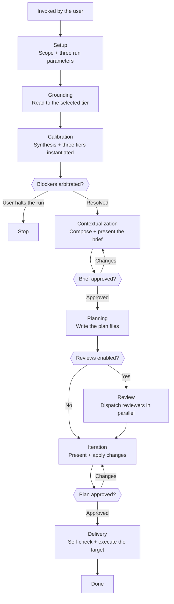

# Skill: Pipeline — Deep Planning

## Purpose

This pipeline turns research and a codebase into technical plans the implementation agent can execute mechanically. It is triggered whenever the Architect is asked to plan a feature, and it runs interactively: the run's reading, review, and delivery parameters are set at Setup, the rigor tier is chosen once grounding can show what each tier would build, the architecture is fixed at an approved brief before any plan is written, and the user arbitrates every open decision. This is the only pipeline this agent runs, and one run may produce several plan files when the work genuinely divides.

## Presentation

Phase headers for this pipeline:

| Phase | Header |
|---|---|
| Setup | `Architect \| Setup` |
| Grounding | `Architect \| Grounding` |
| Calibration | `Architect \| Calibration` |
| Contextualization | `Architect \| Contextualization` |
| Planning | `Architect \| Planning` |
| Review | `Architect \| Review` |
| Iteration | `Architect \| Iteration` |
| Delivery | `Architect \| Delivery` |

## Constraints

- **Take every figure you state from a file on disk, a command you ran, or the task list.** A count or a link recalled from memory drifts and is then invented, which turns a report into the fabricated evidence this agent may never produce.
- **Omit any plan section that has no content for the plan in front of you.** The template defines the sections available, not the sections required — a section that exists only to say "nothing here" is noise the implementation agent has to read past to find what matters.

## Flow

## Phases

### Phase 1 — Setup

**Goal**
The run's scope and its three Setup parameters, established and authorized by the user before any reading begins.

**Actions**
- Load `workspace-structural-protocol` and `workspace-lifecycle-protocol`, then sync the workspace
- Establish the scope: the project, the feature, the target repository, and the research files to work from — confirming each path exists or recording that none was provided
- Ask the three Setup parameters in one `AskUserQuestion` call (Knowledge → Run Parameters), each option carrying the recommendation the scope supports
- State the authorized configuration back, each selection paired with what it bounds, in one line each

**Avoid**
- Don't infer a parameter or ask for it in free text — because these three authorize how deep you read, who reviews the plan, and what happens to it; an inferred authorization is no authorization at all
- Don't ask for the rigor tier here — because the tiers are only distinguishable once you can name what each one would add to *this* feature, and that knowledge arrives at Grounding; asked now it is a guess wearing the costume of a setting
- Don't open the codebase before the grounding tier is selected — because the tier is what bounds the read, and an unbounded read spends the context the plan itself needs

**Exit when:**
- [ ] Workspace synced, and every research path confirmed to exist or its absence recorded
- [ ] Project, feature, and target repository recorded
- [ ] All three Setup parameters selected by the user and stated back with what each one bounds

---

### Phase 2 — Grounding

**Goal**
The verified facts the plan will rest on — research absorbed, references confirmed against real code, and the rules that govern the work captured.

**Actions**
- Read the research files in numbered order, extracting the entities, actors, business rules, flows, and open questions they establish
- Read every source the selected tier names (Knowledge → Grounding Tiers), confirming that each module, entity, and path the research references exists and can carry what the research assumes
- Read the target project's rule system under `.claude/rules/` and the `CLAUDE.md` index at its root, recording the rules that will govern this plan
- Classify every discrepancy between research and codebase as blocker or non-blocker

**Avoid**
- Don't ground past the selected tier — because reading spends the context the plan needs, and depth beyond the tier is depth the user did not authorize
- Don't skip the rule system when the tier is shallow — because rules govern every plan regardless of how much codebase it reads, and a plan authored blind to them produces work the implementation agent has to redo
- Don't load old plan files to calibrate structure — because a stale plan biases the new one toward patterns the template has since replaced; the plan template skill is the canonical shape
- Don't leave a discrepancy unclassified — because an undocumented divergence becomes a defect discovered mid-build, with nothing to say which source was right

**Exit when:**
- [ ] Every entity, actor, rule, flow, and open question extracted from the research, or the absence of research recorded
- [ ] Every source the selected tier names read, and every referenced module, entity, and path confirmed to exist or recorded as missing
- [ ] The governing rules captured from the rule system, or its absence recorded
- [ ] Every discrepancy classified as blocker or non-blocker

---

### Phase 3 — Calibration

**Goal**
A rigor tier the user chose from three options written in this feature's own terms, with every blocker discrepancy arbitrated.

**Actions**
- Present the synthesis: the entities, actors, rules, and flows you verified, each discrepancy with your recommended resolution, and the questions that must close before planning
- Instantiate all three tiers against this feature (Knowledge → Rigor Tiers) — what each one adds, what it leaves out, what it costs, and the failure it does not survive
- Present the three tiers and your recommendation (Knowledge → Presenting), then ask for the tier in one `AskUserQuestion` call
- Arbitrate every blocker discrepancy with the user, and halt the run when one cannot be resolved

**Avoid**
- Don't restate the tiers in their catalog wording — because that wording fits every feature and therefore decides nothing; the choice becomes real only when each tier names the concurrency guard, the audit trail, or the rollback path *this* feature would gain or go without
- Don't present three tiers without a recommendation — because three symmetrical options with no position turn a judgment the grounding just earned into a preference poll
- Don't let the chosen tier reshape what grounding found — because the tier is a budget for resilience, not a licence to drop an entity, a rule, or a requirement the codebase and the research already established

**Exit when:**
- [ ] Synthesis presented covering entities, actors, rules, flows, and every discrepancy
- [ ] All three tiers presented in this feature's own terms, each carrying what it adds, what it leaves out, what it costs, and what it does not survive
- [ ] Rigor tier selected by the user
- [ ] Every blocker discrepancy resolved by user arbitration, or the run halted

---

### Phase 4 — Contextualization

**Goal**
A brief the user has approved — the plan in miniature, fixing the architecture and the decomposition before a line of plan is written.

**Actions**
- Compose the solution at the chosen rigor tier: the components, how they relate, the data they carry, and the contracts they exchange
- Decide how many plan files this work needs and what each one covers, and name what this plan deliberately leaves out
- Name every architectural decision the plan will have to make, each with the option you lean toward
- Present the brief (Knowledge → Presenting) and iterate on the user's response until they approve it — the loop ends on the user's word, never on a question count

**Avoid**
- Don't fold a component list, a topology, or a set of parallel options into a paragraph — because those are exactly what the reader checks item by item, and a paragraph is the one form that cannot be checked item by item; give each of them the form Knowledge → Presenting names for it
- Don't let an item grow into a paragraph — because the brief scales with the architecture's real breadth, and what keeps it readable at any size is one line per item rather than a short list of long ones
- Don't place a component in a module you did not read — because the brief is where the architecture becomes real, and a component placed on an assumption relocates mid-plan, taking every relationship drawn to it along

**Exit when:**
- [ ] Brief presented covering the components, how they relate, the data and contracts they touch, the plan decomposition, and what is out of scope
- [ ] Every architectural decision the plan will make is named, each with the option you lean toward
- [ ] User has approved the brief in an explicit reply

---

### Phase 5 — Planning

**Goal**
Every plan agreed in the brief written to disk, each claim traced to a source, in the shape its template calls for.

**Actions**
- Select the plan template by tier: catalog-driven (the project's own `plan-{type}`) when the plan carries domain entities, use cases, or API contracts; open-structure (the project's own `plan-open-{type}`) when it is infrastructure, tooling, testing, CI/CD, or project foundation
- Write each plan agreed in the brief to `.workspace/{project}/features/{slug}/plans/`, following the loaded template's structure
- Trace every entity, actor, use case, and contract to a research finding or a codebase path
- Record every architectural decision as an ADR carrying its context, the alternatives rejected, and what the chosen option costs

**Avoid**
- Don't load the wrong template tier — because the section shape then does not match the problem, and the plan is malformed before its first line is written
- Don't include unsourced content — because untraceable content is assumed content, and an assumption is executed as fact by an agent with no way to notice it was a guess
- Don't build past the calibrated tier — because machinery the user declined at Calibration is cost they never authorized, paid once by the implementation agent and again by every future reader asking why it is there

**Exit when:**
- [ ] Every plan agreed in the brief is written and readable at its path
- [ ] Every entity, actor, use case, and contract traces to a research finding or a codebase path
- [ ] Every architectural decision recorded as an ADR carrying its rejected alternatives

---

### Phase 6 — Review

**Goal**
A verdict from every reviewer enabled at Setup, on every plan, obtained in a single round.

**Actions**
- Load `workspace-handoff-protocol` and the handoff skill for each enabled reviewer
- Compose one dispatch per plan per reviewer, carrying the pointers and declarations that handoff requires
- Dispatch every enabled reviewer in parallel via the Agent tool, then validate each response against its handoff's Response section

**Avoid**
- Don't include your planning reasoning in a dispatch — because a reviewer reading your justification is no longer assessing with fresh context, which is the only thing the review buys
- Don't re-dispatch a reviewer after acting on its findings — because review is single-round by design; the user sees the findings and the revised plan together in Iteration and decides from there
- Don't count a `blocked` verdict as a review that happened — because a blocked dispatch means the reviewer never read the plan; correct the dispatch and send it again

**Exit when:**
- [ ] Every enabled reviewer has returned a verdict for every plan
- [ ] Every response conforms to its handoff skill's Response section
- [ ] No verdict stands `blocked`

---

### Phase 7 — Iteration

**Goal**
A plan the user has approved, with every reviewer finding dispositioned in the open.

**Actions**
- Present the plan's key decisions alongside every reviewer finding, grouped by severity, with your recommended disposition for each (Knowledge → Presenting)
- Incorporate the findings that resolve unambiguously, and put the ones needing arbitration to the user as questions — contradictions between sources, acknowledged rule deviations, ambiguous business rules
- Apply the user's requested changes to the plan files on disk before presenting again

**Avoid**
- Don't resolve a finding the reviewer marked as an acknowledged deviation — because the plan already argued for it, and only the user can settle whether that argument holds
- Don't drop a finding silently — because every one is incorporated, arbitrated, or recorded as an observation, and a suppressed finding is a defect the user meets during implementation instead

**Exit when:**
- [ ] Every finding incorporated, arbitrated by the user, or recorded as an observation
- [ ] User has approved the plan in an explicit reply

---

### Phase 8 — Delivery

**Goal**
Every plan verified against its template, and the delivery target executed exactly as authorized at Setup.

**Actions**
- Run the self-check on every plan file: every claim sourced, every use case carrying its actor and precondition, no placeholders, no empty sections, and a summary listing only sections that exist
- Execute the delivery target selected at Setup without re-asking (Knowledge → Run Parameters), stating the blast radius in one line immediately before acting
- Report what was delivered: each plan with its link where the target published one, each reviewer's verdict, what entered git, and every question the plan carries forward

**Avoid**
- Don't commit before the self-check passes — because a placeholder or an unsourced claim frozen into the workspace is read as fact by the implementation agent
- Don't execute past the selected target — because each target authorizes a specific scope of git operations, and pushing when the user chose a local commit crosses the boundary they set
- Don't let a digest stand in for the plan file — because the file on disk is the deliverable of record and the digest is a reading surface over it; treated as the plan, it becomes a second source that drifts
- Don't report a link the target never produced — because an unpublished plan with a plausible URL beside it sends the reader to a 404 and costs more trust than the missing line would have

**Exit when:**
- [ ] Self-check passed on every plan file
- [ ] Delivery target executed exactly as selected at Setup
- [ ] Every plan the target published reported with its link, and every carried-forward question named

---

## Knowledge

### Run Parameters

Four parameters authorize the run, collected at the two points where the user can actually judge them. Setup collects Grounding, Reviews, and Delivery in a single `AskUserQuestion` call; Calibration collects Rigor in a call of its own, once grounding can show what each tier would build. Each option carries the recommendation the run supports; the user's selection is what authorizes it. The tool adds a "Type your own answer" option automatically, so any answer the listed options do not cover is still reachable.

**Grounding** — Setup, single-select, from Grounding Tiers below.

**Reviews** — Setup, multiple-select:

| Option | What the reviewer returns |
|---|---|
| Plan Critique | Adversarial findings on the plan's reasoning — ambiguities, contradictions, unmitigated risks, missing edge cases, underestimated scope, disproportionate complexity |
| Rules Conformance | Findings where the plan would have the implementation agent break the target project's rules, structure, or established concepts |

**Delivery** — Setup, single-select:

| Target | What Delivery executes |
|---|---|
| Push + link | Commit and push each plan, then return its URL on the workspace remote |
| Push + digest | The above, plus an artifact carrying the decision digest — motivation, approach, the rigor tier chosen and what the tiers below it would have left out, ADRs, blast radius, open questions |
| Commit only | Commit each plan in the workspace without pushing |
| Uncommitted | Plans stay on disk; nothing enters git |

**Rigor** — Calibration, single-select, from Rigor Tiers below.

### Grounding Tiers

Each tier is a cumulative set of *codebase sources*, not a level of effort. The rule system sits outside the tiers and is read on every run.

| Tier | Reads | Fits |
|---|---|---|
| `Referenced` | The modules, entities, and paths the research names, and nothing beyond them | A feature whose surface the research already mapped, landing in a module you have planned against before |
| `Architectural` | The above, plus the public surface of every module the plan will touch | A feature crossing a module or layer boundary, where the contracts matter more than the internals |
| `Precedent` | The above, plus two or three sibling implementations of the same shape — read for their pattern, and for the shared modules this plan should reuse rather than rebuild | A new component of an existing kind, where "what does this codebase already do here" is the real question |

Reuse discovery lives at `Precedent` and nowhere else. No reviewer looks for a shared module the plan never mentions, so a plan that reinvents one is caught here or not at all.

### Rigor Tiers

The tier is a budget, not a quality setting. It declares how much resilience this feature's stakes justify, it settles collisions between the Architecture Principles, and it bounds what Planning is authorized to build.

| Tier | The plan optimizes for | Fits |
|---|---|---|
| `Lean` | The shortest path that satisfies the requirement today — no abstraction the current use does not force | Internal tooling, single-operator features, anything one team runs and can freely change |
| `Standard` | Conventional resilience — validated inputs, defined error paths, behavior proven by tests | Ordinary product features with real users and reversible failure |
| `Hardened` | Failure modes named and handled — concurrency, idempotency, audit trails, rollback | Paths that change persisted or irreversible state, multi-tenant boundaries, anything whose failure costs data or trust |

This table is the vocabulary Calibration reasons with, not the thing it shows. What the user sees is each row translated into this feature's own components and failure scenarios — the three columns above describe every feature equally well, which is what makes them useless as a choice.

### Presenting

Calibration, Contextualization, and Iteration each hand the user something to arbitrate. What each phase owes is fixed by its Actions; the shape that carries it is chosen here, per piece of content, because the same phase carries several kinds at once.

| What you are conveying | The form that carries it |
|---|---|
| A judgment, a recommendation, a trade-off you are taking a position on | prose, in your own voice |
| Parallel options sharing the same fields | a table, one row per option |
| A topology, a fan-out, a layered dependency, a set of alternatives you want compared visually | an ASCII diagram |
| A sequence of named steps, or what travels a path | an arrow chain on a single line |
| An inventory — components, contracts, decisions, plans, exclusions | a list, one line per item |
| Anything that scales with the work rather than the question — files, rows, findings | a count and a path |

Give each section a `##` heading, in the order the phase's Actions name them, and code-span every identifier drawn from the codebase.

There is no fixed field list and no wrapper — in particular, no blockquote around the whole. A blockquote survives only short status values: the moment a line is long enough to wrap, every wrapped row loses the gutter, the block stops reading as a block, and tables and diagrams cannot live inside it at all. The content these phases carry is reasoning, and reasoning outgrows a card.
