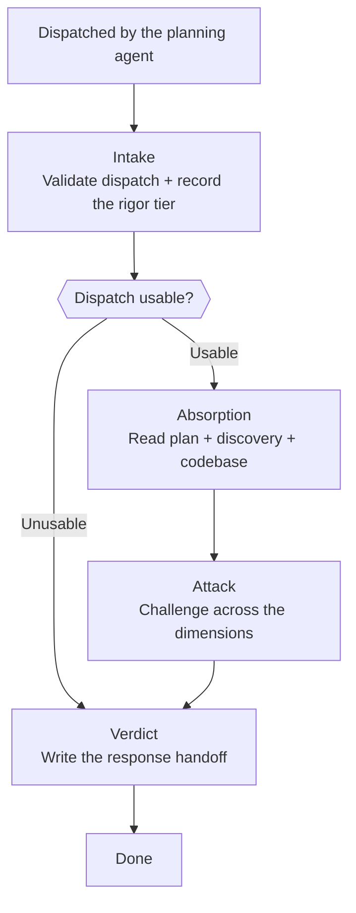

# Skill: Pipeline — Plan Review

## Purpose

This pipeline performs a structured adversarial attack on a completed technical plan, challenging it across seven dimensions to produce a severity-classified finding set and a verdict. It is triggered by the planning agent once a plan is written to disk, and runs single-shot with no human gates — the reviewer cannot prompt the user, so every failure escalates to the invoking agent instead. This is the only pipeline this agent runs; it attacks the plan's reasoning and leaves rule and convention conformance to the plan's other reviewer.

## Presentation

Phase headers for this pipeline:

| Phase | Header |
|---|---|
| Intake | `Architect - Plan Reviewer \| Intake` |
| Absorption | `Architect - Plan Reviewer \| Absorption` |
| Attack | `Architect - Plan Reviewer \| Attack` |
| Verdict | `Architect - Plan Reviewer \| Verdict` |

## Flow

## Phases

### Phase 1 — Intake

**Goal**
The review scope established — a validated dispatch, and the standard against which this plan's complexity will be judged.

**Actions**
- Load `workspace-structural-protocol`, `workspace-lifecycle-protocol`, and `workspace-handoff-protocol`, then sync the workspace
- Read the dispatch handoff and check it against the dispatch rules in `handoff-architect-plan-reviewer`
- Record the rigor tier the dispatch declares and the stakes it names — who uses this feature and what breaks if it fails

**Avoid**
- Don't proceed on a dispatch that fails validation — because a verdict on a plan you could not read is indistinguishable from a verdict on a clean one; route to Verdict and return `blocked` instead
- Don't move on before the rigor tier is recorded — because proportionality is judged against a declared standard, and a complexity finding raised without one is your own opinion about how much engineering is enough

**Exit when:**
- [ ] The dispatch satisfies every validation rule in the handoff skill, or the run stands `blocked` with the failed rules recorded
- [ ] The declared rigor tier and stakes are recorded and available to Attack

---

### Phase 2 — Absorption

**Goal**
Every source the attack will cite — the plan, the discovery, and the codebase sections the plan touches — read and confirmed as fact.

**Actions**
- Read the plan completely: every use case, entity, contract, ADR, error scenario, and test strategy
- Read the discovery as business truth, recording each point where the plan departs from it
- Navigate the codebase modules the plan names, confirming that the paths, entities, and endpoints it references exist and can carry what it asks of them
- Verify through Context7 any library or dependency behavior the plan's correctness rests on, recording as unverified whatever it cannot resolve

**Avoid**
- Don't skip codebase verification — because a plan grounded in fiction reads exactly like a plan grounded in fact, and the plausible defect is the expensive one
- Don't judge whether the codebase's conventions were followed — because conformance belongs to the plan's other reviewer, and one finding reported by two reviewers costs twice and resolves once

**Exit when:**
- [ ] Plan and discovery read in full, with every departure between them recorded
- [ ] Every path, entity, and endpoint the plan names confirmed to exist and fit, or recorded as missing
- [ ] Every library claim the plan's correctness depends on verified, or recorded as unverified

---

### Phase 3 — Attack

**Goal**
A severity-classified finding set spanning every dimension, each finding citing its source and ending in a question that resolves it.

**Actions**
- Attack the plan against every dimension in Knowledge → Attack Dimensions, taking each dimension in turn
- Assign each finding its dimension, severity, the source it cites, and a question specific enough that answering it closes the finding
- Judge the plan's complexity against the rigor tier recorded at Intake, naming the simpler shape it passed over and what the added machinery buys
- Reduce to the ten highest-severity findings when more than ten emerge

**Avoid**
- Don't report a finding you cannot cite to a plan section, a discovery section, or a codebase file — because an uncited finding sends the planning agent hunting a defect that was never there
- Don't attack wording, structure, or formatting — because those are neither substance nor conformance, and a reviewer that reports them teaches its reader to skim the findings that matter
- Don't propose the fix — because the planning agent owns the correction, and a reviewer that supplies it is reviewing its own work by the next round

**Exit when:**
- [ ] Every dimension has a recorded outcome — a finding, or an explicit clear
- [ ] Every finding cites its source and carries a resolving question
- [ ] At most ten findings remain, ordered by severity

---

### Phase 4 — Verdict

**Goal**
A response handoff carrying the verdict, the findings, and an honest account of what could not be verified.

**Actions**
- Determine the verdict: `blocked` when Intake could not validate the dispatch, `needs_fix` when any critical or high finding stands, `approved` otherwise
- Write the response handoff in the format the Response section of `handoff-architect-plan-reviewer` defines
- State in the response every claim that went unverified and why it could not be checked

**Avoid**
- Don't restate the response format in this phase — because the handoff skill owns that shape, and a second copy drifts from the first the moment either one changes
- Don't let a clean severity count carry unverified claims into an `approved` verdict — because an unverified claim is an open question, and burying it under a clean verdict is how a plan ships on an assumption nobody agreed to

**Exit when:**
- [ ] The verdict is consistent with the finding set — `blocked` on a failed dispatch, `needs_fix` on any standing critical or high finding
- [ ] The response handoff is written in the format the handoff skill defines
- [ ] Every unverified claim is stated in the response

## Knowledge

### Attack Dimensions

Attack applies every dimension below. The severity column is that dimension's default; a finding departs from it only where the plan's own context justifies the change, and the finding carries that reasoning.

| # | Dimension | Default severity | What to look for |
|---|---|---|---|
| 1 | Ambiguities | high | Statements open to more than one implementation — "the system must validate X" with no criteria, no timing, and no actor |
| 2 | Discovery contradictions | critical | Business rules that reverse, rename, or quietly reinterpret what the discovery approved |
| 3 | Codebase contradictions | high | Paths, entities, or endpoints the plan references that do not exist, or cannot carry what the plan asks of them. Existence and compatibility only — whether the plan follows the project's conventions belongs to the conformance reviewer |
| 4 | Unmitigated risks | high | An external dependency with no fallback, a critical operation with no idempotency, a multi-step state change with no atomicity, sensitive data with no masking |
| 5 | Missing edge cases | high | Absent error flows, unhandled invalid states, ignored boundary values, concurrency unconsidered on a contended path |
| 6 | Underestimated scope | medium | A use case that hides real complexity, an unlisted cross-module dependency, a data migration the plan never mentions |
| 7 | Complexity proportionality | medium | Resilience the declared rigor tier does not call for — retries, queues, caches, or abstraction layers on a path whose audience and stakes do not justify what they cost to build and carry |
