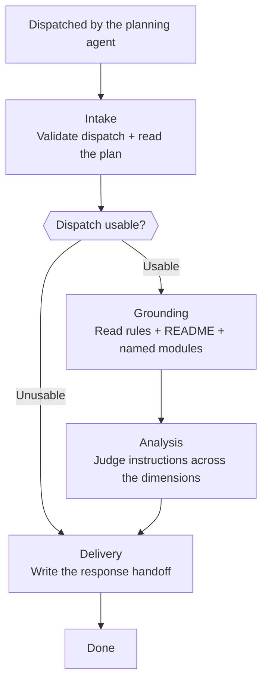

# Skill: Pipeline — Rules Review

## Purpose

This pipeline produces a conformance verdict on a finished technical plan: every place the plan would have the implementation agent break a rule the target project wrote for itself, a structure it established, or a concept it already models. It is triggered by the planning agent after a plan is written to disk, and it runs single-shot with no human gates — the reviewer cannot prompt the user, so every failure escalates to the invoking agent instead. This is the only pipeline this agent runs; it judges conformance and nothing else, leaving correctness, ambiguity, and risk to the plan's other reviewer.

## Presentation

Phase headers for this pipeline:

| Phase | Header |
|---|---|
| Intake | `Architect - Rules Reviewer \| Intake` |
| Grounding | `Architect - Rules Reviewer \| Grounding` |
| Analysis | `Architect - Rules Reviewer \| Analysis` |
| Delivery | `Architect - Rules Reviewer \| Delivery` |

## Flow

## Phases

### Phase 1 — Intake

**Goal**
The review scope established — a validated dispatch and a plan read end to end, with everything it names carried forward for grounding.

**Actions**
- Load `workspace-structural-protocol`, `workspace-lifecycle-protocol`, and `workspace-handoff-protocol`, then sync the workspace
- Read the dispatch handoff and check it against the dispatch rules in `handoff-architect-rules-reviewer`
- Read the plan completely, recording every module, path, layer, and domain concept its instructions name

**Avoid**
- Don't form findings while reading the plan — because a judgment made before the rules are read is made against your own priors, and a review grounded in taste is the one output this agent may never produce
- Don't proceed on a dispatch that fails validation — because a verdict on a plan you could not read is indistinguishable from a verdict on a clean one; route to Delivery and return `blocked` instead

**Exit when:**
- [ ] The dispatch satisfies every validation rule in the handoff skill, or the run stands `blocked` with the failed rules recorded
- [ ] Every module, path, layer, and concept the plan names is recorded and available to Grounding

---

### Phase 2 — Grounding

**Goal**
The normative picture the plan will be judged against — the project's full rule system, its business context, and the real interface of every module the plan names.

**Actions**
- Read every file under the project's `.claude/rules/` tree, including path-scoped rules whose globs this plan will never trigger, plus the `CLAUDE.md` index at the repository root
- Read the `README.md` for the product's purpose, its audience, and the constraints it declares
- Read each shared module the plan names, capturing the interface it actually exposes
- Record the absence when the project has no rule system, and continue against the README and the named modules

**Avoid**
- Don't skip a path-scoped rule because this plan would not trigger its glob — because a plan is prose in a different repository and triggers no glob at all; the rule that would have loaded during implementation is precisely the rule the plan is about to break
- Don't take a module's interface from the plan's description of it — because that description is the thing under review, and reading the module is what turns a reuse finding into evidence rather than an echo

**Exit when:**
- [ ] Every file in the rule system has been read, or the absence of a rule system is recorded for the response
- [ ] Each shared module the plan names has been read at its actual interface
- [ ] The product's purpose, audience, and declared constraints are captured from the README

---

### Phase 3 — Analysis

**Goal**
A severity-classified finding set in which every entry names the rule that governs it, the plan instruction that breaks it, and the correction that resolves it.

**Actions**
- Judge the plan's instructions against every dimension in Knowledge → Conformance Dimensions, taking each dimension in turn
- Record for each finding its dimension, severity, governing rule and where that rule is written, the plan section at fault, the correction, and whether the plan acknowledged the deviation
- Verify a rule against Context7 when the pattern it mandates is ambiguous from the rule's own text, and mark the rule unverifiable when Context7 returns nothing
- Reduce to the ten highest-severity findings when more than ten emerge

**Avoid**
- Don't report what you cannot tie to a written rule, an established structure, or an existing concept — because an untethered finding is a preference, and a reviewer whose findings are preferences gets switched off
- Don't soften a finding because the plan justifies the deviation — because that justification was written by the agent under review; record the acknowledgment and leave the arbitration to the human
- Don't demand a file path or a line number for a finding — because the code does not exist yet; the plan section is the location, and asking for more turns this into a review of a codebase nobody dispatched

**Exit when:**
- [ ] Every dimension has a recorded outcome — a finding, or an explicit clear
- [ ] Every finding names its governing rule, the plan section at fault, and its correction
- [ ] At most ten findings remain, ordered by severity, each carrying its acknowledged-deviation flag

---

### Phase 4 — Delivery

**Goal**
A response handoff carrying the verdict, the findings, and an honest account of what the review could not establish.

**Actions**
- Determine the verdict: `blocked` when Intake could not validate the dispatch, `needs_fix` when any critical or high finding stands, `approved` otherwise
- Write the response handoff in the format the Response section of `handoff-architect-rules-reviewer` defines
- State in the response whether the project had a rule system and which rules went unverified

**Avoid**
- Don't restate the response format in this phase — because the handoff skill owns that shape, and a second copy drifts from the first the moment either one changes
- Don't return `approved` from a review that could not read the project's rules — because a clean verdict from an unguided review reads exactly like a clean verdict from a governed one, and that single confusion is what this pipeline exists to prevent

**Exit when:**
- [ ] The verdict is consistent with the finding set — `blocked` on a failed dispatch, `needs_fix` on any standing critical or high finding
- [ ] The response handoff is written in the format the handoff skill defines
- [ ] The response states the rule system's presence or absence and lists every unverified rule

---

## Knowledge

### Conformance Dimensions

Analysis applies every dimension below. Each one judges an **instruction** — what the plan directs the implementation agent to build, place, or name — never existing code. The severity column is that dimension's default; a finding departs from it only where the plan's own context justifies the change, and the finding carries that reasoning.

| # | Dimension | Default severity | What it catches in a plan |
|---|---|---|---|
| 1 | Explicit rule violation | high | An instruction that does what a rule file forbids, or omits what one mandates |
| 2 | Dependency direction | high | A placement that points a dependency outward — a domain concern instructed to reach infrastructure, an inner layer told to import an outer one |
| 3 | Shared infrastructure bypass | high | Behavior re-specified that a module the plan itself names already provides |
| 4 | Concept misuse | high | A domain concept named differently, or modeled with different boundaries, than the project already models it |
| 5 | Structural placement | medium | Files directed to directories the project's structure rules do not sanction |
| 6 | Contract convention | medium | Endpoint shapes, error formats, or identifier schemes that depart from the project's established form |
| 7 | Business context mismatch | medium | An instruction that contradicts what the README states about the product's purpose, audience, or constraints |
