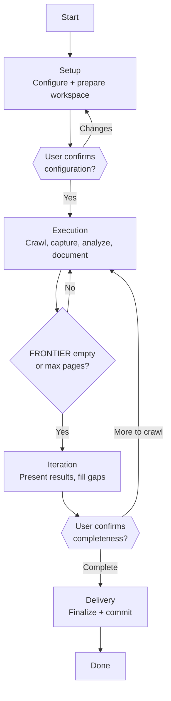

# Skill: Pipeline — Direct Crawl

## Purpose

This pipeline captures the visual and structural state of a web application by navigating its pages, taking screenshots, visually analyzing each captured state, and producing structured view files and a complete crawl record. It is triggered when the user directly requests a crawl with a target URL or list of URLs. It is the only Crawler pipeline — it handles the full lifecycle from configuration through delivery in a single sequential pass with two human-in-the-loop gates.

## Presentation

Phase headers for this pipeline:

| Phase | Header |
|---|---|
| Setup | `Crawler \| Setup` |
| Execution | `Crawler \| Execution` |
| Iteration | `Crawler \| Iteration` |
| Delivery | `Crawler \| Delivery` |

## Flow

## Phases

### Phase 1 — Setup

**Goal**
Configure the crawl, prepare the workspace, and get user confirmation before any execution begins.

**Actions**
- Load `workspace-structural-protocol`, `workspace-lifecycle-protocol`, and `workspace-crawl-protocol` skills; sync workspace
- Collect all crawl configuration parameters via the AskUserQuestion tool (scope, application target, device target, navigation discovery mode, dynamic content wait, max pages, folder structure preferences) — AskUserQuestion accepts at most 4 questions per call, so split these across two calls (group related parameters together) rather than asking one at a time; create crawl folder structure (`screenshots/`, `views/`, `flows/` as configured)
- Write initial `README.md` with scope and configuration snapshot; write initial `FRONTIER.md` with all seed URLs in the Pending table at `high` priority

**Avoid**
- Don't proceed without user confirmation — because crawl configuration determines how many pages are visited and how aggressively links are followed; starting with wrong parameters wastes a full crawl cycle

**Exit**
Workspace prepared. Initial files written. User has confirmed configuration. Ready to begin crawling.

---

### Phase 2 — Execution

**Goal**
Produce a screenshot, visual analysis, and view file for every URL in the FRONTIER before context window compaction can lose the data.

**Actions**
- For each URL in the FRONTIER Pending table in priority order (`high` before `normal`): navigate via Playwright MCP (`browser_navigate`); take a full-page screenshot (`browser_screenshot`) and save to `screenshots/{NN}-{slug}.png`; `Read` the screenshot and analyze it for visual layout, color scheme, information hierarchy, sections, key data values, and interactive elements; extract DOM metadata via `browser_snapshot` (page title, final URL, element data); write view file to `views/{NN}-{slug}.md` following the `workspace-crawl-protocol` template combining the visual analysis and DOM metadata
- After each view file: update FRONTIER.md (move URL from Pending to Visited, record screenshot path and timestamp); discover new URLs per the configured Navigation discovery mode and add to Pending at `normal` priority with source page noted
- Repeat until the FRONTIER Pending table is empty or the Max pages limit is reached

**Avoid**
- Don't batch artifact writes until the end — because context window compaction between turns can lose information; each URL gets its full artifact set (screenshot, visual analysis, view file) immediately to prevent data loss
- Don't fabricate screenshots or visual descriptions — because every screenshot must come from an actual Playwright capture and every description from actually reading and analyzing the image; fabricated content destroys the crawl's value as a factual record
- Don't add URLs to the FRONTIER that were not discovered from an actual page — because invented URLs produce phantom entries that cannot be visited and corrupt the crawl record

**Exit**
FRONTIER Pending table is empty or Max pages limit reached. All visited URLs have screenshots, visual analyses, and view files.

---

### Phase 3 — Iteration

**Goal**
Present crawl results and fill any gaps the user identifies before finalizing.

**Actions**
- Present a crawl summary to the user: total pages visited, screenshots captured, view files produced, any pages skipped or failed
- Ask whether anything was missed (expected pages absent, pages to revisit); if gaps are identified, add missing URLs to FRONTIER.md Pending and return to Execution; repeat until the user confirms completeness

**Avoid**
- Don't impose a limit on the Execution → Iteration loop — because the user decides whether more crawling is needed; the loop is unbounded by design and only ends when the user explicitly says so

**Exit**
User explicitly confirms the crawl is complete and no further exploration is needed.

---

### Phase 4 — Delivery

**Goal**
Finalize the crawl record, pass the CRAWL quality check, and commit.

**Actions**
- Write the final README.md sections: Results (page counts) and Notable Findings
- Run the CRAWL quality framework check from `workspace-crawl-protocol`: **C**omplete (every declared URL visited or accounted for), **R**eal (screenshots from actual capture, view files from actual observation), **A**ccounted (every URL has a final state), **W**ell-named (filenames describe contents), **L**inked (screenshots, view files, FRONTIER entries, and README references all agree); fix any quality issues found
- Commit and push the crawl record

**Avoid**
- Don't commit before the CRAWL quality check passes — because committing without it produces a crawl record with gaps, stale entries, or broken cross-references; the quality check is the gate between "execution complete" and "deliverable ready"

**Exit**
CRAWL quality check passes. Crawl record committed and pushed to the workspace.
