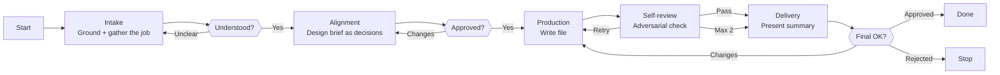

# Skill: Pipeline — Agent Creation

## Purpose

Produces a complete, validated agent file from a user's description of a job that needs an agent. It runs interactively with three human gates: understanding confirmed, design brief approved, final file approved. The user owns the job definition; Demiurge owns the design proposal — every configuration choice (model, effort, tools, topology) is Demiurge's reasoned recommendation for the user to judge, never a question the user must answer cold. Distinguished from Agent Validation (evaluates existing files) and Agent Update (modifies existing files) by starting from zero.

## Presentation

Phase headers for this pipeline:

| Phase | Header |
|---|---|
| Intake | `Demiurge \| Intake` |
| Alignment | `Demiurge \| Alignment` |
| Production | `Demiurge \| Production` |
| Self-review | `Demiurge \| Self-review` |
| Delivery | `Demiurge \| Delivery` |

## Flow

## Phases

### Phase 1 — Intake

**Goal**
A grounded understanding of the job the new agent must do and the system it joins — solid enough to design from, with nothing left to guess.

**Actions**
- Load the `forge-agent` skill, then read the existing fleet: every agent's frontmatter and Identity at minimum, and the full file of any agent with adjacent scope — map where the new agent fits, what it overlaps, who will invoke it, and whom it will need
- Ask the user about the **job, not the configuration**: what the agent must produce, what it must never do, who triggers it and when, what success looks like, product or domain scope, and hard constraints — in AskUserQuestion batches of at most 4, with questions sharpened by what the fleet reading revealed
- Restate the job in your own words, surface every contradiction or vague area immediately, and iterate until the user confirms the restatement is right

**Avoid**
- Don't ask the user to pick model, effort, or tools at intake — because that inverts the roles: the user owns the job description, you own the design proposal; configuration questions at intake produce a transcription, not a design
- Don't design before reading the fleet — because overlaps and topology conflicts are invisible until you look; a new agent that duplicates an existing one is waste the user discovers late
- Don't collect answers and silently resolve contradictions later — because a contradictory understanding becomes a contradictory agent file with the user's apparent approval

**Exit when:**
- [ ] The job, boundaries, invokers, and success criteria are restated in your own words and confirmed by the user
- [ ] The fleet has been read and the new agent's position — overlaps, gaps, topology — is mapped
- [ ] Every surfaced contradiction has a user resolution

---

### Phase 2 — Alignment

**Goal**
An approved design brief in which every consequential choice is presented as a decision with a named rejected alternative — including a deliberately designed tool grant.

**Actions**
- Compose the brief as **decisions, not facts**: for identity and boundaries, topology (who invokes it, whom it invokes, whom it never invokes), model and effort, pipelines (count, names, modes, gates), and key constraints — state your choice, the strongest alternative you rejected, and why the choice wins
- Design the tool grant as its own deliberation: walk the built-in tool reference in `forge-agent` group by group against the agent's responsibilities, propose each grant with a one-line justification, and name what you deliberately withheld and why — an agent missing a coordination tool fails silently at the exact moment it needs to follow up
- Present the brief, then put the two or three genuinely contested decisions to the user as AskUserQuestion options with your recommendation first; iterate until every decision is explicitly agreed or deferred with an agreed default

**Avoid**
- Don't present a coverage checklist as a brief — because a list of settled facts invites rubber-stamping; a decision with a visible alternative forces the user to actually judge it
- Don't compress the tool grant into one line — because tools are the agent's capability boundary: an unjustified grant hides both scope creep and the missing tool the agent will need mid-run
- Don't proceed to Production with an unresolved open question — because drafting with ambiguities embeds design decisions the user never approved

**Exit when:**
- [ ] Every design area in the brief carries a decision with its rejected alternative
- [ ] The tool grant lists per-tool justifications and an explicit withheld list, both user-approved
- [ ] The user has explicitly agreed to every decision, with agreed defaults for anything deferred

---

### Phase 3 — Production

**Goal**
A complete agent file on disk that translates the approved brief faithfully, with every section surviving `forge-agent`'s directives and `forge-principles`' wording craft.

**Actions**
- Load the `forge-principles` skill, then write `agents/{Name}.md` in the canonical section order from `forge-agent`, verifying each section against that section's directives before writing the next
- Apply the principles as you write, naming the one that drives each non-obvious wording choice — positive framing on constraints, the why attached to every boundary, load-bearing rules at section edges — and pass over the principles that don't bite on this agent; an invoked principle that changes nothing is ceremony
- Translate the brief without additions: every decision lands in its section, and anything the brief turns out to be missing is a gap to surface at the next gate, not a choice to improvise inline
- Keep the file contents out of the conversation — confirm only the path

**Avoid**
- Don't invent design during drafting — because production is translation; a new decision made while writing bypasses the gate the entire Alignment phase exists to provide
- Don't leave placeholders, TBDs, or empty sections — because incomplete sections ride silently into the delivered artifact and mislead every future reader

**Exit when:**
- [ ] The file is on disk, all sections filled in canonical order, no placeholders
- [ ] Every brief decision is traceable to the section that implements it

---

### Phase 4 — Self-review

**Goal**
A draft certified against the adversarial dimensions and the full quality checklist before the user ever sees a summary.

**Actions**
- Read the draft back from disk — never review from memory
- Attack it against the `forge-principles` Review Lens — procedural steps vs. goals, over-specification, instruction load, load-bearing rule position, bare prohibitions, unattached whys, example anchoring, ceremony structure, cross-section contradictions
- Run adversarial review across six dimensions: vagueness (hedging replaced with definitive language), contradictions (identity vs. pipeline vs. tools), missing specifications (any point where the agent would improvise), cross-section consistency (skills in Pipeline appear in Tools; constraints match Identity; model and effort match the role), template compliance (`forge-agent` Do/Don't directives), and substantive quality (would a model reading this prompt behave as intended?)
- Run the structural quality checklist from `forge-agent`, fix every failing item, and if fixes are substantial re-read the file and re-run the review on the changed sections

**Avoid**
- Don't review from memory — because the model fills recollection gaps with plausible but incorrect content; only the file on disk shows what was written rather than what was intended
- Don't stop at the first failing check — because defects cluster: a contradiction in Identity usually signals inconsistency elsewhere; run all dimensions before fixing anything

**Exit when:**
- [ ] All six adversarial dimensions and the full quality checklist pass on the file as read from disk
- [ ] Any items still failing after two review iterations are recorded for explicit surfacing in Delivery

---

### Phase 5 — Delivery

**Goal**
A concise decision summary that lets the user give a final verdict with full knowledge of what was decided on their behalf.

**Actions**
- Present: the file path; the key design decisions, especially where the delivered design departs from the user's original framing and why; which authoring principles actually shaped the artifact and which were passed over; trade-offs found during self-review and how they were resolved; any unresolved items or edge cases
- If the user requests changes, apply them on disk, re-run the adversarial self-review, and present the updated summary before asking for approval again
- Confirm the file is final on explicit user approval

**Avoid**
- Don't duplicate the file content in conversation — because the user can read it at the path provided; the summary's value is the decisions, not the text
- Don't present the summary before self-review passes — because surfacing a file with known defects transfers the quality burden to the user

**Exit when:**
- [ ] The user has approved the file, or rejected it with the file left on disk as reference
- [ ] Every unresolved self-review item was explicitly surfaced, none silently dropped
