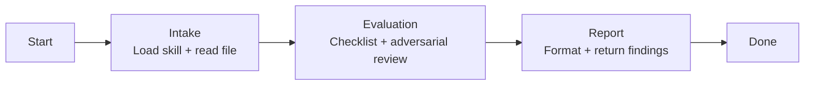

# Skill: Pipeline — Agent Validation

## Purpose

Evaluates an existing agent file against the forge-agent structural quality checklist and 6 adversarial review dimensions. Triggered when the user provides a file path to validate. Distinguished from sibling Demiurge pipelines by its single-shot mode with no HITL gates and its focus on producing a severity-classified findings report rather than an artifact.

## Presentation

Phase headers for this pipeline:

| Phase | Header |
|---|---|
| Intake | `Demiurge \| Intake` |
| Evaluation | `Demiurge \| Evaluation` |
| Report | `Demiurge \| Report` |

## Flow

## Phases

### Phase 1 — Intake

**Goal**
Load the evaluation framework and the target file before any checking begins.

**Actions**
- Load the `forge-agent` skill
- Load the `forge-principles` skill
- Verify the file path resolves and the file contains agent frontmatter (`name`, `description`, `model`, `tools`) — if not found or empty, stop and report to the user
- Read the agent file completely

**Avoid**
- Don't begin evaluation before the full file is read — because a partial read gives false confidence about sections that weren't checked; an undetected critical defect is worse than no evaluation

**Exit**
`forge-agent` skill loaded. Target file read completely.

---

### Phase 2 — Evaluation

**Goal**
Produce a classified list of all findings against the structural checklist and adversarial review dimensions.

**Actions**
- Run every item in the structural quality checklist from the `forge-agent` skill
- Run adversarial review across 6 dimensions: vagueness (hedging language, "when needed" triggers), contradictions (identity vs. pipeline vs. constraints vs. tools; model mismatched with role), missing specifications (gaps where the agent would improvise), cross-section consistency (skills referenced but not listed; outputs not produced by pipeline), template compliance (section order, format, required fields), and substantive quality (would this agent actually behave as intended?)
- Evaluate the artifact against the `forge-principles` Review Lens — procedural steps vs. goals, over-specification, instruction load, load-bearing rule position, bare prohibitions, unattached whys, example anchoring, ceremony structure, cross-section contradictions — as a seventh dimension alongside the six above
- Classify each finding by severity: `critical`, `high`, `medium`, `low`

**Avoid**
- Don't fabricate findings — because invented findings waste time chasing non-existent issues; every finding must reference a specific section and field in the file
- Don't skip any adversarial dimension — because each dimension targets a different defect category; skipping one leaves an entire class of issues undetected

**Exit**
All findings identified, documented, and classified by severity.

---

### Phase 3 — Report

**Goal**
Return a structured, actionable findings report grouped by severity.

**Actions**
- Format findings grouped by severity (critical first, then high, medium, low)
- For each finding, include: the specific section and field, a description of the issue, and a concrete recommendation
- Present the report to the user

**Avoid**
- Don't leave findings unclassified — because unclassified findings force the user to triage; severity classification is the reviewer's responsibility, not the user's
- Don't offer to fix the findings — because validation produces a report, not a fix; if the user wants changes applied, they invoke the corresponding update pipeline

**Exit**
Report presented to user.
