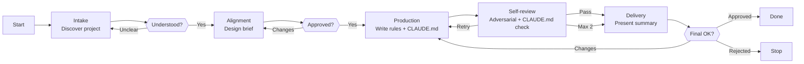

# Skill: Pipeline — MDC Creation

## Purpose

Produces a complete, validated `.claude/rules/` rule system and its generated root `CLAUDE.md` from a user's project description or codebase analysis. Triggered when the user requests creation of a new MDC rule set. It runs interactively with 3 HITL gates across a 5-phase flow, producing a rule set in three tiers — foundation, concerns, components — that loads natively, plus the `CLAUDE.md` orientation file that introduces the project and its task-triggered rules.

Supports both **greenfield** projects (no codebase exists — rules are scaffolded from a description of language, framework, and architectural style) and **existing codebases** (rules are extracted by analyzing the project's conventions, patterns, and structure).

## Presentation

Phase headers for this pipeline:

| Phase | Header |
|---|---|
| Intake | `Demiurge \| Intake` |
| Alignment | `Demiurge \| Alignment` |
| Production | `Demiurge \| Production` |
| Self-review | `Demiurge \| Self-review` |
| Delivery | `Demiurge \| Delivery` |

## Flow

## Phases

### Phase 1 — Intake

**Goal**
Produce a complete picture of the project's conventions and component types from which the rule set can be designed without guessing.

**Actions**
- Load the `forge-mdcs` skill
- Determine whether the project is greenfield or existing: for greenfield, gather language, framework, architectural style, team conventions, file naming patterns, and component types; for existing codebases, use Read, Glob, and Grep to extract conventions — do not ask the user what you can discover yourself
- Ask structured questions to fill gaps: language and framework, component types the agent will create or modify, architecture (feature-based, layered, flat, monorepo), naming and error handling conventions, quality standards, and which rules each tier needs (foundation, concerns, components)
- Flag ambiguities immediately — do not collect answers and silently resolve contradictions later

**Avoid**
- Don't ask one question at a time — because sequential back-and-forth turns a structured intake into a multi-turn interrogation; group related questions into AskUserQuestion calls of up to 4 questions each, and run the few calls back-to-back
- Don't assume a framework or language — because every rule's examples, terminology, and patterns must match the actual project; rules built for a default stack break or mislead on a different one
- Don't proceed if the project description is too vague to design rules — because vague requirements produce rules that enforce assumptions, not conventions; tell the user explicitly what detail is needed

**Exit**
Complete understanding of what rules the project needs and what each rule should cover. User confirms understanding is complete.

---

### Phase 2 — Alignment

**Goal**
Produce an approved design brief that commits the complete rule list before any drafting begins.

**Actions**
- Produce a **design brief** covering: project context (language, framework, architecture), complete list of every rule file organized by tier (foundation always-apply; concerns classified always-apply vs path-scoped, with task-triggered ones flagged; components with path globs), the CLAUDE.md plan (Intro + trigger rows for task-triggered rules), loading model summary
- Proactively flag concerns: component types without a component rule, cross-cutting practices or patterns without a concern, naming conventions that overlap between foundation and a component rule, path globs that are too broad, a concern left always-apply that should be path-scoped, missing foundation architecture rule
- Iterate until every rule and its scope are agreed upon; mark deferred questions with an explicit default you will use

**Avoid**
- Don't skip the Alignment phase and draft immediately — because rushing to draft produces rules that enforce conventions the user never agreed to
- Don't proceed to drafting with unresolved open questions — because ambiguities silently become design choices in the rule files without the user knowing they were made

**Exit**
User explicitly approves the complete rule list and their content scope. No open questions remain (or deferred ones have agreed defaults).

---

### Phase 3 — Production

**Goal**
Write every rule file in canonical format so the full rule set passes the forge-mdcs quality checklist.

**Actions**
- Load the `forge-principles` skill before writing any artifact content — it governs instruction wording (goal-over-procedure, specificity budget, positive framing, load-bearing rule position); the per-artifact forge skill governs section structure
- Create the `.claude/rules/` tier structure (`foundation/`, `concerns/`, `components/<layer>/`) and write each rule file in the rule template from `forge-mdcs`: frontmatter is `paths` only (globs for path-scoped rules; omitted entirely for always-apply), blockquoted Purpose with IS/IS-NOT boundary, Rules as ✅ Do / 🚫 Don't directive tables with mechanism-level reasons, optional Reference, and Patterns (import-free ✅ Correct + inline 🚫 Wrong) for component/concern rules. No `## Checklist`, no `## References`, no `anti-patterns/` folder.
- Generate `CLAUDE.md` at the repo root per `forge-mdcs`: a short project Intro, the two-line loading explanation, and a trigger table with one row per task-triggered rule (natural-language trigger + backticked path — never `@`-imports, no rule bodies); verify each file against the per-file quality checklist from `forge-mdcs`
- Confirm all file paths in conversation — do not output any file content in chat

**Avoid**
- Don't leave placeholders, TBDs, or empty sections — because incomplete rules produce undefined Claude Code behavior at the points where guidance is most needed
- Don't output file contents in conversation — because the user can read files at the paths provided; duplication wastes context without adding value

**Exit**
All `.claude/rules/` files and `CLAUDE.md` written to disk. All per-file checklist items pass.

---

### Phase 4 — Self-review

**Goal**
Certify the full rule set passes all quality and adversarial checks before the user sees a summary.

**Actions**
- Read every rule file back from disk — never review from memory
- Attack the draft against the `forge-principles` Review Lens — procedural steps vs. goals, over-specification, instruction load, load-bearing rule position, bare prohibitions, unattached whys, example anchoring, ceremony structure, cross-section contradictions
- Run adversarial review across 6 dimensions: vagueness (hedging language in rules; vague Purpose sections; reasons that restate instead of naming a mechanism; overly broad or narrow path globs), contradictions (rules that conflict across files; terminology inconsistencies; tier/loading mismatches), missing specifications (component types without a component rule; cross-cutting practices or patterns without a concern; common mistakes without an inline 🚫 Wrong), CLAUDE.md (every task-triggered rule has exactly one trigger row with a correct natural-language trigger and backticked path; no file-bound rule in the table; no `@`-imports; no rule bodies inlined), template compliance (each rule has the required sections in canonical order; correct `paths` frontmatter for its tier; no `anti-patterns/` folder), substantive quality (would an agent reading these rules produce consistent code; are examples realistic and import-free; are reasons convincing enough to prevent the agent from bending the rule?)
- Run the complete quality checklist from `forge-mdcs` (per-file, cross-file, and project-level); fix every failing item; if fixes are substantial, re-read changed files and re-run review

**Avoid**
- Don't review from memory — because the model fills recollection gaps with plausible but incorrect content; only reading the actual files catches what was written vs. what was intended
- Don't ship files that fail the quality checklist — because known-defective rules erode trust in the pipeline's quality guarantee; surface unresolved items to the user in Delivery instead

**Exit**
All adversarial dimensions pass. All quality checklist items pass. No known issues remain. (If 2 review iterations exhausted without full pass, unresolved items are surfaced in Delivery.)

---

### Phase 5 — Delivery

**Goal**
Present a concise summary and confirm the rule set is final with the user.

**Actions**
- Present a concise summary: directory path, file count by tier (N foundation, N concerns, N components) plus CLAUDE.md, key design decisions (especially those that differ from what the user originally described and why), loading model summary (which rules are always-apply vs. path-scoped, and which carry trigger rows), any concerns or edge cases the user should be aware of
- If the user requests changes, apply them to the files on disk and re-run adversarial self-review before presenting the updated summary
- Confirm the rule set is final on explicit user approval

**Avoid**
- Don't duplicate file contents in conversation — because the user can read files at the provided paths; summarizing decisions is more useful than reprinting content
- Don't skip re-running adversarial review after user-requested changes — because incremental edits can introduce cross-file inconsistencies that weren't present in the reviewed draft

**Exit**
User approves the rule set, or user rejects and the files remain as a reference.
