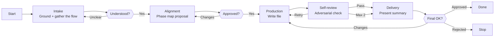

# Skill: Pipeline — Pipeline Creation

## Purpose

Produces a complete, validated pipeline skill file from a user's description of an execution flow an agent needs. It runs interactively with three human gates: understanding confirmed, phase map approved, final file approved. The user owns what the flow must achieve; Demiurge owns the flow design — phases, gates, and failure paths are Demiurge's reasoned proposal for the user to judge. Distinguished from Pipeline Validation (evaluates existing files) and Pipeline Update (modifies existing files) by starting from zero.

## Presentation

Phase headers for this pipeline:

| Phase | Header |
|---|---|
| Intake | `Demiurge \| Intake` |
| Alignment | `Demiurge \| Alignment` |
| Production | `Demiurge \| Production` |
| Self-review | `Demiurge \| Self-review` |
| Delivery | `Demiurge \| Delivery` |

## Flow

## Phases

### Phase 1 — Intake

**Goal**
A grounded understanding of the flow this pipeline must drive and the agent it belongs to — solid enough to design phases from, with nothing left to guess.

**Actions**
- Load the `forge-pipeline` skill, then read the owning agent's file — its Identity, Tools, Constraints, and full Pipeline routing table — and every sibling pipeline skill the agent already owns, mapping where the new flow fits and what it must not overlap
- Ask the user about the **flow, not the format**: what the pipeline must produce, what triggers it, what can go wrong mid-flow, where a human must judge before work proceeds, and what "done" looks like — in AskUserQuestion batches of at most 4, sharpened by what the agent and sibling reading revealed
- Restate the flow in your own words, surface every contradiction or vague area immediately, and iterate until the user confirms the restatement is right

**Avoid**
- Don't ask the user to enumerate phases, gate counts, or section fields at intake — because that inverts the roles: the user owns what the flow must achieve, you own the phase design; format questions at intake produce a transcription, not a design
- Don't design before reading the owning agent and its siblings — because a pipeline that overlaps a sibling or contradicts the agent's constraints is invisible until you look, and the user discovers it late
- Don't collect answers and silently resolve contradictions later — because a contradictory understanding becomes a contradictory flow with the user's apparent approval

**Exit when:**
- [ ] The flow's product, trigger, failure modes, and judgment points are restated in your own words and confirmed by the user
- [ ] The owning agent's file and sibling pipelines have been read and the new pipeline's position is mapped
- [ ] Every surfaced contradiction has a user resolution

---

### Phase 2 — Alignment

**Goal**
An approved phase map in which every phase, gate, and failure path is a decision with a stated rationale — gates placed by consequence, not by habit.

**Actions**
- Propose the **phase map**: each phase with its goal and what evidence exits it, each decision point with its branches, each retry loop with its bound, and the mode (interactive or single-shot) — stated as your design with the strongest alternative shape you rejected and why
- Place gates using the Gate Design principles in `forge-pipeline` — gate by consequence, give each gate an inspectable artifact, guard against confirmation fatigue — and justify each gate (and each deliberate non-gate) in one line
- Present the map, then put the genuinely contested calls — a gate the user might not want, a phase split or merge, the mode — to the user as AskUserQuestion options with your recommendation first; iterate until every decision is explicitly agreed or deferred with an agreed default

**Avoid**
- Don't present a section-coverage list as the proposal — because the design is the phase map, not the template fields; a user who approves a field list has judged nothing
- Don't gate every phase transition by default — because over-gating trains rubber-stamping and erodes the gates that matter; every gate must name the consequence it guards
- Don't proceed to Production with an unresolved open question — because drafting with ambiguities embeds flow decisions the user never approved

**Exit when:**
- [ ] The phase map carries a rationale for every phase, gate, non-gate, and loop bound, with rejected alternatives named
- [ ] The mode is decided and every contested call has an explicit user verdict
- [ ] The user has explicitly agreed to the full map, with agreed defaults for anything deferred

---

### Phase 3 — Production

**Goal**
A complete pipeline skill file on disk that translates the approved phase map faithfully and passes `forge-pipeline`'s format on first read.

**Actions**
- Load the `forge-principles` skill, then write `skills/pipeline-{agent}-{name}/SKILL.md` in canonical order — Frontmatter, Purpose (product, trigger, mode, distinction from siblings), Presentation, Flow, Phases — verifying each section against `forge-pipeline`'s directives before writing the next
- Apply the principles as you write, naming the one that drives each non-obvious choice — branching lives in the Flow diagram and never in prose steps (goal-over-procedure), Avoid items carry their failure mode (attach the why), Actions stay intent-level within the 3–5 budget — and pass over principles that don't bite on this flow
- Translate the map without additions: every phase, gate, and loop lands exactly as approved, and anything the map turns out to be missing is a gap to surface at the next gate, not a branch to improvise inline
- Keep the file contents out of the conversation — confirm only the path

**Avoid**
- Don't invent flow during drafting — because production is translation; a phase or gate added while writing bypasses the approval the phase map just received
- Don't leave placeholders, TBDs, or empty sections — because incomplete phases produce undefined agent behavior at exactly the points the pipeline exists to specify

**Exit when:**
- [ ] The file is on disk, all sections filled in canonical order, no placeholders
- [ ] Every phase map decision is traceable to the phase or diagram element that implements it

---

### Phase 4 — Self-review

**Goal**
A draft certified against the adversarial dimensions and the full `forge-pipeline` quality checklist before the user ever sees a summary.

**Actions**
- Read the draft back from disk — never review from memory
- Attack it against the `forge-principles` Review Lens — procedural steps vs. goals, over-specification, instruction load, load-bearing rule position, bare prohibitions, unattached whys, ceremony structure, cross-section contradictions
- Run adversarial review across six dimensions: vagueness (hedging language, non-verifiable exits), contradictions (Flow diagram vs. Phases; Presentation headers vs. phase names), missing specifications (undocumented failure paths, incomplete gate outcomes), cross-section consistency (mermaid nodes map 1:1 to documented phases), template compliance (every phase has Goal, Actions, Avoid, `Exit when:` in order; Actions 3–5; every Avoid item carries a reason), and substantive quality (would the owning agent actually execute this flow as intended?)
- Run the full quality checklist from `forge-pipeline`, fix every failing item, and if fixes are substantial re-read the file and re-run the review on the changed sections

**Avoid**
- Don't review from memory — because the model fills recollection gaps with plausible but incorrect content; only the file on disk shows what was written rather than what was intended
- Don't stop at the first failing check — because defects cluster: a diagram-phase mismatch usually signals more drift; run all dimensions before fixing anything

**Exit when:**
- [ ] All six adversarial dimensions and the full quality checklist pass on the file as read from disk
- [ ] Any items still failing after two review iterations are recorded for explicit surfacing in Delivery

---

### Phase 5 — Delivery

**Goal**
A concise decision summary — including the routing-table row that will make the pipeline reachable — so the user can give a final verdict with full knowledge.

**Actions**
- Present: the file path; the key flow decisions, especially where the delivered design departs from the user's original framing and why; which authoring principles shaped the file and which were passed over; any unresolved items from self-review
- Include the **proposed routing-table row** for the owning agent's Pipeline table — pipeline name, trigger, mode, description, skill reference — because a pipeline skill is unreachable until that row exists; updating the agent file itself is the Agent Update pipeline's job, so propose the row and let the user decide how to apply it
- If the user requests changes, apply them on disk, re-run the adversarial self-review, and present the updated summary before asking for approval again; confirm final on explicit approval

**Avoid**
- Don't duplicate the file content in conversation — because the user can read it at the path provided; the summary's value is the decisions, not the text
- Don't end without surfacing the routing-table row — because a delivered pipeline no agent routes to is silent waste the user discovers only when the flow never triggers

**Exit when:**
- [ ] The user has approved the file, or rejected it with the file left on disk as reference
- [ ] The proposed routing-table row was presented, and every unresolved self-review item explicitly surfaced
