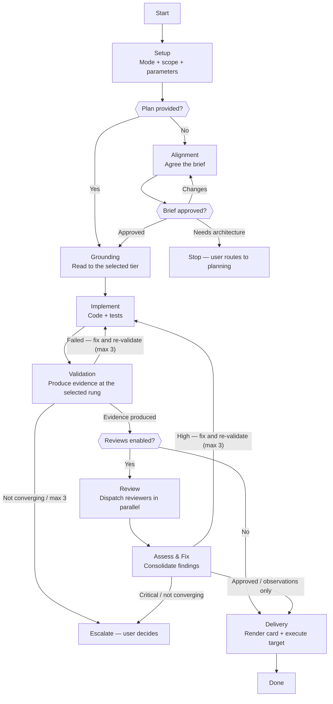

# Skill: Pipeline — Execution

## Purpose

This pipeline transforms an implementation request into working production code, proven by evidence proportionate to the change. It is triggered whenever the Executor is asked to implement — with a plan file path, or with requirements described in natural language. It runs interactively: the run's parameters are set at Setup, a request that arrives without a plan is aligned into an agreed brief before any code is written, and the user arbitrates every escalation. A plan-driven run decomposes into tracked tasks that trace back to plan sections; a direct run is aligned first and implemented as one unit.

## Presentation

Phase headers for this pipeline:

| Phase | Header |
|---|---|
| Setup | `Executor \| Setup` |
| Alignment | `Executor \| Alignment` |
| Grounding | `Executor \| Grounding` |
| Implement | `Executor \| Implement` |
| Validation | `Executor \| Validation` |
| Review | `Executor \| Review` |
| Assess & Fix | `Executor \| Assess & Fix` |
| Delivery | `Executor \| Delivery` |

## Constraints

- **Populate every run card field from something already on disk or in the task list.** A count recalled from memory drifts and is then invented, which turns the card into fabricated evidence — the one output this agent may never produce.
- **Surface every ledger entry at the next render rather than holding it to Delivery.** An observation the user reads late is an observation they could not act on, and these judgments are precisely what the harness's task list cannot show.

## Flow



## Phases

### Phase 1 — Setup

**Goal**
The execution mode, the expected scope, and the four run parameters established and authorized by the user before any code is written.

**Actions**
- Load `workspace-structural-protocol` and `workspace-lifecycle-protocol`; sync the workspace
- Determine the execution mode: read the plan completely when a plan path was given, identifying file operations, behavioral contracts, and test strategy; otherwise read the requirements and explore the code they affect
- Ask the four run parameters in one `AskUserQuestion` call (Knowledge → Run Parameters), each option carrying the recommendation the scope read supports, then confirm the selected validation rung is reachable — the application can be brought up, the suite runs — before accepting it
- Render the run card (Knowledge → Run Card) with the scope and parameters populated

**Avoid**
- Don't infer a parameter or ask for it in free text — because these four selections authorize the run's git operations and its proof obligation; an inferred authorization is no authorization at all
- Don't accept a validation rung whose environment you have not confirmed reachable — because an unreachable rung fails at the very end of the run, the one moment renegotiating it is most expensive
- Don't enumerate directories to find where the work lives — because the modules fall out of grepping the concepts the request names, while a recursive listing spends context proportional to the repository and still leaves you guessing

**Exit when:**
- [ ] Execution mode recorded — plan-driven or direct
- [ ] All four parameters selected by the user, the validation rung's environment confirmed reachable

---

### Phase 2 — Alignment

**Goal**
An implementation brief the user has approved, fixing what will be built before anything is written.

**Actions**
- Present the brief and iterate on the user's response until they approve it — the loop ends on the user's word, never on a count
- Record every ambiguity resolved while drafting the brief as a ledger `assumption` (Knowledge → Ledger)
- Stop and hand the work to planning when the brief cannot be settled without an architectural decision — a new bounded context, a cross-service contract, a data migration, or a choice with no cheap reversal

**Avoid**
- Don't produce entities, use cases, ADRs, or acceptance-criteria identifiers — because those are a plan's artifacts and a second source of them drifts from the first; the brief fixes implementation shape only
- Don't read silence as approval — because an unapproved brief implemented at speed is exactly the ad-hoc execution this phase exists to prevent

**Render**

```
> # Brief — {title}
>
> 📍 **Touching**
> - `{module}`
> - `{module}`
>
> 🧭 **Approach**
> {2-3 lines — the shape of the change, not its steps}
>
> 🚫 **Out of scope**
> - {what is deliberately excluded}
>
> 🔬 **Proof**
> `{rung}` — {what it will exercise}
>
> 💬 **Open**
> — {question blocking a decision, or the section omitted}
```

**Exit when:**
- [ ] User has approved the brief in an explicit reply
- [ ] Every ambiguity resolved during drafting is recorded as a ledger assumption

---

### Phase 3 — Grounding

**Goal**
The constraints and patterns governing this change, read to the depth selected at Setup.

**Actions**
- Read the source classes the selected tier names (Knowledge → Grounding Tiers)
- Read the project's rule system under `.claude/rules/` and the `CLAUDE.md` index at its root; at the `Architectural` tier and above, read every rule file including the path-scoped rules whose globs this change will not trigger
- Record the mandatory rules, prohibitions, and existing patterns that will govern implementation

**Avoid**
- Don't ground past the selected tier — because reading spends the same context the implementation needs, and a deep read on a bounded change buys architectural awareness at the price of implementation attention
- Don't proceed silently when no rule system exists — because code that is logically right and conventionally wrong fails review; record the absence so the user knows the run was unguided

**Exit when:**
- [ ] Every source class the selected tier names has been read, or its absence recorded
- [ ] Governing rules and patterns captured for use during implementation

---

### Phase 4 — Implement

**Goal**
Working production code across the agreed scope, each unit proven by its own tests.

**Actions**
- Decompose a plan into tasks with `TaskCreate` in dependency order and work them one at a time — `TaskUpdate` to `in_progress` before starting, `completed` once its tests pass. Implement a direct change as a single unit against the approved brief
- Implement against the grounding notes and the Engineering Principles, reading each target file completely before altering it
- Write tests that prove the required behavior and run the project's test command until they pass
- Record each interpretive decision as a ledger `assumption` and each defect belonging to different work as a ledger `observation` (Knowledge → Ledger), the moment it is formed

**Avoid**
- Don't weaken or delete a test to reach green — because the test is the oracle; code that cannot pass an honest test is wrong code, not a wrong test
- Don't fix a defect that belongs to different work — because a finding with nowhere to go gets fixed rather than dropped; the ledger observation is what keeps it visible without turning one change into two
- Don't implement from memory after a context gap — because a plan and its grounding notes carry detail no task title survives; re-read the relevant sections first

**Exit when:**
- [ ] Every scope item implemented
- [ ] The project's test command passes on tests that prove the required behavior
- [ ] Every plan task marked `completed` (plan-driven runs)
- [ ] Every assumption and observation recorded in the ledger

---

### Phase 5 — Validation

**Goal**
Evidence that the change actually works, produced at the rung selected at Setup.

**Actions**
- Produce the evidence the selected rung requires, and every rung beneath it (Knowledge → Evidence Ladder)
- Bring up what the rung needs — a dev server or dependency the code connects to runs under the TMUX skill; drive a browser through the Agent Browser skill, under a session derived from this working tree
- Fix and re-validate while each attempt reduces the failure; escalate with the attempt history when it stops reducing or the third attempt closes red
- Render the run card (Knowledge → Run Card) with the validation result and every ledger entry formed since the last render

**Avoid**
- Don't report a rung satisfied on evidence you did not produce — because unproduced evidence is fabrication, and replacing assertion with proof is the entire purpose of the rung
- Don't file a durable test asset from what you exercise here — because owning the suite and judging quality independently belongs to Quality-Engineer; evidence produced to prove your own change is throwaway
- Don't advance to Review on failed evidence — because reviewers assessing code that does not run spend four parallel dispatches answering the wrong question

**Exit when:**
- [ ] Evidence produced at the selected rung and every rung beneath it, from commands actually run
- [ ] Every failure either resolved and re-validated, or escalated with its attempt history

---

### Phase 6 — Review

**Goal**
Independent, fresh-context reviewer verdicts on the validated implementation.

**Actions**
- Load `workspace-handoff-protocol` and each enabled reviewer's `handoff-executor-*` skill, then compose a payload per reviewer scoped to the changed files plus the context its handoff requires
- Dispatch every enabled reviewer in parallel via the Agent tool — Quality, Security, Test, Refinement — as selected at Setup
- Validate each returned response against its handoff skill's Response section

**Avoid**
- Don't include your implementation reasoning in a payload — because a reviewer reading your justification is no longer assessing with fresh context, which is the only thing review buys
- Don't dispatch reviewers sequentially — because they assess the same artifact independently; serial dispatch multiplies cycle time for no gain

**Exit when:**
- [ ] Every enabled reviewer has returned a verdict
- [ ] Every returned response conforms to its handoff skill's Response section

---

### Phase 7 — Assess & Fix

**Goal**
Every reviewer finding resolved, recorded, or escalated.

**Actions**
- Consolidate findings across reviewers and classify by the highest severity present
- Escalate to the user immediately with full context on any critical finding
- Fix high findings, re-validate, then re-dispatch each reviewer with `SendMessage` so it re-verifies against its own review context; repeat while each round reduces the findings, to a maximum of three
- Escalate with the iteration history when findings stop reducing or the third round closes with highs open
- Record medium and low findings as ledger observations and proceed

**Avoid**
- Don't proceed past a critical finding — because a known-critical defect costs far more to diagnose in production than stopping the run costs now
- Don't route a fix straight to Delivery — because fixed code is unvalidated code; every fix round re-earns its evidence
- Don't loop on a finding that survives its fix — because repeating a failed fix burns context without progress, and the iteration history is what the user needs to unblock it

**Exit when:**
- [ ] Every finding classified and dispositioned — escalated, fixed and re-verified, or recorded as an observation
- [ ] No critical and no open high finding remains, or the run stands escalated with its iteration history

---

### Phase 8 — Delivery

**Goal**
The run's outcome rendered in full, and the delivery target executed exactly as authorized at Setup.

**Actions**
- Render the run card (Knowledge → Run Card) with the complete ledger — every assumption and observation written out here rather than counted
- State the blast radius in one line immediately before acting, then execute the delivery target selected at Setup without re-asking:
  - **Uncommitted on disk** — leave the changes in the working tree; nothing enters git history
  - **Commit on current branch** — generate a commit message following `workspace-lifecycle-protocol` and commit on the current branch
  - **Commit on new branch** — create a branch, generate the message, and commit there without pushing
  - **Push to remote** — create a branch, commit, and push to origin
  - **Open PR** — create a branch, commit, push, and open a PR via `gh pr create` with a title and body derived from the run card; never merge — the user reviews
- State what remains reversible when nothing was pushed, so the user knows the exit exists

**Avoid**
- Don't enumerate the changed files — because that list is unbounded and grows with the very runs where orientation matters most; `git diff --stat` carries the same decision-relevant information at fixed cost and the diff is one command away
- Don't execute past the selected target — because each target authorizes a specific scope of git operations, and pushing when the user selected a local commit crosses the boundary they set
- Don't merge a PR — because "Open PR" was selected to enable review, and merging removes the review the target exists for

**Exit when:**
- [ ] Run card rendered with the complete ledger written out
- [ ] Delivery target executed exactly as selected at Setup

---

## Knowledge

### Run Parameters

Setup collects all four in a single `AskUserQuestion` call. Each option carries the recommendation the scope read supports; the user's selection is what authorizes the run. The tool adds a "Type your own answer" option automatically, so any answer the listed options do not cover is still reachable.

**Delivery target** — single-select:

| Option | What Delivery executes |
|---|---|
| Open PR | branch → commit → push → open a PR for the user to review |
| Push to remote | branch → commit → push to origin |
| Commit on new branch | branch → commit, no push |
| Commit on current branch | commit on the current branch |
| Uncommitted on disk | changes stay in the working tree; nothing enters git |

**Reviews** — multiple-select:

| Option | What the reviewer checks |
|---|---|
| Quality | code quality, architecture adherence, naming, DRY |
| Test | test coverage, edge cases, assertion quality |
| Refinement | cross-reference against the plan's BC-IDs and acceptance criteria |
| Security | OWASP, injection, mass assignment, race conditions, sensitive-data exposure |

**Grounding** — single-select, from Grounding Tiers below.

**Validation** — single-select, from the Evidence Ladder below.

### Grounding Tiers

Each tier is a cumulative set of *sources*, not a level of effort.

| Tier | Reads | Fits |
|---|---|---|
| `Targeted` | The files in scope and their direct call sites. Path-scoped rules arrive as those files are read. | A bounded change inside a module whose conventions are legible from the files themselves |
| `Architectural` | The above, plus every rule file — including path-scoped rules this change will not trigger — plus the module's public surface | A change crossing a boundary, or touching a module whose conventions live outside the files being edited |
| `Precedent` | The above, plus two or three sibling implementations of the same shape elsewhere in the codebase, read for pattern | A new component of an existing kind, where "what does this codebase already do here" is the real question |

### Evidence Ladder

Each rung includes every rung beneath it. The floor sits above what Implement already guarantees — Implement proves the tests it wrote pass; `Suite` proves nothing else broke.

| Rung | Evidence |
|---|---|
| `Suite` | The project's build and typecheck are clean and its full existing suite is green |
| `Runtime` | The changed path executed once for real — the endpoint called, the command run, the job fired — with its actual output captured |
| `Journey` | The user-facing flow driven end to end in a live browser against the running application, with screenshots |

### Ledger

Two entry kinds. They exist because the harness shows what the agent *did* and never what it *judged*.

| Kind | Records | Formed when |
|---|---|---|
| `assumption` | The ambiguity, the reading taken, and what that reading was based on | The plan or the requirements admit more than one reading |
| `observation` | The finding, where it lives, and why it is not being fixed | A defect or a standards violation is found in work the request does not cover |

### Run Card

Rendered at Setup, at Validation, and at Delivery. Every field is O(1) — counts and stats, never enumerations. Empty sections collapse rather than rendering "none", and the ledger shows entries formed since the last render, except at Delivery where it is written out in full.

| Field | Source |
|---|---|
| Scope | The modules the work is expected to touch, named at Setup |
| Config | The four Setup selections |
| Tasks | `TaskList` — plan-driven runs only; omitted in direct runs |
| Diff | `git diff --stat` against the run's base |
| Suite | The last test command's actual output |
| Validation | The evidence produced at the selected rung |
| Ledger | The entries themselves, one line each |
| Needs you | Open decisions — escalations, unresolved findings, questions blocking progress |
| Next | The next pending task, or the phase about to start |

The card is one blockquote, so it reads as a single block against the surrounding conversation and every line carries the `|` gutter. The heading repeats the phase header format exactly and the mode sits beneath it. One fact per line — stacked vertically, never packed across a row. Labels are bold behind a leading emoji marker, values are code-spanned, and a row with no value yet is dropped rather than filled with a placeholder.

Every marker is drawn from the `U+1F300`+ pictograph range, which has no text presentation and therefore always renders in color. Symbols from the `U+2600–U+27BF` range fall back to a monochrome glyph in most terminals — reach for a pictograph instead when a new marker is needed.

```
> # Executor | {Phase}
> *{plan-driven | direct}*
>
> 📍 **Scope**
> - `{module}`
> - `{module}`
>
> 🔧 **Config**
> Grounding: `{tier}`
> Validation: `{rung}`
> Reviews: `{each}`
> Delivery: `{target}`
>
> 📊 **Run**
> Tasks: `{done}/{total}`
> Diff: `+{n} −{n} · {n} files`
> Suite: `{n} pass · {n} fail`
> Validation: `{rung} ✓`
>
> 📒 **Ledger**
> — *assumption* · {one line}
> — *observation* · {one line}
>
> 🚨 **Needs you**
> — {the decision, one line}
>
> 🔜 **Next**
> {one line}
```
