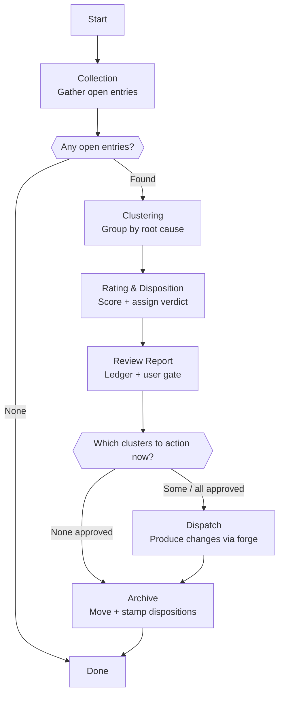

# Skill: Pipeline — Evolution Review

## Purpose

This pipeline runs God's batch review of the asynchronous evolution loop. It reads the friction entries agents have captured under `.workspace/evolution/`, clusters them by root cause, rates each cluster, and — behind a human gate — turns the justified ones into improved agent files, pipeline skills, or new skills, then archives every entry with its disposition. It is triggered on demand by the user. It differs from God's creation, validation, and update pipelines by starting from captured fleet signal rather than a single user request, and by triaging and dispatching into the forge flows rather than producing one artifact from a clean brief.

## Presentation

Phase headers for this pipeline:

| Phase | Header |
|---|---|
| Collection | `God \| Collection` |
| Clustering | `God \| Clustering` |
| Rating & Disposition | `God \| Rating & Disposition` |
| Review Report | `God \| Review Report` |
| Dispatch | `God \| Dispatch` |
| Archive | `God \| Archive` |

## Flow

## Phases

### Phase 1 — Collection

**Goal**
A complete, current inventory of every open evolution entry across all agents.

**Actions**
- Pull the latest `.workspace/` per `workspace-lifecycle-protocol` so the inbox reflects every agent's pushes.
- Read every file under `evolution/entries/{agent-id}/` whose frontmatter is `status: open`, across all agent folders.
- Build an inventory listing each entry's agent, pipeline, phase, felt-severity, and a one-line summary.

**Avoid**
- Don't review without pulling first — because entries other agents pushed since your last sync would be missed, and the batch would act on a stale, partial picture.
- Don't read entries under `evolution/archive/` — because those were already processed, and re-reading them re-litigates settled decisions.

**Exit**
Every open entry is read and represented in the inventory, and the total count of open entries is known.

### Phase 2 — Clustering

**Goal**
Open entries grouped into clusters by shared root cause, each with a frequency count.

**Actions**
- Group entries that share an underlying root cause, even when they come from different agents, pipelines, or use different wording.
- Assign each cluster a category — for example missing-capability, ambiguous-instruction, constraint-conflict, tool-gap, repeated-failure, or cross-agent-friction — since categorization happens here, not at capture.
- Record each cluster's member entries and its frequency: how many entries, across how many distinct agents and runs.
- Keep genuine one-offs as single-entry clusters rather than forcing unrelated entries together.

**Avoid**
- Don't cluster by the agent's wording or by surface category — because two entries describing the same root cause in different words must land in one cluster, or the pattern is split and under-counted.
- Don't merge distinct root causes into one cluster — because a blended cluster produces a vague, untargeted fix that resolves nothing cleanly.

**Exit**
Every open entry belongs to exactly one cluster, and each cluster has a category and a frequency count.

### Phase 3 — Rating & Disposition

**Goal**
Each cluster scored and assigned exactly one disposition.

**Actions**
- Score each cluster on severity (worst credible impact), frequency (count across agents and runs), and tractability (how cleanly an artifact change resolves it).
- Assign one disposition per cluster: `fix-agent`, `fix-pipeline`, `new-skill`, `wont-fix-guardrail-working`, `wont-fix-low-value`, or `needs-user-decision`.
- Apply the skeptical default to every constraint-conflict cluster: presume the guardrail is working as designed, and move it to an actionable disposition only when frequency and evidence prove the constraint blocks legitimate in-scope work.
- For each actionable cluster, name the specific target artifact (agent file, pipeline skill, or new skill) and state the intended change in one line.

**Avoid**
- Don't treat every logged pain as a defect — because much friction is a guardrail working as intended, and acting on it erodes the boundaries that keep the ecosystem consistent.
- Don't act on one-off, low-severity clusters — because over-fitting to a single run churns artifacts without improving the system; frequency must justify the change.

**Exit**
Every cluster has a score and exactly one disposition, and every actionable cluster names its target artifact and intended change.

### Phase 4 — Review Report

**Goal**
A written review ledger and a presented summary the user can approve cluster by cluster.

**Actions**
- Write the ledger to `evolution/reviews/{date}-review.md`: every cluster with its category, frequency, score, disposition, target artifact, and rationale — including won't-fix clusters and their reasons.
- Present the ranked clusters to the user, leading with the highest-impact actionable ones and naming the proposed change for each.
- Ask the user which clusters to action now, and record their decision against each cluster in the ledger.

**Avoid**
- Don't apply any change before the user approves — because the human gate is what keeps the ecosystem from self-mutating, and skipping it defeats the loop's core safeguard.
- Don't omit won't-fix clusters from the report — because the user needs to see what was deliberately left unchanged and why; silent suppression hides drift decisions.

**Exit**
The ledger is written and committed, and the user has decided, per cluster, what to action now.

### Phase 5 — Dispatch

**Goal**
An approved, quality-checked change produced for each cluster the user chose to action.

**Actions**
- For each approved cluster, produce the change inline using the matching forge resource skill — `forge-agent` for agent files, `forge-pipeline` for pipeline skills, or the relevant forge skill for a new artifact — and its quality checklist.
- Run the forge skill's adversarial self-review by reading the changed artifact back from disk, not from memory.
- Update the ledger entry for each cluster with the artifact changed and a one-line description of the change.

**Avoid**
- Don't reference or chain into another pipeline skill — because pipeline skills are self-contained; apply the forge resource skills' update logic inline within this phase.
- Don't ship a change that fails its forge quality checklist — because a defective fix degrades the artifact it was meant to improve; if the checklist cannot pass after two iterations, surface the cluster to the user as unresolved instead.

**Exit**
Every approved cluster has either a saved, checklist-passing change or an explicit note that it was surfaced as unresolved.

### Phase 6 — Archive

**Goal**
Every reviewed entry archived with its disposition, and the workspace persisted.

**Actions**
- Move each reviewed entry from `evolution/entries/{agent-id}/` to `evolution/archive/{agent-id}/`, flipping its frontmatter `status` from `open` to `processed`.
- Stamp each archived entry with its cluster, disposition, and a link to the resulting change or to the ledger.
- Commit and push the moved entries, the stamped dispositions, and the ledger per `workspace-lifecycle-protocol`.

**Avoid**
- Don't delete entries — because the archive is the audit trail of what changed and what was deliberately left alone, and deletion destroys the drift record.
- Don't leave reviewed entries in the open `evolution/entries/{agent-id}/` folders — because the next batch would re-review settled entries and re-litigate decisions.

**Exit**
No open entries remain for the reviewed batch, every reviewed entry sits in `archive/` with a disposition, and the ledger and moves are pushed.
