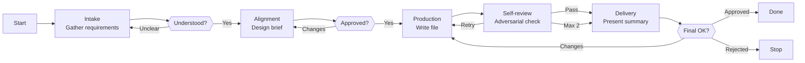

# Skill: Pipeline — Handoff Creation

## Purpose

Produces a complete, validated handoff skill file from a user's natural language description. Triggered when the user requests creation of a new handoff skill. Distinguished from sibling God pipelines by its 5-phase interactive flow with 3 HITL gates and its focus on designing a bilateral handoff contract between sender and receiver agents that follows the forge-handoff design guide.

## Presentation

Phase headers for this pipeline:

| Phase | Header |
|---|---|
| Intake | `God \| Intake` |
| Alignment | `God \| Alignment` |
| Production | `God \| Production` |
| Self-review | `God \| Self-review` |
| Delivery | `God \| Delivery` |

## Flow

## Phases

### Phase 1 — Intake

**Goal**
Produce a complete set of design inputs from which the handoff contract can be drafted without guessing.

**Actions**
- Load the `forge-handoff` skill
- Ask structured questions covering every decision the handoff requires: sender and receiver agents with their roles, trigger condition (which pipeline phase or event), payload mode (pointing vs. composing and how the user decided), payload fields (name, type, required/optional, description for each), validation rules the receiver must apply, error handling on validation failure, and naming pattern
- Flag ambiguities immediately — do not collect answers and silently resolve contradictions later

**Avoid**
- Don't ask one question at a time — because sequential back-and-forth turns a structured intake into a multi-turn interrogation; group related questions into AskUserQuestion calls of up to 4 questions each, and run the few calls back-to-back
- Don't proceed if the user's description is too vague to ask targeted questions — because guessing produces artifacts that match assumptions, not requirements; tell the user explicitly what level of detail is needed
- Don't silently choose between pointing and composing payload modes — because the choice has structural consequences in the file; surface the decision and justify it with the user

**Exit**
Every question the skill requires can be answered. No guesses remain. User confirms understanding is complete.

---

### Phase 2 — Alignment

**Goal**
Produce an approved design brief that commits all decisions before any drafting begins.

**Actions**
- Produce a **design brief** covering: sender and receiver with roles, trigger condition, payload mode with justification, payload fields table (name, type, required/optional, description), validation rules, error handling, file naming pattern, any impact on sender or receiver agent prompts, known open questions
- Proactively flag concerns: pointing payload where composing would be needed (or vice versa), receiver agent missing `workspace-handoff-protocol` in its skills, missing error handling for validation failure, payload field overlap with an existing handoff skill
- Iterate until every decision is agreed upon; mark deferred questions with an explicit default you will use

**Avoid**
- Don't skip the Alignment phase and draft immediately — because rushing to draft produces a contract that embeds design decisions the sender and receiver agents never agreed to
- Don't proceed to drafting with unresolved open questions — because ambiguities silently become design choices in the file without the user knowing they were made

**Exit**
User explicitly agrees with all design decisions in the brief. No open questions remain (or deferred ones have agreed defaults).

---

### Phase 3 — Production

**Goal**
Write a complete, well-formed handoff skill file that passes the forge-handoff quality checklist.

**Actions**
- Load the `forge-principles` skill before writing any artifact content — it governs instruction wording (goal-over-procedure, specificity budget, positive framing, load-bearing rule position); the per-artifact forge skill governs section structure
- Write the handoff skill file to `skills/handoff-{agent-name}/SKILL.md` following the `forge-handoff` skill's design guide; reference `workspace-handoff-protocol` without duplicating its content
- Verify each section against the `forge-handoff` skill's directives before writing the next
- Confirm the file path in conversation — do not output file contents

**Avoid**
- Don't duplicate `workspace-handoff-protocol` content in the handoff file — because the protocol is referenced by pointer; duplication creates a maintenance fork that diverges when the protocol changes
- Don't leave placeholders, TBDs, or empty sections — because incomplete payload fields and validation rules produce undefined sender and receiver behavior

**Exit**
Complete handoff skill file written to disk. All sections filled. No placeholders.

---

### Phase 4 — Self-review

**Goal**
Certify the draft passes all quality and adversarial checks before the user sees a summary.

**Actions**
- Read the draft file back from disk — never review from memory
- Attack the draft against the `forge-principles` Review Lens — procedural steps vs. goals, over-specification, instruction load, load-bearing rule position, bare prohibitions, unattached whys, example anchoring, ceremony structure, cross-section contradictions
- Run adversarial review across 6 dimensions: vagueness (hedging language in any section; payload fields without types or descriptions), contradictions (payload mode vs. actual content; validation rules contradicting payload field types), missing specifications (payload fields without type, required/optional mark, or description; error handling gaps), cross-section consistency (validation rules reference fields that exist in the payload; error handling aligns with validation rules), protocol compliance (workspace-handoff-protocol referenced without duplication; universal handoff structure followed), substantive quality (would both sender and receiver, reading this skill, produce and consume handoff files correctly?)
- Run the quality checklist from the `forge-handoff` skill; fix every failing item; if fixes are substantial, re-read and re-run review on changed sections

**Avoid**
- Don't review from memory — because the model fills recollection gaps with plausible but incorrect content; only reading the actual file catches what was written vs. what was intended
- Don't ship a file that fails the quality checklist — because a known-defective handoff contract erodes trust in the pipeline's quality guarantee; surface unresolved items to the user in Delivery instead

**Exit**
All adversarial dimensions pass. All quality checklist items pass. No known issues remain. (If 2 review iterations exhausted without full pass, unresolved items are surfaced in Delivery.)

---

### Phase 5 — Delivery

**Goal**
Present a concise summary and confirm the file is final with the user.

**Actions**
- Present a concise summary: file path, key design decisions (payload mode, field choices, validation rules — especially those that differ from what the user originally requested and why), trade-offs flagged during self-review and how they were resolved, any concerns or edge cases the user should be aware of
- If the user requests changes, apply them to the file on disk and re-run adversarial self-review before presenting the updated summary
- Confirm the file is final on explicit user approval

**Avoid**
- Don't duplicate the full file content in conversation — because the user can read it at the provided path; summarizing decisions is more useful than reprinting content
- Don't skip re-running adversarial review after user-requested changes — because incremental edits can introduce new inconsistencies that weren't present in the reviewed draft

**Exit**
User approves the file, or user rejects and the file remains as a reference.
