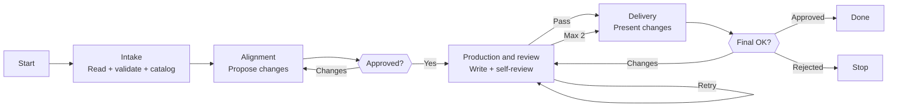

# Skill: Pipeline — Handoff Update

## Purpose

Updates an existing handoff skill file by reading it, validating it against the forge-handoff quality checklist, proposing changes through interactive alignment, and producing a reviewed update. Triggered when the user provides a file path and describes what to change. Distinguished from sibling God pipelines by its 4-phase flow with 2 HITL gates and its focus on evolving an existing handoff artifact rather than creating a new one.

## Presentation

Phase headers for this pipeline:

| Phase | Header |
|---|---|
| Intake | `God \| Intake` |
| Alignment | `God \| Alignment` |
| Production and review | `God \| Production and review` |
| Delivery | `God \| Delivery` |

## Flow

## Phases

### Phase 1 — Intake

**Goal**
Understand the existing file and catalog current issues before proposing any changes.

**Actions**
- Load the `forge-handoff` skill
- Read the existing handoff skill file completely
- Run the structural quality checklist and adversarial review across all 6 dimensions (vagueness, contradictions, missing specifications, cross-section consistency, protocol compliance, substantive quality); classify each finding by severity: `critical`, `high`, `medium`, `low`

**Avoid**
- Don't skip validation of the existing file — because proposing changes on top of unknown defects compounds the problems; validate first, then align
- Don't proceed with a partial read — because unread sections can contain critical issues that invalidate any changes proposed on top of them

**Exit**
File read completely. Existing issues cataloged and classified by severity.

---

### Phase 2 — Alignment

**Goal**
Produce an agreed set of changes that addresses both the user's request and any pre-existing issues worth fixing in this update.

**Actions**
- Present validation findings alongside the user's requested changes — let the user decide whether to address pre-existing issues now or defer them
- Propose changes section by section — what changes, why, and what stays the same
- Proactively flag concerns (payload consistency, validation rule changes that break sender or receiver behavior, error handling gaps, overlap with existing handoff skills); iterate until all changes are agreed

**Avoid**
- Don't expand scope beyond what the user requested — because update pipelines evolve existing artifacts, not redesign them; unasked-for changes bypass the user's judgment
- Don't proceed with unresolved trade-offs — because unacknowledged design choices get embedded in the file without the user knowing they were made

**Exit**
User approves all proposed changes. No unresolved trade-offs remain.

---

### Phase 3 — Production and review

**Goal**
Write the updated file and validate it passes all checks before the user sees a summary.

**Actions**
- Load the `forge-principles` skill before writing any artifact content — it governs instruction wording (goal-over-procedure, specificity budget, positive framing, load-bearing rule position); the per-artifact forge skill governs section structure
- Write the complete updated handoff skill file to disk
- Read the updated file back from disk and run adversarial review across all 6 dimensions plus the structural quality checklist
- Attack the draft against the `forge-principles` Review Lens — procedural steps vs. goals, over-specification, instruction load, load-bearing rule position, bare prohibitions, unattached whys, example anchoring, ceremony structure, cross-section contradictions
- Fix every failing item; if fixes are substantial, re-read and re-run review on changed sections

**Avoid**
- Don't review from memory — because the model fills recollection gaps with plausible but incorrect content; only reading the actual file catches what was written vs. what was intended
- Don't output the file content in conversation — because the user can read it at the provided path; duplication wastes context without adding value

**Exit**
All checks pass. No known issues remain. (If 2 review iterations exhausted without full pass, unresolved items are surfaced in Delivery.)

---

### Phase 4 — Delivery

**Goal**
Present a concise summary of changes and confirm the file is final with the user.

**Actions**
- Present a diff-style summary of what changed and why
- If the user requests additional changes, apply them to the file on disk and re-run adversarial self-review before presenting the updated summary
- Confirm the file is final on explicit user approval

**Avoid**
- Don't duplicate the full file content in conversation — because the user can read it at the provided path; summarize decisions, not content

**Exit**
User approves the file, or user rejects and the file remains as a reference.
