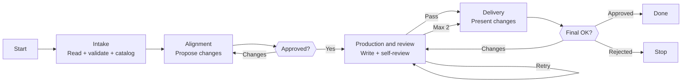

# Skill: Pipeline — MDC Update

## Purpose

Updates an existing `.claude/rules/` rule system and regenerates its root `CLAUDE.md` by reading the rule set, validating it against the `forge-mdcs` quality checklist, proposing changes through interactive alignment, and producing reviewed updates. Triggered when the user provides a path and describes what to change. Distinguished from sibling God pipelines by its 4-phase flow with 2 HITL gates and its focus on evolving an existing rule set rather than creating a new one.

Supports both **convention evolution** (changing existing rules to match new team standards) and **rule addition** (adding new rules for component types or concerns not yet covered). When the project has an existing codebase, God analyzes it to discover conventions not yet captured in rules.

## Presentation

Phase headers for this pipeline:

| Phase | Header |
|---|---|
| Intake | `God \| Intake` |
| Alignment | `God \| Alignment` |
| Production and review | `God \| Production and review` |
| Delivery | `God \| Delivery` |

## Flow

## Phases

### Phase 1 — Intake

**Goal**
Understand the existing rule set, catalog current issues, and map what the user needs to change before proposing anything.

**Actions**
- Load the `forge-mdcs` skill
- Read all existing `.claude/rules/` files and the repo-root `CLAUDE.md` completely; if the project has an existing codebase, analyze it for conventions not yet captured in rules (new component types, naming patterns, architectural changes not reflected in the rule set)
- Run the complete quality checklist (per-file, CLAUDE.md, project-level) and adversarial review across all 6 dimensions; classify each finding: `critical`, `high`, `medium`, `low`

**Avoid**
- Don't skip validation of the existing rule set — because proposing changes on top of unknown defects compounds the problems; validate first, then align
- Don't proceed with a partial read — because unread files can contain critical issues that invalidate any changes proposed on top of them

**Exit**
File inventory complete (`.claude/rules/` + `CLAUDE.md`). Existing issues cataloged and classified by severity. Requested changes understood.

---

### Phase 2 — Alignment

**Goal**
Produce an agreed set of changes that addresses both the user's request and any pre-existing issues worth fixing in this update.

**Actions**
- Present validation findings alongside the user's requested changes — let the user decide whether to address pre-existing issues now or defer them
- Propose changes file by file — what changes, why, and what stays the same; flag ripple effects (rule changes that make other rules inconsistent, CLAUDE.md regeneration required, a rule's loading changing — gaining or losing `paths` — which adds or removes a trigger row)
- Proactively flag concerns (path glob narrowing that removes coverage, new rule that overlaps with existing, flipping a concern between always-apply and path-scoped, a task-triggered rule whose CLAUDE.md trigger row goes stale); iterate until all changes are agreed

**Avoid**
- Don't expand scope beyond what the user requested plus existing issues they agreed to fix — because unasked-for changes bypass the user's judgment about what conventions to enforce
- Don't evaluate against any external standard — because the only standard is the `forge-mdcs` quality checklist; proposing changes to match a NestJS template is not a valid reason

**Exit**
User approves all proposed changes. No unresolved trade-offs remain.

---

### Phase 3 — Production and review

**Goal**
Write all changed files and validate the full rule set passes all checks before the user sees a summary.

**Actions**
- Load the `forge-principles` skill before writing any artifact content — it governs instruction wording (goal-over-procedure, specificity budget, positive framing, load-bearing rule position); the per-artifact forge skill governs section structure
- Write every changed file: new files in the unified template from scratch, modified files preserving unchanged sections, delete files the user agreed to remove; then regenerate `CLAUDE.md` wholesale from the new rule state (rebuild the Intro, the loading explanation, and the trigger table — never inline rule bodies, never `@`-imports)
- Read every changed file and the regenerated `CLAUDE.md` back from disk and run the complete quality checklist (per-file, CLAUDE.md, project-level) plus adversarial review across all 6 dimensions
- Attack the draft against the `forge-principles` Review Lens — procedural steps vs. goals, over-specification, instruction load, load-bearing rule position, bare prohibitions, unattached whys, example anchoring, ceremony structure, cross-section contradictions
- Fix every failing item; if fixes are substantial, re-read and re-run review on changed sections

**Avoid**
- Don't review from memory — because the model fills recollection gaps with plausible but incorrect content; only reading the actual files catches what was written vs. what was intended
- Don't output file contents in conversation — because the user can read files at the provided paths; duplication wastes context without adding value

**Exit**
All checklist items pass. No known issues remain. (If 2 review iterations exhausted without full pass, unresolved items are surfaced in Delivery.)

---

### Phase 4 — Delivery

**Goal**
Present a concise summary of changes and confirm the rule set is final with the user.

**Actions**
- Present a diff-style summary: files created (name, tier, what it covers), files modified (what changed and why), files deleted (what was removed and why), and how `CLAUDE.md` changed (trigger rows added/removed, Intro updates)
- If the user requests additional changes, apply them to the files on disk and re-run adversarial self-review before presenting the updated summary
- Confirm the files are final on explicit user approval

**Avoid**
- Don't duplicate file contents in conversation — because the user can read files at the provided paths; summarize decisions, not content

**Exit**
User approves the changes, or user rejects and the files remain as a reference.
