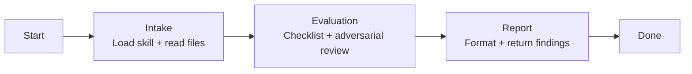

# Skill: Pipeline — MDC Validation

## Purpose

Evaluates an existing `.claude/rules/` rule system and its root `CLAUDE.md` against the `forge-mdcs` structural quality checklist and adversarial review dimensions. Triggered when the user provides a path to validate. Distinguished from sibling God pipelines by its single-shot mode with no HITL gates and its focus on producing a severity-classified findings report rather than an artifact.

## Presentation

Phase headers for this pipeline:

| Phase | Header |
|---|---|
| Intake | `God \| Intake` |
| Evaluation | `God \| Evaluation` |
| Report | `God \| Report` |

## Flow

## Phases

### Phase 1 — Intake

**Goal**
Load the evaluation framework and all rule files before any checking begins.

**Actions**
- Load the `forge-mdcs` skill
- Load the `forge-principles` skill
- Verify the `.claude/rules/` path exists and is non-empty — if not found or empty, stop and report to the user
- Read every file across the tiers (`foundation/*.md`, `concerns/*.md`, `components/<layer>/*.md`) and the repo-root `CLAUDE.md`; catalog the inventory: count by tier, identify which rules are present and which are missing

**Avoid**
- Don't begin evaluation before all files are read — because a partial read gives false confidence about files that weren't checked; an undetected critical defect in an unread file is worse than no evaluation

**Exit**
`forge-mdcs` skill loaded. All `.claude/rules/` files and `CLAUDE.md` read. File inventory complete.

---

### Phase 2 — Evaluation

**Goal**
Produce a classified list of all findings against the quality checklist and adversarial review dimensions.

**Actions**
- Run every item in the quality checklist from `forge-mdcs`: per-file checks (tier placement, naming, `paths`-only frontmatter correct for the tier, required sections incl. blockquoted Purpose and ✅ Do / 🚫 Don't directive tables, mechanism-level reasons, import-free examples, size, internal contradictions, match to the real codebase), CLAUDE.md checks (Intro + loading explanation + trigger table structure, every task-triggered rule with exactly one trigger row, no file-bound rules in the table, backticked paths that resolve, no `@`-imports, no rule bodies inlined), project-level checks (coverage of all component types, cross-cutting practice + pattern coverage, foundation trio present, architecture documented in foundation)
- Run adversarial review across 6 dimensions: vagueness (hedging; vague Purpose; reasons that restate instead of naming a mechanism; over/under-scoped globs), contradictions (conflicting rules; terminology drift; tier/loading mismatches), missing specifications (component types without a component rule; cross-cutting practices/patterns without a concern; common mistakes without an inline 🚫 Wrong), CLAUDE.md (trigger table completeness and correctness; stale or duplicated rows; inlined rule bodies; `@`-imports; code snippets in Intro or triggers), template compliance (missing or non-canonical sections; wrong `paths` frontmatter for the tier), substantive quality (would an agent reading these produce consistent code; realistic import-free examples; convincing reasons?)
- Evaluate the artifact against the `forge-principles` Review Lens — procedural steps vs. goals, over-specification, instruction load, load-bearing rule position, bare prohibitions, unattached whys, example anchoring, ceremony structure, cross-section contradictions — as a seventh dimension alongside the six above
- Classify each finding by severity: `critical` (broken/incorrect loading, CLAUDE.md out of sync with the rules, inlined rule bodies or `@`-imports in CLAUDE.md, missing required sections), `high` (contradictions between rules, missing rules for core component types, rules that contradict the real codebase, `anti-patterns/` folder present), `medium` (vague language, restated reasons, size violations, trigger-table inaccuracies), `low` (style inconsistencies, suboptimal globs)

**Avoid**
- Don't fabricate findings — because invented findings waste time chasing non-existent issues; every finding must reference a specific file and section
- Don't evaluate against any external standard — because the only standard is the `forge-mdcs` quality checklist; deviations from a NestJS template are not findings

**Exit**
All findings identified, documented, and classified by severity.

---

### Phase 3 — Report

**Goal**
Return a structured, actionable findings report grouped by severity.

**Actions**
- Format findings grouped by severity (critical first, then high, medium, low)
- For each finding, include: severity, file name, section (if applicable), description of the issue, and a concrete recommendation
- Present a summary header with total findings by severity and an overall assessment (pass / needs fixes / critical issues)

**Avoid**
- Don't leave findings unclassified — because unclassified findings force the user to triage; severity classification is the reviewer's responsibility, not the user's
- Don't offer to fix the findings — because validation produces a report, not a fix; if the user wants changes applied, they invoke the corresponding update pipeline

**Exit**
Report presented to user.
