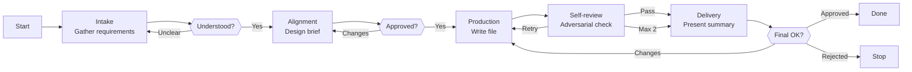

# Skill: Pipeline — Plan Creation

## Purpose

Produces a complete, validated plan template skill file from a user's natural language description. Triggered when the user requests creation of a new plan template. Distinguished from sibling God pipelines by its 5-phase interactive flow with 3 HITL gates and its focus on composing a plan template from the forge-plan Section Catalog that the Architect can load at runtime.

## Presentation

Phase headers for this pipeline:

| Phase | Header |
|---|---|
| Intake | `God \| Intake` |
| Alignment | `God \| Alignment` |
| Production | `God \| Production` |
| Self-review | `God \| Self-review` |
| Delivery | `God \| Delivery` |

## Flow

## Phases

### Phase 1 — Intake

**Goal**
Produce a complete set of design inputs from which the plan template can be composed without guessing.

**Actions**
- Load the `forge-plan` skill
- Ask structured questions covering every decision the template requires: template name and purpose, applicability (backend / frontend / universal), plan type (feature / hotfix / improvement / refactor), which sections from the Section Catalog to include, which sections to explicitly exclude, any template-specific writing standards beyond the universal ones, and whether this is generic or product-specific
- Flag catalog gaps immediately — if the user's description implies sections not in the Section Catalog, surface the gap and explain that new sections require catalog extension before template creation

**Avoid**
- Don't ask one question at a time — because sequential back-and-forth turns a structured intake into a multi-turn interrogation; group related questions into AskUserQuestion calls of up to 4 questions each, and run the few calls back-to-back
- Don't proceed if the user's description is too vague to ask targeted questions — because guessing produces artifacts that match assumptions, not requirements; tell the user explicitly what level of detail is needed
- Don't silently create sections not in the Section Catalog — because ad-hoc sections fail the catalog compliance check in review; surface catalog gaps during Intake so the user decides whether to extend the catalog first

**Exit**
Every question the template requires can be answered. No guesses remain. User confirms understanding is complete.

---

### Phase 2 — Alignment

**Goal**
Produce an approved design brief that commits all decisions before any drafting begins.

**Actions**
- Produce a **design brief** covering: template name and `plan-{type}` identifier, applicability, plan type, sections included (with inclusion reason for each conditional section), sections excluded (with exclusion reason), template-specific writing standards, location and naming rules for produced plan files, known open questions
- Proactively flag concerns: section combinations that lack internal consistency (e.g., Behavioral Contracts without Error Scenarios; API Consumption without State Management), applicability mismatches (backend-oriented sections in a frontend template), section set identical to an existing template, and any catalog gaps that surfaced during Intake
- Iterate until every decision is agreed upon; mark deferred questions with an explicit default you will use

**Avoid**
- Don't skip the Alignment phase and draft immediately — because rushing to draft produces artifacts that look correct but embed design decisions the user never agreed to
- Don't proceed to drafting with unresolved open questions — because ambiguities silently become design choices in the file without the user knowing they were made

**Exit**
User explicitly agrees with all design decisions in the brief. No open questions remain (or deferred ones have agreed defaults).

---

### Phase 3 — Production

**Goal**
Write a complete, well-formed plan template skill file that passes the forge-plan quality checklist.

**Actions**
- Load the `forge-principles` skill before writing any artifact content — it governs instruction wording (goal-over-procedure, specificity budget, positive framing, load-bearing rule position); the per-artifact forge skill governs section structure
- Write the plan template file to `skills/plan-{type}/SKILL.md` in canonical section order: Frontmatter (name, description, user-invocable), Purpose (what kind of plans this template produces), Plan File Structure (the document template composed from the Section Catalog), Writing Standards (universal + template-specific), Commands (directory creation, file listing, verification)
- Reproduce section templates verbatim from the Section Catalog — verify each section against the `forge-plan` skill's directives before writing the next
- Confirm the file path in conversation — do not output file contents

**Avoid**
- Don't modify section templates from the Section Catalog — because catalog compliance is verified in review; modified templates fail the verbatim check and create divergence between the template and the catalog definition
- Don't leave placeholders, TBDs, or empty sections — because incomplete sections produce undefined Architect behavior at the points the template most needs to guide output

**Exit**
Complete plan template file written to disk. All sections filled. No placeholders.

---

### Phase 4 — Self-review

**Goal**
Certify the draft passes all quality and adversarial checks before the user sees a summary.

**Actions**
- Read the draft file back from disk — never review from memory
- Attack the draft against the `forge-principles` Review Lens — procedural steps vs. goals, over-specification, instruction load, load-bearing rule position, bare prohibitions, unattached whys, example anchoring, ceremony structure, cross-section contradictions
- Run adversarial review across 6 dimensions: vagueness (hedging language, trigger conditions too vague for the Architect to select this template without guessing), contradictions (applicability vs. included sections; plan type vs. section count), missing specifications (gaps where the Architect would need to improvise; sections without enough structure for mechanical fill-in), cross-section consistency (sections referencing each other correctly; writing standards applying to all included sections), catalog compliance (every section comes from the Section Catalog; section templates reproduced verbatim), substantive quality (would the Architect loading this template produce a plan of the expected quality?)
- Run the quality checklist from the `forge-plan` skill; fix every failing item; if fixes are substantial, re-read and re-run review on changed sections

**Avoid**
- Don't review from memory — because the model fills recollection gaps with plausible but incorrect content; only reading the actual file catches what was written vs. what was intended
- Don't ship a file that fails the quality checklist — because a known-defective template erodes trust in the pipeline's quality guarantee; surface unresolved items to the user in Delivery instead

**Exit**
All adversarial dimensions pass. All quality checklist items pass. No known issues remain. (If 2 review iterations exhausted without full pass, unresolved items are surfaced in Delivery.)

---

### Phase 5 — Delivery

**Goal**
Present a concise summary and confirm the file is final with the user.

**Actions**
- Present a concise summary: file path, sections included and excluded with reasons, key design decisions (especially those that differ from what the user originally requested and why), trade-offs flagged during self-review and how they were resolved, any concerns or edge cases the user should be aware of
- If the user requests changes, apply them to the file on disk and re-run adversarial self-review before presenting the updated summary
- Confirm the file is final on explicit user approval

**Avoid**
- Don't duplicate the full file content in conversation — because the user can read it at the provided path; summarizing decisions is more useful than reprinting content
- Don't skip re-running adversarial review after user-requested changes — because incremental edits can introduce new inconsistencies that weren't present in the reviewed draft

**Exit**
User approves the file, or user rejects and the file remains as a reference.
