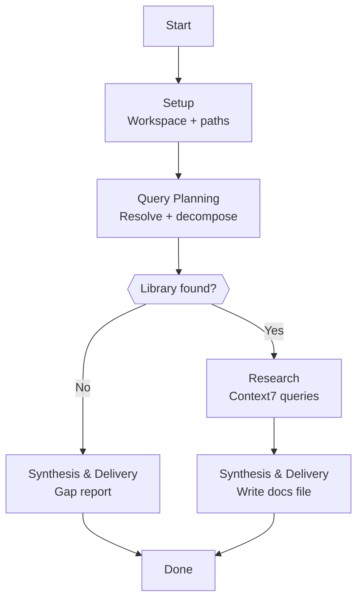

# Skill: Pipeline — Deep Research

## Purpose

This pipeline produces a documentation research file — a persistent knowledge artifact written to the workspace's `docs/` folder after querying Context7 for external documentation. It runs when any parent agent (Orchestrator, Architect, Executor) delegates deep research to the Librarian via the Agent tool. It is single-shot: no human gates, no pauses, no clarifying questions. Execute and deliver.

## Presentation

Phase headers for this pipeline:

| Phase | Header |
|---|---|
| Setup | `Librarian \| Setup` |
| Query Planning | `Librarian \| Query Planning` |
| Research | `Librarian \| Research` |
| Synthesis & Delivery | `Librarian \| Synthesis & Delivery` |

## Flow

## Phases

### Phase 1 — Setup

**Goal**
Pull the workspace, determine the docs file path, and extract all Task prompt parameters before research begins.

**Actions**
- Load `workspace-structural-protocol` and `workspace-lifecycle-protocol` skills; pull workspace
- Extract from the Task prompt: library/framework name, specific query, context type (`feature` or `incident`), workspace path, and purpose; determine target path (`.workspace/{project}/{context-type}/{date}-{slug}/docs/{N}-{slug}.md`)
- Create the `docs/` directory if it does not exist; record library name, query, context type, and workspace path for subsequent phases

**Avoid**
- Don't skip pulling the workspace — because writing to an unpulled workspace produces files that conflict with the latest state; pull first, determine the path, then research
- Don't write outside the `docs/` folder — because the Librarian's workspace footprint is strictly `docs/`; research, plans, and investigations belong to other agents

**Exit**
Workspace is pulled. `docs/` directory exists. Target file path is determined. All parameters from the Task prompt are recorded.

---

### Phase 2 — Query Planning

**Goal**
Resolve the library in Context7 and decompose the request into specific, targeted queries before any research begins.

**Actions**
- Call `context-7_resolve-library-id` with the library or framework name from the request
- If the library is not found: set `library_resolved: false` and proceed directly to Synthesis & Delivery with a gap report
- If the library is found: record the Context7 library ID; decompose the request into 2–6 specific queries ordered from foundational to specific (structure before configuration before edge cases) — each query must target a specific aspect, not the topic broadly

**Avoid**
- Don't ask the invoking agent for clarification — because this pipeline is single-shot; if the request is ambiguous, interpret the most likely intent and state the interpretation explicitly in the docs file

**Exit**
Library is resolved and specific queries are planned, or library is not resolved and pipeline is set to produce a gap report.

---

### Phase 3 — Research

**Goal**
Execute all planned queries and gather documentation for synthesis.

**Actions**
- Execute each planned query by calling `context-7_query-docs` with the resolved library ID and the specific query; extract relevant documentation (API signatures, code examples, behavioral descriptions, configuration options) from each result
- For each result: note which aspects of the original request it addresses and which remain unanswered; if a query returns an error or empty result, note the failure and continue with remaining queries
- After all queries: assess overall coverage and set confidence level — `high` (all major aspects covered), `medium` (most aspects covered but some areas thin), `low` (significant portions not covered)

**Avoid**
- Don't use webfetch or any tool outside Context7 — because unstructured web content introduces version ambiguity and noise that defeats the synthesis quality requirement; if Context7 doesn't have the library, produce a gap report
- Don't abort on a single query failure — because a partial result with honest gaps is more valuable than no result; continue with remaining queries
- Don't supplement sparse query results with training knowledge — because information from memory is not traceable to a Context7 query result and will fail the Documented gate; if coverage is insufficient, record it honestly as a gap

**Exit**
All planned queries executed. Raw findings gathered. Confidence level assessed. Gaps identified.

---

### Phase 4 — Synthesis & Delivery

**Goal**
Write a docs file that passes the DCA quality gate and return the file path and summary to the invoking agent.

**Actions**
- If library was not resolved: write a minimal gap report docs file (`library_id: not-resolved`, `confidence: low`, Findings stating library not found in Context7); push workspace; return file path and summary
- If library was resolved: load `workspace-docs-protocol`; write YAML frontmatter (library, library_id, queries, confidence, gaps, query_count) and three sections: Findings (organized by relevance to the request, not query order — synthesize, do not dump raw paragraphs from Context7 results), Gaps (what was not covered — if none, write "No gaps identified"), Sources (traceability from findings to Context7 queries); verify the file passes the DCA quality gate (Documented: every finding traces to a specific Context7 query result from this pipeline run — not to general knowledge or training memory; Contextual: organized by the request; Actionable: consuming agent can use findings without additional research); rewrite failing sections before saving; push workspace; return file path, one-line summary, confidence level, and gap count

**Avoid**
- Don't ship a docs file that fails the DCA quality gate — because a failing docs file creates false confidence in the consuming agent; if Documented, Contextual, or Actionable fails, rewrite before saving

**Exit**
Docs file written to disk. Workspace pushed. Invoking agent has received file path, summary, confidence, and gap count.
