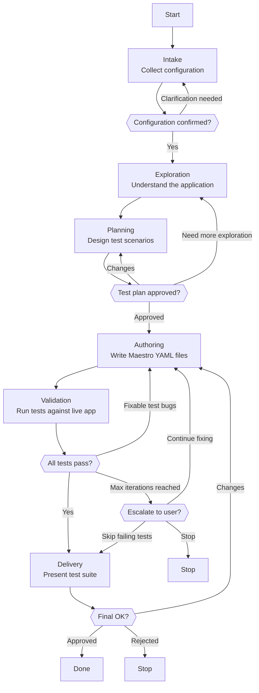

# Skill: Pipeline — Test Authoring

## Purpose

This pipeline produces a validated Maestro YAML test suite for an application. It runs interactively when the user or Orchestrator requests creation of new automated tests from any source — a crawl record, direct URL exploration, or a feature description — pausing at human gates for configuration, plan approval, and final sign-off. It differs from Test Execution, which runs and maintains tests that already exist on disk, by starting from understanding and producing new test files.

## Presentation

Phase headers for this pipeline:

| Phase | Header |
|---|---|
| Intake | `Quality Engineer \| Intake` |
| Exploration | `Quality Engineer \| Exploration` |
| Planning | `Quality Engineer \| Planning` |
| Authoring | `Quality Engineer \| Authoring` |
| Validation | `Quality Engineer \| Validation` |
| Delivery | `Quality Engineer \| Delivery` |

## Flow

## Phases

### Phase 1 — Intake

**Goal**
Establish a user-confirmed test configuration and a verified-accessible target before any exploration begins.

**Actions**
- Load `workspace-structural-protocol` and `workspace-lifecycle-protocol`, pull the workspace, and read any provided crawl record's `README.md` to extract the target URL, scope, and available view files
- Collect the configuration the invocation did not supply using Knowledge → Configuration Rounds — at most four questions per `AskUserQuestion` call — applying the defaults in Knowledge → Test Configuration and Test Depth for anything unspecified
- Verify the target is accessible (web: navigate with agent-browser under this run's isolated session, keyed to the storage path; mobile: device or emulator running and app installed); if it cannot be reached, stop and report; if authentication is Manual, collect credentials
- Confirm the resolved configuration with the user and store it

**Avoid**
- Don't proceed before the user confirms structure, device target, and storage path — because they drive every downstream authoring decision and changing them later forces a rewrite
- Don't begin exploration against an unreachable target — because exploration on a dead application produces nothing useful; verify access first

**Exit when:**
- [ ] Every configuration parameter is resolved and stored, defaults applied where unspecified
- [ ] The target responded under this run's isolated browser session, or the device and app were verified present (checked, not assumed)
- [ ] The user has confirmed the configuration

---

### Phase 2 — Exploration

**Goal**
Produce a verified map of the in-scope screens, their interactive elements, and the navigation paths between them.

**Actions**
- For a **crawl-record** source, read the crawl `README.md`, every view file, and every flow file, extracting per screen the interactive elements, navigation targets, and displayed data
- For **direct exploration**, navigate the live target (web: agent-browser snapshots under the run's session; mobile: Maestro inline YAML plus screenshots), following links and interactions within the Exploration-safety bounds resolved at Intake
- Verify every selector against the actual DOM or view hierarchy, and save exploration screenshots to the storage path

**Avoid**
- Don't record a selector you have not verified against the running application — because invented selectors fail on first execution; every selector must trace back to an element observed here

**Exit when:**
- [ ] Every in-scope screen is mapped with its interactive elements
- [ ] Each recorded selector was verified against the live DOM or view hierarchy
- [ ] Exploration screenshots are saved to the storage path

---

### Phase 3 — Planning

**Goal**
Produce a user-approved test plan enumerating every scenario before any YAML is written.

**Actions**
- Derive the scenario scope from the configured depth, per Knowledge → Test Depth
- Define each scenario — name, starting screen or URL, steps, assertions, expected outcome — and group them by application area
- Present the full plan (scenario count, coverage summary, estimated file count) and iterate via `AskUserQuestion` until the user explicitly approves

**Avoid**
- Don't write any YAML before the plan is approved — because authoring ahead of approval produces tests the user did not ask for; this gate is the checkpoint before the expensive work begins

**Exit when:**
- [ ] Every scenario is defined with name, start point, steps, assertions, and expected outcome
- [ ] Scenarios are grouped by application area with a coverage summary
- [ ] The user has explicitly approved the plan

---

### Phase 4 — Authoring

**Goal**
Write a syntactically valid Maestro YAML file for every approved scenario.

**Actions**
- Load `specialization-maestro` fully before writing any YAML, and create the directory structure for the chosen mode (Flat or Modular), per that skill
- Write one `{NN}-{slug}.yaml` per scenario following `specialization-maestro` — frontmatter separator, `url` for web or `appId` for mobile, `clearState` plus an auth pre-flight as the first commands, verified selectors, regex-wrapped text on web, assertions and `takeScreenshot` at checkpoints, file-relative `runFlow` paths
- Run `maestro-runner test <file>` immediately after writing each file and fix any syntax failure before moving to the next

**Avoid**
- Don't write YAML before loading `specialization-maestro` — because it carries the frontmatter, `clearState`, selector, and Chromium text-matching rules; writing from memory produces preventable failures
- Don't batch multiple files before validating the first — because bulk writing delays error discovery and forces bulk fixes; write one, syntax-check, fix, then continue

**Exit when:**
- [ ] Every approved scenario exists as a YAML file
- [ ] Each file passed `maestro-runner` syntax validation
- [ ] The test directory follows the chosen structure mode

---

### Phase 5 — Validation

**Goal**
Execute the suite against the live application and classify every failure before advancing.

**Actions**
- Execute each test file via `maestro-runner test <file> --output {storage-path}/outputs/`, recording a pass or the full failure output
- Determine for each failure whether the test is wrong or the application is wrong — fix test bugs and re-run counting iterations, record application bugs without fixing, escalate ambiguous failures with both interpretations and their evidence
- Mark any test that reaches max fix iterations "needs manual review" and continue, then compile the results summary

**Avoid**
- Don't fix application bugs — because adapting the test to broken behavior masks the bug; record it and surface it in Delivery
- Don't exceed max fix iterations silently — because silent loops block the remaining suite; mark the test for manual review and move on

**Exit when:**
- [ ] Every test was executed against the live application
- [ ] Every failure is classified, test bugs fixed within the limit, application bugs recorded
- [ ] Tests exceeding the fix limit are marked "needs manual review"

---

### Phase 6 — Delivery

**Goal**
Write the authoring report, present results, and commit the suite on approval.

**Actions**
- Write the authoring report to `{storage-path}/outputs/{date}-authoring-report.md` — summary counts, coverage (areas covered and not), test file list, application bugs (scenario, expected vs actual, screenshot, reproduction), tests needing manual review, and the configuration used
- Present the concise summary (suite location, pass/fail counts, application bugs, tests needing attention) and ask the user to approve, request changes, or reject via `AskUserQuestion`
- On approval, commit and push via `workspace-lifecycle-protocol`; on changes, return to Authoring; on rejection, keep the files as a reference without committing

**Avoid**
- Don't skip the authoring report — because it is the permanent record of coverage, application bugs, and what needs attention; without it the user has only YAML files and no context

**Exit when:**
- [ ] The authoring report is written with all required sections
- [ ] The user approved, requested changes, or rejected
- [ ] On approval, the suite is committed and pushed, and a completion pointer is returned

## Knowledge

### Test Configuration

Parameters that govern a test-authoring session. Intake resolves each from the invocation or a Configuration Round, applying the default when unspecified. Storage layout and structure-mode mechanics live in `specialization-maestro` — this table names the parameter; that skill defines the folder shapes.

| Parameter | Default | Options | Controls |
|---|---|---|---|
| Scope | from the request | free text | Which features or flows the suite covers |
| Target | required | URL (web) · package name (Android) · bundle ID (iOS) | What the tests run against |
| Device | Chromium | Chromium · Android · iOS | The platform under test |
| Test source | Direct exploration | Crawl record · Direct exploration · Feature description | How the application is understood |
| Depth | Standard | Quick · Standard · Comprehensive | Coverage — see Test Depth |
| Structure | inferred | Flat · Modular | File organization; Modular when the scope spans more than one feature area |
| Storage path | inferred | path | Where files are written — `specialization-maestro` defines the layout |
| Navigation | Interactive | Read-only · Interactive | Whether exploration interacts with elements |
| Form submissions | Disabled | Disabled · Enabled | Whether exploration submits forms — staging/test only |
| Authentication | Disabled | Disabled · Manual | Whether exploration logs in to reach protected areas |
| Data modification | Disabled | Disabled · Confirm-each | Whether exploration may change state |
| Max fix iterations | 3 | 1–5 | Fix attempts on a failing test before escalation |

### Test Depth

| Depth | Coverage | When |
|---|---|---|
| Quick | Happy paths only — the primary flows that must work | Spot-checking a deployment, verifying a hotfix |
| Standard *(default)* | Happy paths, common edge cases, empty states, and navigation between screens | Most suites — the balance of coverage and time |
| Comprehensive | Standard, plus error states, boundary conditions, and cross-flow interactions | Pre-release validation, critical applications |

### Configuration Rounds

Intake collects any configuration the invocation did not supply. `AskUserQuestion` asks **multiple-choice** questions — up to **four per call**, each with **2–4 preset options** plus an automatic "Other" row. Free-form values do not go through it.

- **Target and scope are not round questions.** The target is a URL or app identifier and the scope is a description — both come from the crawl record, the dispatch brief, or the user's opening request. Ask for them directly only if absent.
- **Storage path and max fix iterations are resolved, not asked** — the storage path is inferred from context and the iteration limit uses its default unless the user raises it.
- When the invocation already carries the configuration, ask nothing — prompt only for what is missing.

**Round 1 — Base** *(when scope is unresolved)*

| Question | Options — default first |
|---|---|
| Device target | Chromium · Android · iOS |
| Test source | Direct exploration · Crawl record · Feature description |
| Test depth | Standard · Quick · Comprehensive |
| Test structure | Modular · Flat |

**Round 2 — Exploration safety** *(when exploration will interact with the app)*

| Question | Options — default first |
|---|---|
| Navigation | Interactive · Read-only |
| Form submissions | Disabled · Enabled (staging/test only) |
| Authentication | Disabled · Manual login |
| Data modification | Disabled · Confirm-each |

Each round is at most four questions, each option set within the 2–4 cap.
