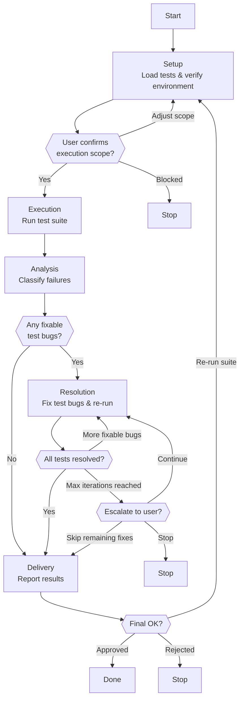

# Skill: Pipeline — Test Execution

## Purpose

This pipeline executes an existing Maestro YAML test suite against a live application using the Maestro Runner, classifies every failure as a test bug or an application bug, fixes test bugs autonomously within bounded iterations, and produces a structured execution report documenting application bugs for routing to the engineering team. It runs interactively, pausing to confirm scope and to sign off the report. It differs from Test Authoring, which creates new tests from exploration, by operating on tests that already exist on disk.

## Presentation

Phase headers for this pipeline:

| Phase | Header |
|---|---|
| Setup | `Quality Engineer \| Setup` |
| Execution | `Quality Engineer \| Execution` |
| Analysis | `Quality Engineer \| Analysis` |
| Resolution | `Quality Engineer \| Resolution` |
| Delivery | `Quality Engineer \| Delivery` |

## Flow

## Phases

### Phase 1 — Setup

**Goal**
Inventory the test suite over a verified-accessible target and confirm the execution scope before running anything.

**Actions**
- Load `workspace-structural-protocol` and `workspace-lifecycle-protocol`, sync the workspace, and inventory every `.yaml` in the test directory (flat `flows/*.yaml` or modular `{module}/flows/*.yaml`), reading each comment block for its scenario name; if none are found, stop and report
- Verify the application is accessible (web: valid response through agent-browser under this run's isolated session, keyed to the storage path; mobile: app installed and device running); if it cannot be reached, stop and report
- Present the pre-execution summary (file count, target, device) and confirm scope with the user via `AskUserQuestion`

**Avoid**
- Don't run tests against an unreachable application — because a dead target produces environment errors that masquerade as test failures and corrupt the Analysis classification

**Exit when:**
- [ ] The suite is inventoried with file path, scenario name, sequence, and module
- [ ] The target is verified accessible under this run's isolated browser session (checked, not assumed)
- [ ] The user has confirmed the execution scope

---

### Phase 2 — Execution

**Goal**
Run every test exactly once and capture raw results, classifying and fixing nothing.

**Actions**
- Execute each inventoried test once via `maestro-runner test <file> --output {storage-path}/outputs/`, recording a pass (exit 0) or the full failure output (stdout and stderr)
- Continue through the whole suite regardless of failures — a Runner crash is logged as an environment error, not a test failure, and execution proceeds
- Compile the raw results: passes, failures with output and screenshot paths, environment errors

**Avoid**
- Don't classify or fix failures during Execution — because changing the suite mid-run makes it impossible to know which tests failed against the original suite; classify in Analysis and fix in Resolution
- Don't halt the suite on a single failure — because Analysis needs the complete raw picture; a partial run misleads classification

**Exit when:**
- [ ] Every inventoried test executed exactly once
- [ ] Raw results are captured: passes, failures with output and screenshots, environment errors
- [ ] No failure was classified or fixed

---

### Phase 3 — Analysis

**Goal**
Classify every failure with exactly one label and supporting evidence before any fixing begins.

**Actions**
- For each failure, read the failing YAML, review the Runner output, inspect the live page state (web: compare the browser's DOM to what the test expected), and read the failure screenshot
- Classify each failure using Knowledge → Failure Classification Guide — test bug (selector, timing, or stale reference), environment issue, application bug (regression or visual defect), or ambiguous
- Group failures into fixable test bugs (to Resolution), application bugs and environment issues (to the Delivery report), and ambiguous (escalate with both interpretations before proceeding)

**Avoid**
- Don't classify without reading the failure screenshot — because the Runner's auto-captured visual is the primary signal; classifying without it is guesswork
- Don't begin fixing before all failures are classified — because the classification gate separates observation from action; fixing first risks masking an application bug

**Exit when:**
- [ ] Every failure carries exactly one classification and its supporting evidence
- [ ] Failures are grouped into fixable, report, and escalate buckets
- [ ] No fixing has begun

---

### Phase 4 — Resolution

**Goal**
Fix every fixable test bug within the iteration limit and mark the rest for manual review.

**Actions**
- Load `specialization-maestro` before editing any YAML, then apply each fix from Analysis (selector → match the real element; timing → add `waitFor` or raise the timeout; stale reference → re-explore with the browser and update the YAML)
- Re-run each fixed file via `maestro-runner test <file> --output {storage-path}/outputs/`; on a pass, mark it fixed with before-and-after state; on a repeat failure, increment the counter and attempt one further fix
- When a test reaches the configured maximum, mark it "needs manual review" with the full attempt history and move to the next

**Avoid**
- Don't re-label an application bug as a test bug to make it fixable — because that masks a real bug, the most dangerous action this pipeline can take; if new evidence changes the classification, stop and escalate — the user decides
- Don't exceed max fix iterations — because unbounded retries block the suite and yield diminishing returns; mark for manual review and continue

**Exit when:**
- [ ] Every fixable test bug is fixed and re-run to a pass, or marked "needs manual review"
- [ ] No application bug was re-labeled to force a fix
- [ ] Manual-review tests carry their full attempt history

---

### Phase 5 — Delivery

**Goal**
Write the execution report, present it, and commit on approval.

**Actions**
- Write the execution report to `{storage-path}/outputs/{date}-execution-report.md` — summary counts, passing tests, fixed test bugs (original failure, fix, verification), application bugs (scenario, expected vs actual, screenshot, reproduction, severity), manual-review tests, environment issues, and execution metadata (date, URL, device, Runner version)
- Present the concise summary (pass/fail counts, application bugs by severity, fixed vs manual review, report path) and ask the user to approve, request changes, or re-run via `AskUserQuestion`
- On approval, commit the report and updated tests via `workspace-lifecycle-protocol`; on re-run, return to Setup; on rejection, keep the files without committing

**Avoid**
- Don't skip the execution report — because results lost to conversation history after compaction are unrecoverable; the report is the durable record downstream agents route bugs from
- Don't fix application bugs — because they belong in the report for engineering routing; editing tests to accommodate broken behavior destroys the suite's value as a quality gate

**Exit when:**
- [ ] The execution report is written with all required sections
- [ ] The user approved, requested changes, or chose a re-run
- [ ] On approval, the report and updated tests are committed and pushed

## Knowledge

### Failure Classification Guide

Analysis classifies every failure against this taxonomy before any fix is attempted. The classification determines what happens next — and separates a test that is wrong from an application that is wrong.

| Classification | Indicators | Action |
|---|---|---|
| **Test bug — selector issue** | The element exists on screen but the selector in the YAML does not match. For web targets, inspecting the live page shows the element with a different ID, text, or hierarchy than the test expects. | Fix the selector in the YAML. Re-run the test. |
| **Test bug — timing issue** | The element is present but not yet visible when the assertion runs. The test passes when re-run after a delay. The screen shows a loading state or skeleton at the moment of assertion. | Add a `waitFor` or extended assertion timeout in the YAML. Re-run the test. |
| **Test bug — stale reference** | The test references a screen or flow that no longer exists. The navigation path changed, a modal was removed, or a button was relocated. | Re-explore the affected area with the browser (web). Update the test to match the current application. Re-run. |
| **Environment issue** | The failure comes from the environment — application unreachable, database empty, authentication expired. Neither the test logic nor the application logic is at fault. | Report the environment issue. Do not fix the test — the test is correct, the environment is wrong. |
| **Application bug — regression** | The test is correct and the application does not behave as expected. The selector matches, the timing is right, but the application shows an error, wrong data, or unexpected behavior. | Do not fix the test. Document as an application bug with screenshot, expected vs actual behavior, reproduction steps, and the failing YAML path. |
| **Application bug — visual defect** | The test is correct, the application functions, but the visual output is wrong — broken layout, missing styles, incorrect rendering. | Do not fix the test. Document as a visual application bug with a screenshot and description, at lower severity. |
| **Ambiguous** | The failure could be either a test bug or an application bug. The evidence is inconclusive. | Escalate with both interpretations and the evidence. Do not guess — the user decides the classification. |
