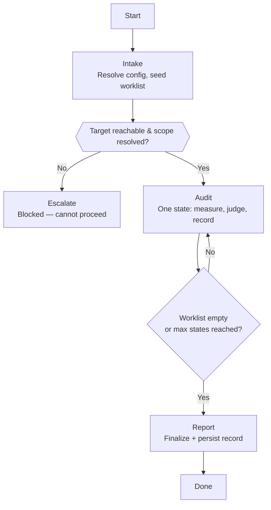

# Skill: Pipeline — Web Audit

## Purpose

This pipeline audits a running web application against quality criteria and produces an audit record — a folder of evidence-backed findings, each judged against a stated criterion. It covers the instrumented concerns (performance, accessibility, best practices, SEO) and the heuristic ones (visual, content, PII exposure, forms and error states, input debounce, data freshness). It runs start to finish without pausing for approval, walking the application one state at a time and returning the record — stopping only on a blocker it cannot work around, like an unreachable target. Unlike the Maestro test pipelines, it writes no executable tests: it assesses and reports, leaving the fix and the product-acceptability call to whoever receives the record.

## Presentation

Phase headers for this pipeline:

| Phase | Header |
|---|---|
| Intake | `Quality Engineer \| Intake` |
| Audit | `Quality Engineer \| Audit` |
| Report | `Quality Engineer \| Report` |

## Flow

## Phases

### Phase 1 — Intake

**Goal**
Establish a runnable audit configuration, a verified-accessible target, and an initialized audit record whose worklist is seeded with the states in scope.

**Actions**
- Load `workspace-audit-protocol`, `workspace-structural-protocol`, and `workspace-lifecycle-protocol`, then pull the workspace
- Resolve the configuration from the dispatch brief when present, collecting only genuinely missing inputs from the user via Knowledge → Configuration Rounds; apply the defaults in Knowledge → Audit Catalog and Audit Depth for anything unspecified
- Surface any enabled concern whose required permission is denied by the resolved configuration, and record the resolution — a concern that cannot run is a coverage gap, not a silent omission
- Establish this run's isolated browser session — keyed to the audit slug so parallel audits never share a browser — then verify the target responds and any required authentication succeeds under it and set the base viewport; if the target cannot be reached or authenticated, escalate with what was tried
- Initialize the audit record per `workspace-audit-protocol` — write the run card and seed `AUDITS.md` with the in-scope states as Pending

**Avoid**
- Don't re-collect inputs the dispatch brief already carries — because asking for supplied configuration wastes a return trip and contradicts the brief that was sent; prompt only for what is missing
- Don't begin auditing an unreachable or unauthenticated target — because every concern would report false failures that waste the whole run; confirm access first and escalate if it fails
- Don't drop a concern whose permission is denied without recording it — because an unexamined concern that leaves no trace reads to the next reader as one that was checked and passed

**Exit when:**
- [ ] The enabled concerns, depth, viewport, and permissions are resolved, with any permission conflict surfaced and recorded
- [ ] This run's isolated browser session is established under its audit-slug key, the target responded and any required authentication succeeded under it, and the base viewport is set
- [ ] The audit record exists with its run card written and `AUDITS.md` seeded with pending states

---

### Phase 2 — Audit

**Goal**
Produce, for every state in the worklist, its findings written to disk with evidence — before moving to the next state.

**Actions**
- Take the next state from `AUDITS.md` in priority order and navigate to it under the run's browser session at the configured base viewport
- For a route whose instrumented concerns have not yet been measured, run each enabled engine once, writing raw output straight into the finding's `evidence/` and reading back only the fields needed to judge, per Knowledge → Context Discipline
- Review the state against each enabled heuristic concern using the criteria in Knowledge, reading the page with a snapshot scoped to the region under review — or a screenshot, written to disk, when the judgement is visual
- Write each finding as it is observed — report, verdict, severity, criteria, and evidence — per `workspace-audit-protocol`, recording conformities for concerns checked and held
- Mark the state audited in `AUDITS.md`, append any newly discovered states as Pending, and continue until the worklist is empty or the max-states cap is reached

**Avoid**
- Don't hold findings in memory to write at the end — because an audit walks more states than a context window survives; a batched write loses the entire run when it is compacted or stopped, which is the single most expensive failure this pipeline can have
- Don't snapshot the whole document when a region will do — because a full-body read costs materially more than a scoped one, and every interaction returns fresh page state, so the cost compounds across hundreds of captures
- Don't re-run page-level engines for sub-states of a route already measured — because they measure a document, so re-running per modal multiplies runtime without producing new information
- Don't exceed the resolved permissions — because submitting forms or mutating data on a target not marked writable creates real side effects the audit was never authorized to cause

**Exit when:**
- [ ] `AUDITS.md` has no Pending states, or the max-states cap was reached
- [ ] Every audited state has its findings written to disk with their evidence
- [ ] Every worklist entry has a final state — audited, or skipped with a reason

---

### Phase 3 — Report

**Goal**
Complete the audit record so it stands alone as a decision-ready input — run card finalized, coverage stated, persisted, and returned.

**Actions**
- Finalize the run card: fill the findings index sorted by severity, write the verdict summary, and state coverage — what was examined, and what was not, including concerns skipped for missing permissions
- Verify each finding folder is complete (its README plus every referenced evidence file) and that the index matches the folders on disk
- Commit and push the audit record per `workspace-lifecycle-protocol`
- Return the audit record path and a severity-sorted headline summary to the invoker

**Avoid**
- Don't leave coverage implicit — because a reader who mistakes an unexamined area for a clean one draws false confidence from the audit; name what was not examined and why
- Don't return before persisting — because an unpushed record is invisible to the Orchestrator that will register issues from it; commit and push first

**Exit when:**
- [ ] The run card's findings index matches the finding folders on disk, and coverage names what was not examined
- [ ] The audit record is committed and pushed
- [ ] The invoker has received the record path and a severity-sorted headline summary

## Constraints

- **Report conformance to the stated criteria, never product-acceptability.** A finding means "this fails the criteria" — never "this must be fixed" or "this is fine for the product." Whether a criteria failure is a genuine defect or an accepted limitation needs product context this audit does not hold; that triage belongs to whoever receives the report.

## Knowledge

### Audit Catalog

Each concern is independently toggleable; default is on. Intake resolves which concerns run; Audit applies each one left on. **Requires** is the permission a concern needs — a concern whose permission is denied cannot run and is recorded as a coverage gap.

| Concern | Nature | Default | Requires | Judged against | Engine |
|---|---|---|---|---|---|
| Performance | instrumented | on | read-only | Core Web Vitals | Lighthouse |
| Accessibility | instrumented | on | read-only | WCAG 2.2 AA | axe-core + Lighthouse |
| Best Practices | instrumented | on | read-only | HTTPS, console errors, vulnerable libraries | Lighthouse |
| SEO | instrumented | on | read-only | Meta, crawlability, structured data | Lighthouse |
| Visual / Responsive | heuristic | on | read-only | Layout integrity across breakpoints | Agent Browser screenshots |
| Content & Copy | heuristic | on | read-only | Clarity · consistency · plain language | scoped review |
| PII Exposure | heuristic | on | read-only | Sensitive identifiers masked by default | scoped review |
| Forms & Error States | heuristic | on | interaction | WCAG 3.3.x; Nielsen #5 and #9 | walkthrough |
| Input Debounce | heuristic | on | interaction | Request volume per keystroke | walkthrough + network |
| Data Freshness | heuristic | on | **write** | UI reflects mutations without a manual refresh | walkthrough + mutation |

**Data Freshness is on by default but gated by environment.** On a production or read-only target it never runs — it is recorded as not examined, with the reason, in Coverage. It executes only where data modification is permitted.

### Audit Depth

| Depth | Coverage |
|---|---|
| Quick | Key routes only; the headline issue per enabled concern |
| Standard *(default)* | Primary flows plus their common states across the resolved scope |
| Deep | Every route in scope; edge, empty, and error states; all configured breakpoints |

### Context Discipline

An audit walks many states, and every interaction with the browser returns fresh page state. The binding constraint is **the number of captures you pull into context, not the size of any one** — hundreds of reads is what exhausts a context window, and nothing held only in context survives compaction.

- **Read a page with a `snapshot` scoped to the region under review** — `main`, the table, the form — rather than the whole body. A scoped aria snapshot is the cheapest way to read structure; `read` (rendered markdown) is the fallback when you need the page's text rather than its accessibility tree.
- **Screenshots persist to disk, but reading one back costs.** The capture itself is cheap in context — the tool writes the image into `evidence/` and returns a path, not an inline blob. But an image is not machine-readable text: to *judge* from it, the agent reads it back multimodally, which costs more than a scoped snapshot. So a screenshot is never the general way to read a page — reach for it only when the judgement is genuinely visual (layout, contrast as rendered, a visual defect) or when a finding needs visual proof, and once written it lives as evidence at its path without re-entering context unless visual reasoning demands it.
- **Write engine output straight to `evidence/` and read back only the fields you judge.** A Lighthouse report runs to hundreds of kilobytes; reading it whole costs more than everything else in the state combined.
- **Interact deliberately.** Each click, fill, and submit returns page state. Exploratory clicking is what turns a short flow into hundreds of captures.

### Configuration Rounds

Intake collects any configuration the dispatch brief did not supply. `AskUserQuestion` asks **multiple-choice** questions — up to **four per call**, each with **2–4 preset options** plus an automatic "Other" row. Free-form values do not go through it.

- **Target and scope are not round questions.** The target is a URL and the scope is a description — both come from the dispatch brief or the user's opening request. Ask directly only if absent.
- **Concerns toggle per-concern via multi-select**, split by nature so each question stays inside the option cap. Default is every concern selected; the user deselects what to skip.
- When the brief already carries the configuration, ask nothing — prompt only for what is missing.

**Round 1 — What to check**

| Question | Type | Options |
|---|---|---|
| Instrumented concerns | multi-select | Performance · Accessibility · Best Practices · SEO |
| Static heuristic concerns | multi-select | Visual/Responsive · Content & Copy · PII Exposure |
| Interactive heuristic concerns | multi-select | Forms & Error States · Input Debounce · Data Freshness |
| Depth | single | Standard · Quick · Deep |

**Round 2 — How to look**

| Question | Type | Options |
|---|---|---|
| Base viewport | single | 1920×1080 · 1440×900 · 1366×768 · 375×812 |
| Responsive breakpoints | multi-select | Desktop 1920 · Laptop 1440 · Tablet 768 · Mobile 375 |
| Environment | single | Production — read-only · Staging · Local |
| Authentication | single | Disabled · Manual login |

**Round 3 — What it may do**

| Question | Type | Options |
|---|---|---|
| Navigation | single | Interactive · Read-only |
| Form submissions | single | Disabled · Enabled |
| Data modification | single | Confirm-each · Disabled · Enabled |
| Max states | single | 25 · 50 · 100 · Unlimited |

The base viewport is set once, before any capture, and restored after any responsive check that changes it — a page read at an unintended viewport produces layout findings that describe a window nobody uses.

### Instrumented Criteria

How to read each instrumented engine's output into findings:

- **Performance** — from the Lighthouse report: LCP ≤ 2.5s is good, ≤ 4s needs improvement, > 4s poor; CLS ≤ 0.1; Total Blocking Time is the lab proxy for responsiveness. A metric outside "good" is the finding; the score is context.
- **Accessibility** — run axe-core with the WCAG AA tag set; every violation it returns is a finding, carrying the rule and the offending selector. The most common is **1.4.3 Contrast (Minimum), AA** — text below 4.5:1 (3:1 for large text). Lighthouse's accessibility score is a supplementary floor, never a substitute for axe.
- **Best Practices / SEO** — a specific Lighthouse audit that fails is the finding (insecure request, console error, missing meta); the category score is context, not the finding itself.

### Content & Copy Heuristics

Evaluate the copy an end user reads. Each check names its reference and a failing → passing example, so the judgement is specific rather than impressionistic.

| Check | Reference | Failing → Passing |
|---|---|---|
| **Terminology consistency** — one concept, one term | Nielsen #4, Consistency and standards | "Client" on the list, "Customer" on the detail header → one term everywhere |
| **Plain language, no jargon** — no internal or developer vocabulary reaching users | Nielsen #2, Match the real world; WCAG 3.1.5 Reading Level (AAA, aspirational) | "Sync failed: constraint_violation" → "We couldn't save your changes." |
| **Clarity and correctness** — labels say what they do; grammar holds | Nielsen #2 | A "Submit" button that deletes → "Delete member" |
| **Audience fit** — text a general user cannot act on is a finding even if technically correct | Nielsen #2 | "Token expired (401)" → "Your session ended. Please sign in again." |

### Forms & Error-State Heuristics

Evaluate forms and failure states. axe covers the structural criteria (a label exists); the walkthrough covers whether the guidance is actually usable.

| Check | Reference | Failing → Passing |
|---|---|---|
| **Labels and instructions** — every input has a persistent visible label and any format hint | WCAG 3.3.2 Labels or Instructions (A) | A bare field → labeled "Tax ID", hint "9 digits, no dashes" |
| **Error prevention** — constraints, defaults, confirmation before destructive actions | Nielsen #5 | A one-click irreversible "Delete" → a confirm step |
| **Error identification** — the field in error is named in text, not by colour alone | WCAG 3.3.1 Error Identification (A) | A red border, no message → "Email is required." |
| **Error suggestion, validated inline** — the message names the problem *and* a fix, on blur | WCAG 3.3.3 Error Suggestion (AA) | "Invalid date" → "Enter the date as DD/MM/YYYY." |
| **Message anatomy and tone** — plain, neutral, never a raw backend error or code | Nielsen #9 | "Error: tax_id_check constraint_violation" → "Enter a valid 9-digit tax ID." |
| **Bad-state guidance** — empty, offline, permission-denied, server-error states point to a next step | Nielsen #9 | A blank table → "No members yet. Add your first member." |

### PII Exposure Heuristics

Personal identifiers rendered in the interface are the most common accidental data exposure. Treat any national or tax identifier, full account number, or contact detail as sensitive — whichever of them the product uses as its primary identifier is the one most often rendered in full.

| Check | Failing → Passing |
|---|---|
| **Masked by default** — sensitive identifiers render obscured unless deliberately revealed | `123-45-6789` in a table cell → `***-**-6789` with a reveal control |
| **Reveal is deliberate and scoped** — unmasking is an explicit per-record action, never the default state | A page-level "show all" that renders every record unmasked on load → per-record toggle, hidden by default |
| **No leakage through secondary surfaces** — identifiers do not escape through places a mask does not cover | A national ID in the page title, a tooltip, an export filename, or a console log → masked or absent there too |

### Data Freshness Heuristics

After a mutation, every view derived from the changed data must reflect it without the user reloading. In a query-cache architecture the usual cause is a missing or too-narrow cache invalidation after the mutation succeeds.

| Check | Failing → Passing |
|---|---|
| **Create reflects immediately** | A new record is created, the list still shows the previous set until a manual refresh → the list includes it on success |
| **Update reflects immediately** | An edited field still shows its old value in the table row → the row shows the new value |
| **Delete reflects immediately** | A deleted record stays visible in the list → it disappears on success |
| **Dependent views agree** | The detail view updates but the list count, summary card, or badge stays stale → every view derived from that data agrees |

Run this only where data modification is permitted, and prefer creating and then removing a clearly-marked throwaway record over mutating existing data.

### Input Debounce Heuristics

An un-debounced search or filter turns one user's typing into a request per keystroke, multiplying backend load by the length of every query.

| Check | Failing → Passing |
|---|---|
| **Search inputs debounce** | Typing a 7-character term fires 7 requests → one request after typing settles |
| **Filters batch or debounce** | Each filter toggle triggers an immediate refetch → changes batch into one request |
| **Stale responses are discarded** | An earlier slow response arrives last and overwrites newer results → out-of-order responses are ignored or cancelled |

Method: type a multi-character term into the input at a normal pace and count the requests to the backing endpoint. The count, the term, and the endpoint are the evidence.
