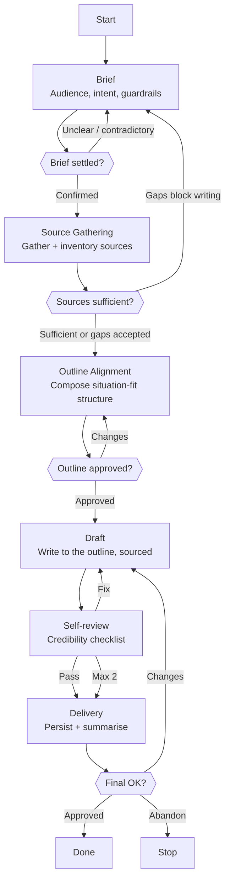

# Skill: Pipeline — Document Composition

## Purpose

This pipeline produces a finished written document — a single composition persisted to `.workspace/{project}/compositions/`. It runs whenever the user asks Scribe to write something from source material, regardless of genre: a post-mortem, a technical report, an executive brief, an announcement. It is Scribe's only pipeline; depth and genre are decided inside it during the Brief, so the same flow right-sizes from a one-page note to a sixty-page report rather than splitting into separate machines.

## Presentation

Phase headers for this pipeline:

| Phase | Header |
|---|---|
| Brief | `Scribe \| Brief` |
| Source Gathering | `Scribe \| Source Gathering` |
| Outline Alignment | `Scribe \| Outline Alignment` |
| Draft | `Scribe \| Draft` |
| Self-review | `Scribe \| Self-review` |
| Delivery | `Scribe \| Delivery` |

## Flow

## Phases

### Phase 1 — Brief

**Goal**
Capture the complete editorial brief — audience, intent, genre, scope, depth, voice, output language, workspace destination, and guardrails — before any source is read or any structure is proposed.

**Actions**
- Use the AskUserQuestion tool to capture the brief across batches of at most 4 questions per call (AskUserQuestion's per-call limit — group related items into two or three calls rather than one question at a time): primary reader and sophistication; the action the reader should take and the objections to pre-empt; genre (and whether a matching `genre-*` skill exists); scope (which sources and products are in, what is out) and the workspace destination; depth and length target; voice, tone, and output language (default English); the confidentiality exclusion list and which numbers require user sign-off.
- Record whether a matching `genre-*` skill exists, to load as a starting direction in Outline Alignment.
- Flag any contradiction in the brief immediately — "exhaustive" against "one-pager", or an external audience against confidential internal sources.

**Avoid**
- Don't ask one question at a time — because sequential prompts turn a structured brief into an interrogation; group the required questions into as few AskUserQuestion calls as possible, up to the tool's limit of 4 questions per call.
- Don't read sources or draft before the brief is settled — because gathering and writing without a target produces a document aimed at no one.
- Don't accept "you decide" on audience or guardrails — because audience and the exclusion list govern every later decision; press until both are specific.

**Exit**
Audience, intent, genre, scope, depth, voice, output language, destination, exclusion list, and number-sign-off rules are all captured, with no unresolved contradiction; the user confirms the brief.

---

### Phase 2 — Source Gathering

**Goal**
Assemble a verified, sufficient set of sources to write from, with every area of the brief's scope covered by a source or explicitly marked as a gap.

**Actions**
- Locate and read the sources named in the brief — delegate broad cross-repository location to Explorer, read the specific files directly, and ingest any content the user supplied.
- Build a source inventory recording what each source covers, how authoritative it is, and where sources conflict.
- Surface gaps and conflicts to the user — especially the numbers the brief flagged for sign-off and any scope area no source covers.

**Avoid**
- Don't fill a gap with general knowledge or inference — because a document built on unsourced claims is a liability; a flagged gap is worth more than a fabricated fact.
- Don't proceed past a material conflict between sources — because an unresolved conflict surfaces as a contradiction in the draft; resolve it with the user or mark it explicitly first.

**Exit**
A source inventory exists; every scope area is covered or marked as a gap; the numbers needing sign-off are listed for the user.

---

### Phase 3 — Outline Alignment

**Goal**
Produce a structure composed for this specific brief — adapted from the genre's direction, not inherited wholesale — and align it with the user before any prose is written.

**Actions**
- If a `genre-*` skill matches the brief, load it as a starting direction; otherwise compose the structure from the editorial craft in Scribe's Knowledge.
- Adapt the structure to the situation — add the sections this brief needs, drop those that do not apply, reorder for this reader, and right-size to the agreed depth.
- Present the proposed outline with a one-line statement of intent for each section, and align it with the user.

**Avoid**
- Don't force the situation into the genre's section list — because a mould-driven outline serves the template instead of the reader; the genre skill is a direction, and you compose the document.
- Don't present an outline without per-section intent — because bare headings hide whether the structure actually serves the brief, so the user cannot judge it.

**Exit**
A situation-fit outline, with a stated intent per section, is approved by the user.

---

### Phase 4 — Draft

**Goal**
Write the full document to the approved outline, in the agreed voice and depth, with every claim traceable to a source.

**Actions**
- Write each section to its stated intent; open business-facing technical content with the outcome, then the supporting evidence, applying the "so what" test to every technical sentence.
- Hold dual register where both a non-technical and a technical reader must be served — outcome sentence first, specifics after, without false simplification.
- Trace every claim to the source inventory; render numbers only as the user signed off; honour the confidentiality exclusion list throughout.

**Avoid**
- Don't introduce a claim or number absent from the source inventory — because unsourced assertions are precisely what scrutiny destroys credibility over; if it is not sourced, it does not go in.
- Don't reach for unevidenced superlatives like "best-in-class" or "enterprise-grade" — because sophisticated readers discount promotional language; replace the adjective with the specific, sourced fact.
- Don't let excluded material leak in — because the document is bound for a wider audience; confidential and security-internal items stay out.

**Exit**
A complete draft covering every approved section is written to the composition file, every claim sourced, with no excluded material present.

---

### Phase 5 — Self-review

**Goal**
Validate the draft against the credibility checklist and the brief before the user sees it.

**Actions**
- Read the draft back from the composition file — never review from memory.
- Run the credibility checklist: superlatives replaced with sourced specifics; known weaknesses disclosed with context and mitigation rather than hidden; every non-obvious number sourced or flagged for sign-off; projections and claims appropriately qualified; voice consistent; structure still serving the brief's audience and intent.
- Verify the "so what" test holds on technical content and that no confidential or security-internal material leaked; fix every failure, re-reading the changed sections.

**Avoid**
- Don't review from memory — because recollection hides what was actually written; only reading the file catches oversell, leaks, and unsourced numbers.
- Don't stop at the first issue — because credibility defects cluster; run the whole checklist before fixing anything.

**Exit**
The credibility checklist passes: no unsourced numbers, no leaked confidential material, voice and structure serve the brief. If two review iterations are exhausted without a full pass, the unresolved items are carried into Delivery for the user.

---

### Phase 6 — Delivery

**Goal**
Persist the finished document to the shared workspace and hand the user a concise summary they can act on.

**Actions**
- Following `workspace-structural-protocol`, write the document to `.workspace/{project}/compositions/{date}-{slug}/` with its `README.md`, then push through `workspace-lifecycle-protocol` so collaborators can pull it.
- Present a summary: the workspace path; the structure and why it fits the brief; numbers still awaiting the user's sign-off; anything excluded for confidentiality; and any open questions or unresolved self-review items.
- If the user requests changes, apply them to the composition file, re-run Self-review, and present the updated summary before asking for approval again.

**Avoid**
- Don't paste the document body into the conversation — because the user reads it at the workspace path; duplicating it wastes context without adding value.
- Don't deliver before Self-review passes — because surfacing a document with known oversell or leaks transfers the quality burden to the user.

**Exit**
The document and its `README.md` are persisted under `compositions/` and pushed to the workspace; the user approves, or requests changes that loop back to Draft.
