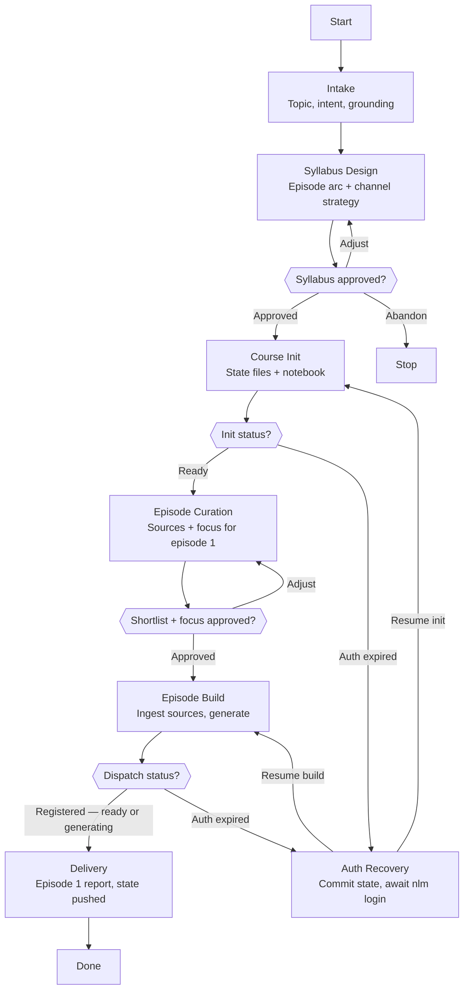

# Skill: Pipeline — Course Creation

## Purpose

Produces a new course: an approved multi-episode syllabus, initialized course state under `.workspace/teaching/courses/`, a dedicated NotebookLM notebook, and the first episode generated and ready. It runs interactively, triggered by the user naming a topic they want taught over time, with two gates: the syllabus (the course's plan) and episode one's shortlist-plus-focus package. It differs from Study Session (one-shot notebook, no memory) and from Course Session (continues an existing course) by creating the durable state every later session depends on.

## Presentation

Phase headers for this pipeline:

| Phase | Header |
|---|---|
| Intake | `Teacher \| Intake` |
| Syllabus Design | `Teacher \| Syllabus Design` |
| Course Init | `Teacher \| Course Init` |
| Episode Curation | `Teacher \| Episode Curation` |
| Episode Build | `Teacher \| Episode Build` |
| Auth Recovery | `Teacher \| Auth Recovery` |
| Delivery | `Teacher \| Delivery` |

## Flow

## Phases

### Phase 1 — Intake

**Goal**
A confirmed course brief: topic, learning intent, grounding decision, and per-episode artifact defaults — checked against courses that already exist.

**Actions**
- Sync the workspace per `workspace-lifecycle-protocol`, then load `~/.claude/skills/teacher-teaching-protocol/SKILL.md` and `~/.claude/skills/teacher-source-registry/SKILL.md`, and list `teaching/courses/` for overlap with the requested topic
- Call `studio_status(action="list_types")` and build the per-episode artifact menu from the live response — never from a remembered catalog, because the platform's types and format options shift without notice and the defaults chosen here repeat for every episode of the course
- Ask via AskUserQuestion, in batches of at most 4: the topic, what the user wants to be able to answer or do by the end, whether the course is work-grounded (and against which product), and the default artifacts per episode — podcast preselected, every other live-catalog type offered with format options where they serve the course intent
- When work-grounded, survey `{project}/` research, docs, and plans in the workspace and record the candidate artifacts worth using as notebook sources
- Restate the brief in one short confirmation before designing

**Avoid**
- Don't open a new course that overlaps an active one — because two ledgers tracking the same concepts produce conflicting schedules; propose extending or resuming the existing course instead
- Don't accept a topic without the intent behind it — because the syllabus arc and every focus prompt inherit this answer; a vague intent produces a generic course the user abandons by episode three

**Exit when:**
- [ ] Topic, intent, grounding, and artifact defaults are restated and confirmed
- [ ] `teaching/courses/` was checked and no unresolved overlap exists
- [ ] For a grounded course, candidate workspace artifacts are recorded with their paths

---

### Phase 2 — Syllabus Design

**Goal**
A user-approved syllabus: the episode arc with concepts per episode, the course-level channel strategy, and where grounding artifacts enter.

**Actions**
- Design the arc — listening-session-sized episodes, each introducing a small concept set that builds on the previous, ordered so later episodes can naturally re-expose earlier concepts
- Attach the channel strategy for the whole course using the registry heuristics, and for grounded courses, place the recorded workspace artifacts in the episodes they serve
- Present the syllabus as a table (episode, concepts, likely channels) via AskUserQuestion and iterate until approved

**Avoid**
- Don't design episodes that each introduce more than a handful of concepts — because the ledger schedules retrieval per concept, and an overloaded episode floods the next quiz beyond its 4-question cap
- Don't defer the channel strategy to per-episode negotiation — because the user chose streamlined sessions: the strategy is approved once here, and sessions carry only a light shortlist confirm

**Exit when:**
- [ ] Every episode has a title and concept set, and the arc's ordering rationale is stated
- [ ] The channel strategy and grounding placement are part of the approved package
- [ ] The user has explicitly approved the syllabus

---

### Phase 3 — Course Init

**Goal**
Durable course state on disk and a dedicated notebook, matching the schemas in the teaching protocol.

**Actions**
- Create `teaching/courses/{date}-{course-slug}/` with `README.md`, `syllabus.md`, an empty `ledger.md`, and the `quizzes/` and `episodes/` folders, per the teaching protocol schemas
- Create the course notebook with `notebook_create`, named after the course, and record its name and id in the course card; on an auth failure, enter Auth Recovery
- Commit the initialized state with the protocol's message convention

**Avoid**
- Don't reuse an existing notebook for a course — because the notebook accumulates the course's sources across months; mixing it with one-shot study material degrades every artifact generated from it
- Don't seed the ledger at init — because concepts enter the ledger when their episode is produced, per the spacing rules; pre-seeding starts retrieval clocks on material the user has never heard

**Exit when:**
- [ ] The course folder exists with all protocol files and is committed
- [ ] The notebook id is recorded in the course card

---

### Phase 4 — Episode Curation

**Goal**
An approved episode-one package: the shortlist and the focus prompt.

**Actions**
- Curate sources for episode one's concept set from the approved channel strategy — registry sources trusted, every new candidate spot-checked with WebFetch, public accessibility preferred, grounded artifacts included where the syllabus placed them
- Compose the focus prompt from the course intent and episode one's concepts — questions posed, anchored to the user's work
- Present the shortlist (one-line case per source) and the focus prompt verbatim as one package via AskUserQuestion; adjust until approved

**Avoid**
- Don't re-open the channel strategy here — because it was approved at the syllabus gate; renegotiating it per episode is the full-gates ritual the user explicitly declined
- Don't shortlist from titles and blurbs — because they routinely dress up shallow content, and a weak first episode kills a course before its arc can pay off

**Exit when:**
- [ ] Every shortlisted source is registry-trusted, spot-checked, or a recorded grounding artifact
- [ ] The focus prompt was presented verbatim and the package explicitly approved

---

### Phase 5 — Episode Build

**Goal**
Episode one's sources ingested and its artifacts dispatched with the approved focus prompt — dispatch confirmed, ready or generating, none awaited.

**Actions**
- Add each approved source to the course notebook with `source_add` — workspace artifacts as file or text sources — verifying each result; record any single-source failure and continue
- Trigger `studio_create` for each default artifact with the approved focus prompt, exactly as gated
- Confirm each dispatch registered with a single `studio_status` check — a strange or `"unknown"` status on a just-dispatched artifact means processing, not failure — recording each artifact as ready or generating, then stop checking; audio takes ~30 minutes and the notebook is where it lands; on an auth failure, enter Auth Recovery

**Avoid**
- Don't add sources beyond the approved package — because the curation gate is the only quality control between the web and a notebook that will feed every future episode
- Don't rewrite the focus prompt at generation time — because the user approved specific steering text; an unapproved rewrite regenerates the gate's decision without the gate

**Exit when:**
- [ ] Every approved source is verified in the notebook or recorded as failed with its cause
- [ ] Each artifact is confirmed ready or recorded as generating for the Delivery report

---

### Phase 6 — Auth Recovery

**Goal**
Course state safe in the workspace and NotebookLM access restored, with the interrupted phase resumed exactly where it stopped.

**Actions**
- Record the pending step in the course files (episode record or course card), then commit and push — the workspace is the durable store; nothing waits in scratch space
- Tell the user to run `nlm login` in a terminal and wait for their confirmation
- Re-verify access with `notebook_list`, then resume the interrupted phase from the committed state

**Avoid**
- Don't retry the failed calls before the user confirms re-login — because every call fails identically until the cookies refresh; retries add noise without progress
- Don't resume from memory instead of the committed files — because the course files are the source of truth; memory drifts across a pause and re-litigates approved decisions

**Exit when:**
- [ ] The pending step is committed and pushed in the course files
- [ ] Access is re-verified by a successful NotebookLM call
- [ ] The interrupted phase has resumed from the committed state

---

### Phase 7 — Delivery

**Goal**
Episode one reported honestly and the course's opening state persisted — ledger seeded, syllabus updated, everything pushed.

**Actions**
- Write the episode record, mark episode one `produced` in the syllabus, and enter its concepts into the ledger per the spacing rules (due in 2 days, strength weak)
- Commit and push the full course state with the protocol's message convention
- Report: episode readiness per artifact, the notebook's source list with any failures, the syllabus ahead, and when the first recall quiz will come due

**Avoid**
- Don't report completion before the push succeeds — because an unpushed ledger means the next session quizzes from a schedule that does not exist anywhere but this conversation
- Don't close with an unreported failure — because a missing source or half-generated artifact discovered mid-listen converts a small honest caveat into broken trust

**Exit when:**
- [ ] Ledger, syllabus, and episode record match the delivered state and are pushed
- [ ] The user acknowledged the report, including when their first quiz is due
