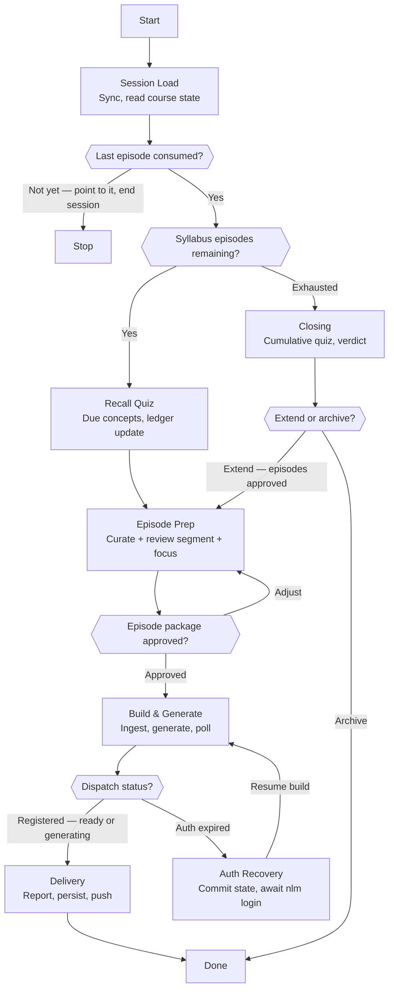

# Skill: Pipeline — Course Session

## Purpose

Produces one course increment: a scored recall quiz that updates the spacing ledger, and the next syllabus episode generated with due-for-review concepts woven in — or, when the syllabus is exhausted, the course's closing: a cumulative quiz and an extend-or-archive decision. It runs interactively, triggered by the user asking to continue a course, with a single mid-flow gate on the episode package. It differs from Course Creation (which builds the syllabus and state this pipeline consumes) and from Study Session (one-shot, no memory) by being the recurring, ledger-driven loop.

## Presentation

Phase headers for this pipeline:

| Phase | Header |
|---|---|
| Session Load | `Teacher \| Session Load` |
| Recall Quiz | `Teacher \| Recall Quiz` |
| Episode Prep | `Teacher \| Episode Prep` |
| Build & Generate | `Teacher \| Build & Generate` |
| Auth Recovery | `Teacher \| Auth Recovery` |
| Delivery | `Teacher \| Delivery` |
| Closing | `Teacher \| Closing` |

## Flow

## Phases

### Phase 1 — Session Load

**Goal**
The course's current state in hand — ledger, syllabus, card — with the session's route determined: quiz, closing, or stop.

**Actions**
- Sync the workspace per `workspace-lifecycle-protocol`, then load `~/.claude/skills/teacher-teaching-protocol/SKILL.md` and the course's files from `teaching/courses/`
- Identify the course: the one the user named, the single active course when only one exists, or an AskUserQuestion choice among active courses
- Confirm the user consumed the last produced episode and mark it `consumed` in the syllabus; when they have not, point them to it, mark nothing, and end the session — quizzing unheard material only records false misses
- Route by syllabus state: episodes remaining leads to the Recall Quiz; an exhausted syllabus leads to Closing

**Avoid**
- Don't proceed on a stale local workspace — because the ledger's schedule may have been updated by a previous session's push; quizzing from stale state asks the wrong questions at the wrong intervals
- Don't guess which course the user means — because ledger updates land in whichever course is loaded; a wrong guess corrupts two courses at once

**Exit when:**
- [ ] Course files are loaded from a freshly pulled workspace
- [ ] The consumption check passed and the session's route is determined

---

### Phase 2 — Recall Quiz

**Goal**
A scored quiz on due and newest concepts, with the ledger updated by the spacing rules.

**Actions**
- Select questions per the teaching protocol: concepts due today or overdue plus the newest consumed episode's concepts, capped at 4, prioritized by weakest strength then longest overdue
- Ask open free-recall questions one at a time in chat — the user answers in their own words — and evaluate each answer for the concept's substance, telling the user what a complete answer contained when they miss
- Update the ledger per the spacing rules — correct multiplies the interval, a miss resets it and flags the concept for this episode's review segment — and write the quiz file

**Avoid**
- Don't ask multiple-choice questions — because recognition is the weaker signal; the ledger's schedule is only as honest as the retrieval that feeds it
- Don't soften scoring to be encouraging — because a miss recorded as a pass silently removes the concept from the review segment and re-surfaces it a month later, still unlearned
- Don't skip the quiz on the user's momentum ("just give me the episode") without telling them the cost — because skipped retrieval quietly converts the course back into passive listening; when they still want to skip after hearing it, honor it and leave the ledger untouched

**Exit when:**
- [ ] Every asked question has a recorded result in the quiz file
- [ ] The ledger reflects the results per the spacing rules, with missed concepts flagged for review

---

### Phase 3 — Episode Prep

**Goal**
An approved episode package: sources for the next syllabus episode plus a focus prompt that carries both the new concepts and the review segment.

**Actions**
- Curate sources for the episode's concept set from the course's approved channel strategy — registry trusted, new candidates spot-checked with WebFetch, grounding artifacts included where the syllabus placed them
- Compose the focus prompt: the new concepts as posed questions anchored to the user's work, plus an explicit review segment instructing the hosts to revisit the flagged and due concepts in new contexts
- Present the shortlist (one-line case per source) and the focus prompt verbatim as one package via AskUserQuestion; adjust until approved

**Avoid**
- Don't drop the review segment when the episode feels full — because re-exposure after a miss is the spacing engine's repair mechanism; an episode without it leaves missed concepts decaying until a distant quiz finds them gone
- Don't re-open the channel strategy — because it was approved at the syllabus gate; sessions carry one light confirm, which is the streamlined ritual the user chose

**Exit when:**
- [ ] The package explicitly covers both new concepts and the review segment
- [ ] Every source is registry-trusted, spot-checked, or a recorded grounding artifact, and the user approved the package

---

### Phase 4 — Build & Generate

**Goal**
The episode's sources ingested into the course notebook and its artifacts dispatched with the approved focus prompt — dispatch confirmed, ready or generating, none awaited.

**Actions**
- Add each approved source with `source_add`, verifying each result; record any single-source failure and continue with the rest
- Trigger `studio_create` for each of the course's default artifacts with the approved focus prompt, exactly as gated
- Confirm each dispatch registered with a single `studio_status` check — a strange or `"unknown"` status on a just-dispatched artifact means processing, not failure — recording each artifact as ready or generating, then stop checking; audio takes ~30 minutes and the notebook is where it lands; on an auth failure, enter Auth Recovery

**Avoid**
- Don't add sources beyond the approved package — because the episode gate is the only quality control on a notebook that feeds every future episode of this course
- Don't sit in a polling loop waiting for completion — because audio takes on the order of 30 minutes and mid-generation statuses are unreliable; one registration check is all the API can honestly answer, and Delivery reports generating artifacts as exactly that. Ready is only what the check confirmed

**Exit when:**
- [ ] Every approved source is verified in the notebook or recorded as failed with its cause
- [ ] Each artifact is confirmed ready or recorded as generating for the Delivery report

---

### Phase 5 — Auth Recovery

**Goal**
Session progress safe in the workspace and NotebookLM access restored, with the interrupted phase resumed exactly where it stopped.

**Actions**
- Record the pending step in the course files, then commit and push — quiz results and ledger updates from this session must survive the pause
- Tell the user to run `nlm login` in a terminal and wait for their confirmation
- Re-verify access with `notebook_list`, then resume the interrupted phase from the committed state

**Avoid**
- Don't retry the failed calls before the user confirms re-login — because every call fails identically until the cookies refresh; retries add noise without progress
- Don't resume from memory instead of the committed files — because the course files are the source of truth; memory drifts across a pause and re-litigates recorded results

**Exit when:**
- [ ] This session's progress so far is committed and pushed
- [ ] Access is re-verified by a successful NotebookLM call
- [ ] The interrupted phase has resumed from the committed state

---

### Phase 6 — Delivery

**Goal**
The session's increment reported honestly and every state change persisted: episode record, ledger entries, syllabus status, quiz file — pushed.

**Actions**
- Write the episode record, mark the episode `produced` in the syllabus, enter its new concepts into the ledger per the spacing rules, and commit and push with the protocol's message convention
- Report: artifact readiness, the review segment's contents, quiz performance in one line, and when the next concepts come due
- Propose a registry update when a new source proved excellent this session, writing only on the user's approval

**Avoid**
- Don't report completion before the push succeeds — because an unpushed ledger means the next session quizzes from a stale schedule and this session's retrieval evidence is lost
- Don't close with an unreported failure — because a missing source or half-generated artifact discovered mid-listen converts a small honest caveat into broken trust

**Exit when:**
- [ ] Ledger, syllabus, episode record, and quiz file match the delivered state and are pushed
- [ ] The user acknowledged the report, including when the next quiz is due

---

### Phase 7 — Closing

**Goal**
A cumulative verdict on the course — what stuck, what didn't — and the user's decision executed: extension episodes approved or the course archived.

**Actions**
- Run a cumulative quiz across the whole ledger — up to 8 open questions, prioritized by weakest strength then longest interval — update the ledger per the spacing rules, write the quiz file, and commit and push them before the verdict
- Present the course verdict: strong, developing, and weak concepts by name, episodes consumed, and your recommendation to extend (naming what the extension should target) or archive
- On extend: propose the extension episodes, append them to the syllabus on approval, and continue into Episode Prep; on archive: set the course card to `archived`, move the folder to `teaching/archive/`, commit and push, and deliver the final report

**Avoid**
- Don't recommend archiving a course whose ledger still shows weak concepts without naming them — because "done" measured by episodes consumed instead of concepts retained is the passive-listening trap this whole system exists to escape
- Don't extend by adding episodes for material the ledger shows as strong — because extension exists to close gaps, not to let a finished course run on momentum

**Exit when:**
- [ ] The cumulative quiz results are in the ledger and the quiz file, pushed
- [ ] The user's extend-or-archive decision is executed and reflected in the course files
