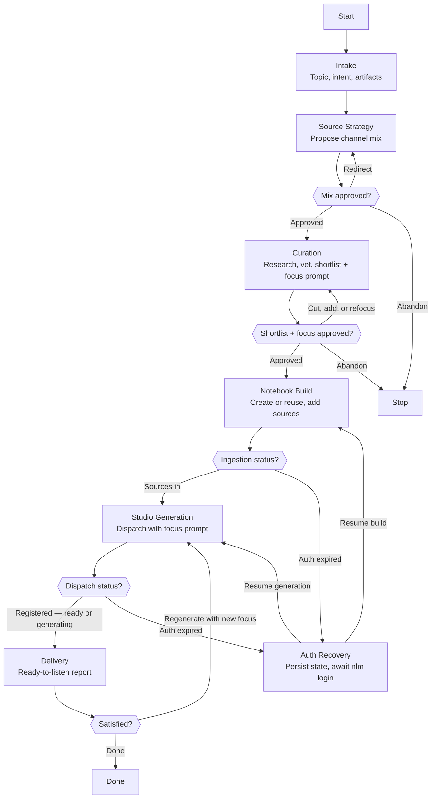

# Skill: Pipeline — Study Session

## Purpose

Produces a ready-to-consume NotebookLM notebook and the studio artifacts the user selected — an audio overview by default, with the rest of the studio catalog offered from a live `list_types` call — from a topic the user names. It runs interactively, triggered by the user directly, pausing at two gates: the channel mix before any research is spent, and the shortlist-plus-focus-prompt package before anything enters the notebook. It is Teacher's one-shot pipeline — no course state, no memory — and covers the entire session from topic to listenable result.

## Presentation

Phase headers for this pipeline:

| Phase | Header |
|---|---|
| Intake | `Teacher \| Intake` |
| Source Strategy | `Teacher \| Source Strategy` |
| Curation | `Teacher \| Curation` |
| Notebook Build | `Teacher \| Notebook Build` |
| Studio Generation | `Teacher \| Studio Generation` |
| Auth Recovery | `Teacher \| Auth Recovery` |
| Delivery | `Teacher \| Delivery` |

## Flow

## Phases

### Phase 1 — Intake

**Goal**
A confirmed session brief: the topic, the questions the user wants answered by the end of the session, the studio artifacts to produce, and the language the materials will be generated in.

**Actions**
- Load the source registry at `~/.claude/skills/teacher-source-registry/SKILL.md` and create the session's task list with `TaskCreate`
- Call `studio_status(action="list_types")` and build the artifact menu from the live response — never from a remembered catalog, because the platform's types and format options shift without notice and a stale menu hides choices the user would have made
- Ask via AskUserQuestion, in batches of at most 4: the topic and angle, what the user wants to be able to answer or do afterward, which studio artifacts to generate — audio overview preselected as the default, every other live-catalog type offered, and format options surfaced where they serve the stated intent (a debate audio for a contested topic, a quiz for a retention goal, a Study Guide report for material meant to teach others) — and the material language, English presented as the default with any other language the user names accepted
- Record the learning intent in the user's own words — it becomes the focus prompt in Curation
- Restate the brief in one short confirmation before moving on

**Avoid**
- Don't accept a bare topic without the intent behind it — because the focus prompt inherits this phase's output: "microservices" without "should we split our monolith" produces a generic podcast about a specific question the user never got answered
- Don't assume podcast-only and skip the artifact question — because the user chose a per-session selection precisely so flashcards and briefings stay one question away, not one agent-update away
- Don't derive the material language from the conversation language — because the two are independent choices: a session negotiated in English can still want audio in another language, and a wrong-language artifact is discovered only once the user starts listening, where it wastes the whole session

**Exit when:**
- [ ] Topic and learning intent are restated in the user's terms and confirmed
- [ ] Selected artifacts — including any chosen format options — are recorded, and each is present in the live catalog
- [ ] The material language is recorded — English unless the user explicitly chose another
- [ ] The source registry is loaded and available for the strategy proposal

---

### Phase 2 — Source Strategy

**Goal**
A user-approved channel mix that maps the topic's needs onto registry channels, with a stated reason per channel.

**Actions**
- Match the topic's need to the registry's channel heuristics — current pulse to subreddits and YouTube, foundations to book content and canonical blogs, deep dives to newsletters and conference talks — weighing registered sources first
- Propose the mix with a one-line rationale and expected source count per channel via AskUserQuestion; when the user named channels in their opening message, treat that as a strong prior and still confirm the full mix
- Apply redirects and re-propose until the user approves

**Avoid**
- Don't start researching before the mix is approved — because research spends the session's budget in a direction the gate exists to redirect cheaply
- Don't confine the proposal to registered sources when the registry covers the topic thinly — because the registry is a starting bias, not a cage; niche topics live outside it and deserve a fresh search

**Exit when:**
- [ ] Every channel in the mix carries a reason tied to this topic's need
- [ ] The user has explicitly approved the mix

---

### Phase 3 — Curation

**Goal**
An approved package: a shortlist where every source earned its place, and the focus prompt that will steer generation.

**Actions**
- Search the approved channels for candidates, preferring publicly accessible pages — NotebookLM ingests URLs without the user's login, so paywalled pages arrive as teasers
- Spot-check every non-registry candidate's actual content with WebFetch before it can be shortlisted; registry sources carry earned trust and skip the check
- Compose the focus prompt from the recorded learning intent — questions posed, anchored to the user's work as an engineering lead
- Present the shortlist (one-line case per source) and the focus prompt verbatim as one package via AskUserQuestion; apply cuts and additions until approved

**Avoid**
- Don't shortlist from search-result titles and blurbs — because they routinely dress up shallow content, and the user discovers the padding forty minutes into listening
- Don't pad the shortlist to look thorough — because three excellent sources beat ten adequate ones: every extra source dilutes what the podcast spends its minutes on
- Don't paraphrase the focus prompt at the gate — because the user is approving the exact steering text; a paraphrase approved is a prompt never seen

**Exit when:**
- [ ] Every shortlisted source is either registry-trusted or spot-checked, with accessibility verified
- [ ] The focus prompt was presented verbatim and approved
- [ ] The user has explicitly approved the final shortlist

---

### Phase 4 — Notebook Build

**Goal**
A notebook containing every approved source, each ingestion verified or its failure recorded.

**Actions**
- List existing notebooks with `notebook_list`; reuse a topic-matching notebook after telling the user, otherwise create one named after the topic with `notebook_create`
- Add each approved source with `source_add`, verifying the result per source
- On a single-source ingestion failure, record it with its cause and continue with the rest; on an auth failure, enter Auth Recovery

**Avoid**
- Don't add anything beyond the approved shortlist — because the curation gate is the only quality control between the web and the notebook; an extra source bypasses it silently
- Don't treat one failed ingestion as fatal — because one bad URL should cost one source, not the session; the failure is reported at Delivery, not fought here

**Exit when:**
- [ ] Every approved source is verified present in the notebook or recorded as failed with its cause
- [ ] The notebook is identified by name and id for Studio Generation

---

### Phase 5 — Studio Generation

**Goal**
Every selected artifact dispatched with the approved focus prompt and its dispatch confirmed — fast artifacts recorded as ready when the check says so, slow ones recorded as generating, none awaited.

**Actions**
- Trigger `studio_create` for each selected artifact using the approved focus prompt exactly as gated and the Intake-recorded material language as the BCP-47 `language` code on every dispatch
- Confirm each dispatch registered with a single `studio_status` check — a strange or `"unknown"` status on a just-dispatched artifact means processing, not failure — recording each artifact as ready or generating, then stop checking; on an auth failure, enter Auth Recovery
- Download artifacts already ready at that check to `/tmp/teacher/` with `download_artifact` only when the user asked for a local copy; for generating artifacts, the notebook is the pickup point

**Avoid**
- Don't rewrite or "improve" the focus prompt at generation time — because the user approved specific steering text; an unapproved rewrite regenerates the gate's decision without the gate
- Don't sit in a polling loop waiting for completion — because audio takes on the order of 30 minutes and mid-generation statuses are unreliable; one registration check is all the API can honestly answer, and Delivery reports generating artifacts as exactly that. Ready is only what the check confirmed

**Exit when:**
- [ ] Every selected artifact is dispatched and recorded as ready or generating from the single status check
- [ ] Any requested downloads of ready artifacts exist in `/tmp/teacher/`

---

### Phase 6 — Auth Recovery

**Goal**
Session state preserved through the login outage and NotebookLM access restored, with the interrupted phase resumed exactly where it stopped.

**Actions**
- Persist the approved shortlist, focus prompt, notebook id, and completed-versus-pending steps to `/tmp/teacher/{date}-{topic-slug}.md`
- Tell the user to run `nlm login` in a terminal and wait for their confirmation
- Re-verify access with a cheap call (`notebook_list`), then resume the interrupted phase from the persisted file

**Avoid**
- Don't retry the failed calls before the user confirms re-login — because every call fails identically until the cookies refresh; retries add noise without progress
- Don't resume from memory instead of the persisted file — because the file is the source of truth across a pause; a from-memory shortlist drifts and re-litigates approved decisions

**Exit when:**
- [ ] The state file exists in `/tmp/teacher/` with everything needed to resume
- [ ] Access is re-verified by a successful NotebookLM call
- [ ] The interrupted phase has resumed from the persisted state

---

### Phase 7 — Delivery

**Goal**
An honest ready-to-listen report: what was built, what is still generating, what was cut or failed and why.

**Actions**
- Report per artifact — ready, generating, or failed — plus the notebook's final source list and any ingestion failures with their causes; generating artifacts are named with the ~30-minute expectation and the notebook as the pickup point, no follow-up checks owed
- Propose a registry update when a new source proved excellent this session, writing to the registry only on the user's approval
- On a refocus request, present the revised focus prompt for approval and return to Studio Generation with it

**Avoid**
- Don't close the session with an unreported failure — because a missing source or half-generated artifact discovered mid-listen converts a small honest caveat into broken trust
- Don't register new sources unprompted on your own judgment — because the registry encodes the user's taste; a proposal declined is fine, a silent write is not

**Exit when:**
- [ ] The user acknowledged the report, or requested a regeneration that was then completed and re-reported
- [ ] Any approved registry updates are written to the registry skill
