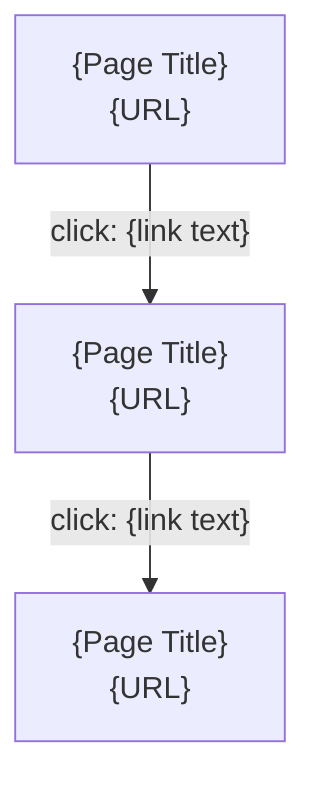

# Skill: Workspace Crawl Protocol

## Purpose

This skill governs how crawl records are written inside `.workspace/`. A crawl record is only valuable if the person or agent reading it can understand the application's visual and structural state without opening the application themselves. A weak crawl record — missing screenshots, incomplete frontier, no view context — wastes the reader's time and forces them to re-crawl.

**Load `workspace-structural-protocol` first** if you haven't already, to know where to write the files.

---

## Crawl Folder Structure

Every crawl lives under `{project}/crawls/{date}-{slug}/` and contains:

```
{date}-{slug}/
  README.md         — Always required: crawl metadata, scope, results, and findings
  FRONTIER.md       — Always required: URL tracking — visited, pending, skipped
  screenshots/      — Optional: sequentially numbered PNG screenshots
    01-homepage.png
    02-login-modal.png
  views/            — Optional: markdown files documenting each visual state
    01-homepage.md
    02-login-modal.md
  flows/            — Optional: Mermaid diagrams of navigation flows
    authentication.md
    checkout.md
```

### When to create which subfolder

| Subfolder | Created when | Contents |
|---|---|---|
| `screenshots/` | Screenshots parameter enabled | PNG images, sequentially numbered across all visual states |
| `views/` | View files parameter enabled | Markdown files — one per visual state (page, modal, tab, etc.) |
| `flows/` | Flow files parameter enabled | Markdown files with Mermaid diagrams |

Both `README.md` and `FRONTIER.md` are always created — they are not optional.

---

## View Types

Every visual state captured during a crawl is classified by type. The type appears in the view file header and helps consumers understand what kind of visual state they are looking at.

| Type | Description | Identifying characteristics |
|---|---|---|
| `page` | A full page loaded by navigating to a URL | Has its own URL. Appears as a browser navigation event. |
| `modal` | An overlay that appears on top of a page | Blocks interaction with the underlying page. Typically has a close button. Does not change the URL. |
| `tab-panel` | Content displayed when a specific tab is active | Replaces content within a section of the page without navigating. Tab headers remain visible. |
| `drawer` | A sliding panel from the edge of the screen | Partially covers the underlying page. Typically slides from left or right. |
| `expanded-section` | Content revealed by expanding a collapsed element | Accordion panels, collapsible sections, dropdown menus. The expansion changes the visible content without full navigation. |

---

## View File Template

Every visual state captured during a crawl produces one view file in `/views/`. The file follows this template. The Navigation section is included only when the corresponding parameter is enabled during Setup — omit it entirely if disabled, do not leave an empty header. All other sections (Visual Description, Key Features, Data Landscape, Screenshot) are always included.

````markdown
# {View Title}

> **URL:** {final URL after redirects, or "—" for sub-states without a URL change}
> **Status:** {HTTP status code or "—" for sub-states}
> **Title:** {page title from `<title>` tag, or "—" if not applicable}
> **Type:** {page | modal | tab-panel | drawer | expanded-section}
> **Captured:** {ISO 8601 timestamp}
> **Parent:** {relative path to parent view file, or "—" for top-level pages}

## Visual Description

{Rich visual analysis produced by reading the screenshot image directly. 2–4 paragraphs covering: visual layout and structure (sidebar, main content area, sections, cards), color scheme and design language (dominant colors, accent colors, typography style), information hierarchy (what draws attention first, how content is organized), visible sections and their content, and overall appearance. Must be written after reading and analyzing the actual screenshot image — never from DOM metadata alone. This section is always included.}

## Key Features

{Grouped description of what users can do on this page, organized by capability area. Observational language — describe what the page offers without interpreting business purpose. Group related actions together and omit trivial items (e.g., do not list every sidebar link individually — summarize as "Sidebar navigation to all major sections with notification badges for pending items"). Example: "Member management: register new members, export member list, filter by status (active, suspended, expired). Overdue triage: review overdue loans, send reminders, view loan details with due dates. Quick actions: publish announcements, register members, export activity logs."}

## Data Landscape

{What data entities and values are visible on the page. Structured and factual. Include: metrics with their current values and change indicators, entity names with key attributes, table contents summarized, and field values. Example: "Key metrics: 12,480 titles in catalog (+1.2%), 3,204 active loans (+4.2%), 4,281 active members (+2.1%), 37 overdue loans. Overdue alerts: Dana Reyes — high severity, 3 books 21 days late; Omar Ali — medium severity, 1 book 9 days late. Loans by branch: Central 1,240, Riverside 1,102, Hillcrest 862."}

## Screenshot

*(Included only when Screenshots parameter is enabled.)*


## Navigation

*(Included only when Navigation section parameter is enabled.)*

- **Arrived from:** {view file reference, or "seed URL"}
- **Links to:** {list of view files or external URLs discovered on this state}
- **Flows:** {flow file references, or "—"}
````

### Naming convention

`{NN}-{slug}.md` where `NN` is a sequential counter starting at 01, incrementing for every visual state captured (primary pages and sub-states alike). The slug is a short kebab-case description of the visual state.

Examples: `01-homepage.md`, `02-homepage-settings-modal.md`, `03-about.md`, `04-about-team-tab.md`

### View file rules

- **One view file per visual state.** Do not combine multiple visual states in a single file. Every page, modal, tab panel, drawer, and expanded section gets its own file.
- **Visual Description is always present and always screenshot-driven.** The Visual Description section must contain 2–4 paragraphs of rich visual analysis produced by reading the actual screenshot image. Never write Visual Description from DOM-level data alone — this is the most critical quality rule in the entire crawl protocol.
- **Key Features and Data Landscape are always present.** These sections provide the structural context that downstream consumers need. They are not optional.
- **Header metadata is always present.** The blockquote header with URL, Status, Title, Type, Captured, and Parent is included in every view file.
- **Parent references use relative paths.** For a modal view file `02-homepage-settings-modal.md`, the Parent field reads `01-homepage.md`.
- **Navigation is omitted only when explicitly disabled.** If the user disabled the Navigation section during Setup, omit it entirely — do not include an empty section header.
- **Failed pages still get view files.** If a page fails to load, write a minimal view file with Visual Description describing the failure and the error details.

---

## The CRAWL Quality Framework

Before finalizing any crawl record, validate your output against CRAWL:

| Letter | Criterion | Question to ask yourself |
|---|---|---|
| **C** | **Complete** | Did you visit every URL the user asked for? Are all declared scope boundaries covered? Does every visual state have a view file (if View files enabled)? |
| **R** | **Real** | Is every screenshot from an actual page capture? Is every visited URL genuinely navigated to? Is every view file based on an actually observed visual state? |
| **A** | **Accounted** | Is every URL that entered the frontier tracked to its final state — visited, skipped, or failed? No URLs vanish. |
| **W** | **Well-named** | Do screenshot filenames, view file names, and flow titles clearly describe what they contain? Can someone find the checkout modal view without guessing? |
| **L** | **Linked** | Do screenshots, view files, FRONTIER entries, and README references all agree? No broken paths, no phantom references, no orphan files. |

**If any letter fails, fix before saving.** A crawl record that fails CRAWL is unreliable as a reference artifact.

---

## FRONTIER.md Specification

FRONTIER.md is the audit trail of the crawl. It tracks every URL the agent encountered and its final disposition. It is a markdown file with three tables.

### Format

```markdown
# Crawl Frontier

## Visited

| URL | Status | Screenshot | Timestamp |
|---|---|---|---|
| https://example.com | 200 | screenshots/01-homepage.png | 2026-05-14T10:30:00Z |
| https://example.com/login | 200 | screenshots/02-login.png | 2026-05-14T10:31:15Z |

## Pending

| URL | Source | Priority |
|---|---|---|
| https://example.com/about | homepage link | normal |

## Skipped

| URL | Reason |
|---|---|
| https://external-site.com | Outside declared scope |
```

### Table column definitions

**Visited:**

| Column | Description | Values |
|---|---|---|
| URL | The final URL after any redirects | Full URL string |
| Status | HTTP status code or outcome | `200`, `301`, `403`, `404`, `500`, `failed` |
| Screenshot | Relative path to the primary screenshot file | `screenshots/{NN}-{slug}.png` or `—` if screenshots disabled |
| Timestamp | When the page was captured | ISO 8601 format (`YYYY-MM-DDTHH:MM:SSZ`) |

**Pending:**

| Column | Description | Values |
|---|---|---|
| URL | The URL to be visited | Full URL string |
| Source | Where this URL was discovered | `seed` (user-provided), `{page-slug} link` (discovered on a page) |
| Priority | Visit order priority | `high` (seed URLs), `normal` (discovered links) |

**Skipped:**

| Column | Description | Values |
|---|---|---|
| URL | The URL that was skipped | Full URL string |
| Reason | Why it was skipped | `Outside declared scope`, `Redirect outside scope: {target}`, `Exceeded crawl depth`, `Authentication required` |

### Lifecycle

1. **Initial state:** All seed URLs in Pending with priority `high`. Visited and Skipped tables contain placeholder rows.
2. **During execution:** URLs move from Pending → Visited or Pending → Skipped. Newly discovered URLs are added to Pending with priority `normal`.
3. **Final state:** Pending table is empty. All URLs are in Visited or Skipped. No URL exists in more than one table.

---

## README.md Template

Every crawl workspace must have a `README.md` at its root. It serves as both orientation (what is this crawl?) and results summary (what was found?).

### Initial template (written during Setup)

```markdown
# {Crawl Title}

- **Type:** crawl
- **Project:** {project}
- **Opened:** {YYYY-MM-DD}
- **Opened by:** Crawler

## Scope

{Target URLs and scope boundaries declared by the user.}

## Configuration

{Snapshot of the configuration chosen during Setup. List each parameter and its current setting.}
```

### Final template (written during Delivery)

Append the following sections to the initial README:

```markdown
## Results

- **Pages visited:** {N}
- **Pages skipped:** {N}
- **Pages failed:** {N}
- **Screenshots captured:** {N}
- **View files produced:** {N}

### Notable Findings

- {Broken pages, unexpected redirects, 404s, error states encountered}
- {If no issues, write "No issues encountered."}
```

---

## Screenshot Naming Conventions

```
{NN}-{slug}.png
```

- `NN` — Sequential integer, zero-padded to two digits (`01`, `02`, `03`, ...). Increments for every visual state captured — primary pages and sub-states (modals, tabs, etc.) alike.
- `slug` — Short kebab-case description of the visual state.

Examples: `01-homepage.png`, `02-homepage-settings-modal.png`, `03-about.png`, `04-about-team-tab.png`

### Screenshot quality requirements

- Full viewport capture — not partial crops
- Capture after the page reaches a stable state (network idle or DOM content loaded)
- If dynamic content is loading (spinners, skeleton screens), wait for completion before capturing
- Record the final URL after redirects in metadata — the filename reflects the intended visual state, not the redirect target
- Screenshots and view files share the same `{NN}-{slug}` naming — `01-homepage.png` corresponds to `01-homepage.md`

---

## Flow File Format

Flow files document navigation paths as Mermaid diagrams. Each file represents one logical user journey or section of the application.

### Template

````markdown
# {Flow Title}

> Navigation flow for: {section or journey description}
> Generated by: Crawler
> Date: {YYYY-MM-DD}

---


````

### Flow file rules

- **One flow per file.** Do not combine unrelated navigation paths in a single diagram.
- **Node labels include page title and URL.** A node with just "Login" is ambiguous. A node with "Login\nhttps://app.example.com/auth/login" is precise.
- **Edge labels describe the action.** What the user clicks or does to navigate — `click: Sign in button`, `submit: login form`, `redirect: after authentication`.
- **Filename matches the flow.** `authentication.md`, `checkout.md`, `settings-navigation.md` — descriptive, not generic.
- **Include dead ends.** If a flow leads to an error page or a page with no onward navigation, include that terminal node. Do not truncate the flow at the last "successful" page.

---

## Writing Standards

**Every screenshot must have a corresponding view file and FRONTIER.md entry.** If a screenshot exists in `screenshots/`, a view file with the same `{NN}-{slug}` must exist in `views/` (if View files enabled), and its URL must appear in the FRONTIER.md Visited table. If a URL appears in Visited with a screenshot path, the file must exist. No orphans.

**Every view file must reference a screenshot.** If Screenshots is enabled, every view file's Screenshot section must point to a PNG that exists in `screenshots/`. If Screenshots is disabled, the Screenshot section shows `—`. No phantom references.

**Visual Description must be driven by analyzing the screenshot.** Every view file's Visual Description section must reflect actual analysis of the screenshot image, read directly. Writing Visual Description from DOM metadata alone produces the same shallow descriptions that undermine crawl value. Visual analysis is not optional — it is the foundation of the view file.

**Do not interpret.** The README "Notable Findings" section records facts — "Login page returned HTTP 500 at the time of crawling" — not analysis — "The login module appears to have a database connection issue." View file Visual Description sections describe what is visually present — layout, colors, sections, data values — based on visual analysis of the screenshot. Key Features and Data Landscape are observational — they describe what exists on the page, not why it behaves that way.

**Timestamps are UTC.** All timestamps in FRONTIER.md and view file headers use ISO 8601 format in UTC (`Z` suffix).

**Number by capture order.** The first visual state captured gets `01-`, the second gets `02-`, regardless of whether it is a primary page or a sub-state. This numbering is shared between screenshots and view files.

**Flow files are derived from metadata, not guessed.** Every arrow in a flow diagram must correspond to an actual navigation action recorded during execution. Do not invent navigation paths that were not observed.

**Failed pages are honest records.** If a page returned a 404 or 500, record it in FRONTIER.md and write a view file describing the failure. Do not omit it from the crawl record to make the results look cleaner.

---

## Commands

### Create a new crawl workspace

```bash
# Determine project and slug
PROJECT="{project}"
SLUG="{date}-{crawl-slug}"

# Create folder structure (add subfolders based on enabled outputs)
mkdir -p .workspace/${PROJECT}/crawls/${SLUG}/screenshots
mkdir -p .workspace/${PROJECT}/crawls/${SLUG}/views
mkdir -p .workspace/${PROJECT}/crawls/${SLUG}/flows

# Create required files
touch .workspace/${PROJECT}/crawls/${SLUG}/README.md
touch .workspace/${PROJECT}/crawls/${SLUG}/FRONTIER.md
```

### Verify screenshots match view files and FRONTIER entries

```bash
# List all screenshots
ls .workspace/${PROJECT}/crawls/${SLUG}/screenshots/

# Count screenshots
ls .workspace/${PROJECT}/crawls/${SLUG}/screenshots/*.png | wc -l

# List all view files
ls .workspace/${PROJECT}/crawls/${SLUG}/views/

# Count view files
ls .workspace/${PROJECT}/crawls/${SLUG}/views/*.md | wc -l
```

### Verify crawl record completeness

```bash
# List all files in the crawl workspace
find .workspace/${PROJECT}/crawls/${SLUG}/ -type f | sort

# Check that required files exist
ls .workspace/${PROJECT}/crawls/${SLUG}/README.md
ls .workspace/${PROJECT}/crawls/${SLUG}/FRONTIER.md
```

### Commit the crawl record

```bash
cd .workspace/ && git add . && git commit -m "crawler: crawl complete — ${SLUG}" && git push
```

---

## Quality Gate

Before reporting that the crawl is complete, run this check:

1. **README.md exists** and contains both the initial sections (Scope, Configuration) and the final sections (Results, Notable Findings).
2. **FRONTIER.md exists** and the Pending table is empty — all URLs are in Visited or Skipped.
3. **Every screenshot file referenced in README.md** exists in `screenshots/`. No broken paths.
4. **Every screenshot file in `screenshots/`** has a corresponding Visited entry in FRONTIER.md and a corresponding view file in `views/` (if View files enabled). No orphan files.
5. **Every view file in `views/`** references a screenshot that exists in `screenshots/` (if Screenshots enabled). No phantom references.
6. **No view file has an empty or DOM-only Visual Description section.** Visual Description is mandatory and must reflect actual visual analysis of the corresponding screenshot — even failed pages must describe the failure visually.
7. **Every view file's Parent reference** (if not `—`) points to an existing view file in `views/`.
8. **Flow files** (if produced) contain valid Mermaid syntax and reference pages that were actually visited.
9. **No fabricated observations.** Every entry in FRONTIER.md corresponds to an actual page visitation. Every screenshot is from an actual page capture. Every view file describes a visual state that was actually observed.

If any item fails, fix the crawl record before committing. Do not commit an incomplete or inconsistent crawl.
